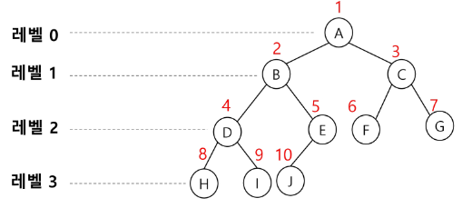

# Data Structure

[stack](#stack)
[queue](#queuelinear)
[tree](#tree)


## Stack
물건을 쌓아 올리듯 자료를 쌓아 올린 형태의 자료구조
- 스택에 저장된 자료는 선형 구조를 가짐
- 마지막에 삽입한 자료를 가장 먼저 꺼냄(LIFO: Last In First Out)

### 구현
자료를 선형으로 저장할 저장소 필요(배열 사용 가능)  
top: 스택에 마지막으로 삽입된 원소의 위치

- push(삽입): 저장소에 자료를 저장, push라고 함
```python
def push(item, size):
    global top
    top += 1
    if top == size:
        print('overflow')
    else:
        stack[top] = item

size = 10  # size를 정하지 않고 동적으로 할당하는 방법을 사용하는 경우가 더 빈번
stack = [0] * size
top = -1
```
- pop(삭제): 저장소에서 자료를 꺼냄
```python
def pop():
    global top
    if top == -1:
        print('underflow')
        return 0
    else:
        top -= 1
        return stack[top + 1]
```
- isEmpty: 스택이 공백인지 아닌지 확인
- peek: 스택의 top에 있는 item(원소)을 반환


## Queue(Linear)
스택과 마찬가지로 삽입과 삭제의 위치가 제한적인 자료구조
- 큐의 뒤에서는 삽입만 하고, 큐의 앞에서는 삭제만 이루어지는 구조
- 먼저 삽입된 원소는 먼저 삭제됨(FIFO: First In First Out)

### 구현
자료를 선형으로 저장할 저장소 필요
front: 최근 삭제된 위치
rear: 저장된 원소 중 마지막 원소

- enQueue: 큐의 rear 다음에 원소를 삽입
```python
def enQueue(item):
    global rear
    if isFull():
        print("Queue is Full")
    else:
        rear += 1
        Queue[rear] = item
```
- deQueue: 큐의 front에서 원소를 삭제하고 반환
```python
def deQueue():
    if isEmpty():
        print("Queue is Empty")
    else:
        front += 1
        return Queue[front]
# 실제로 삭제하는 것은 아니고 새로운 원소를 리턴하면서 삭제와 동일한 기능을 함
```
- createQueue: 비어있는 큐를 생성  
초기 상태: front = rear = -1
- isEmpty: 큐가 비어있는지 확인
공백 상태: front == rear
```python
def isEmpty():
    return front == rear
```
- isFull: 큐가 가득 찼는지 확인
포화 상태: rear == n - 1(n: 배열의 크기)
```python
def isFull():
    return rear == len(Queue) - 1
```
- Qpeek(): 큐의 front에서 원소를 삭제 없이 반환
```python
def Qpeek():
    if isEmpty():
        print("Queue is Empty")
    else: return Q[front+1]
```


## Circular Queue
선형 큐 이용시 원소의 삽입과 삭제를 계속할 경우, 배열의 앞부분에 활용할 수 있는 공간이 있음에도 불구하고 rear == n-1인 포화상태로 인식하여 더 이상의 삽입이 불가능해짐  
간단한 해결방법으로 매 연산이 이루어질 때마다 저장된 원소들을 배열의 앞부분으로 모두 이동시키는 방법이 있지만, 원소 이동에 많은 시간이 소요되어 효율성이 급격히 떨어진다.
- 그래서 1차원 배열을 사용하되, 논리적으로 배열의 처음과 끝이 연결된 원형 형태의 큐를 이룬다고 가정하고 사용

### index의 순환
front와 rear의 위치가 배열의 마지막 인덱스인 n-1을 가리킨 후, 배열의 처음 인덱스인 0으로 이동해야 함  
이를 위해 나머지 연산자 mod 활용

### 구현
- isEmpty: 큐가 비어있는지 확인
공백 상태: front == rear
```python
def isEmpty():
    return front == rear
```
- isFull: 큐가 가득 찼는지 확인
포화 상태: (rear + 1) mod n == front(n: 배열의 크기)
```python
def isFull():
    return (rear + 1) % len(Queue) == front
```
[왜 원형 큐는 한자리를 사용하지 않는가](./Circular_Queue.md)

- enQueue: 원형 큐이므로 rear = (rear + 1) mod n을 활용
```python
def enQueue(item):
    global rear
    if isFull():
        print("Queue is Full")
    else:
        rear = (rear + 1) % len(Queue)
        Queue[rear] = item
```
- deQueue: 마찬가지로 원형 큐이므로 front = (front + 1) mod n을 활용
```python
def deQueue():
    global front
    if isEmpty():
        print("Queue is Empty")
    else:
        front = (front + 1) % len(Queue)
        return Queue[front]
```


## Linked Queue
Linked List를 활용한 Queue
- Queue의 원소: 단수 연결 리스트의 노드
- Queue의 원소 순서: 노드의 연결 순서, 링크로 연결되어 있음

### 구현
초기 상태: front == rear == null
공백 상태: front == rear == null
<!-- 추후 코드도 찾아서 추가할 것 -->


## Deque(덱)
양쪽 끝에서 빠르게 추가와 삭제를 수행할 수 있는 리스트류 컨테이너

### 구현
```python
# 추후 추가할 것
```

## Priority Queue
우선순위를 가진 항목들을 저장하는 Queue  
FIFO 순서가 아니라 우선순위가 높은 순서대로 나가게 된다.

### 적용 분야
- 시뮬레이션 시스템
- 네트워크 트래픽 제어
- 운영체제의 테스크 스케쥴링

### 구현
<!-- 추후 추가할 것 -->


### Queue의 활용: Buffer(버퍼)

#### 버퍼란?
데이터를 한 곳에서 다른 한 곳으로 전송하는 동안 일시적으로 데이터를 보관하는 메모리의 영역  
- 버퍼링: 버퍼를 활용하는 방식 또는 버퍼를 채우는 동작을 의미

버퍼는 일반적으로 입출력 및 네트워크와 관련된 기능에서 이용  
순서대로 입력/출력/전달되어야 하므로 FIFO방식의 자료구조인 Queue를 활용


## Tree
비선형 구조  
원소들 간에 1:n 관계를 가지는 자료구조  
원소들 간에 계층 관계를 가지는 계층형 자료구조  

### 용어 정리
Root node: 노드 중 최상위 노드, 트리의 시작 노드  
node: 트리의 원소  
edge(간선): 노드를 연결하는 선  
sibling node: 같은 부모 노드의 자식 노드들  
parent nodes: 간선을 따라 루트 노드까지 이르는 경로에 있는 모든 노드들  
subtree: 부모 노드와 연결된 간선을 끊었을 때 생성되는 트리  
자손 노드: 서브 트리에 있는 하위 레벨의 노드들  
degree(차수): 노드에 연결된 자식 노드의 수  
트리의 차수: 트리에 있는 노드의 차수 중에서 가장 큰 값  
(Leaf node)단말 노드: 차수가 0인 노드, 자식 노드가 없는 노드  
높이: 루트에서 노드에 이르는 간선의 수, 레벨이라고도 함  
트리의 높이: 트리에 있는 노드의 높이 중 가장 큰 값, 최대 레벨이라고도 함  

## Binary Tree(이진 트리)
모든 노드들이 2개의 서브트리를 갖는 형태의 트리  
각 노드가 자식 노드를 최대 2개까지만 가질 수 있음  

### 구현1
이진 트리의 각 노드 번호를 아래와 같이 부여

```python
[-, A, B, C, D, E, F, G, H, I, J, -, -, -, -, -] # 이 배열이 트리를 나타낸다.
```

노드 번호가 i인 노드 기준  
부모 노드의 번호: i // 2  
왼쪽 자식 노드의 번호: i * 2  
오른쪽 자식 노드의 번호: i * 2 + 1  
레벨 n의 노드 시작 번호: 2 ** n  
-> 하나의 배열로 트리를 구현할 수 있음  
-> 조상 찾기 또한 자식 노드의 번호 // 2 == 부모 노드의 번호임을 활용하여 찾을 수 있음
### 구현2
- 2개의 자식 번호를 저장하는 배열에 부모 번호의 인덱스로 자식 번호를 저장
- 자식 번호를 인덱스로 부모 번호를 저장

단점
- 사용하지 않는 배열 원소에 대한 메모리 공간 낭비
- 트리의 중간에 새로운 노드를 삽입하거나 기존의 노드를 삭제할 경우 배열의 크기 변경이 어려움  
-> 연결 리스트를 활용한 이진 트리 구현

### Full Binary Tree(포화 이진 트리)
모든 레벨에 노드가 포화상태로 차 있는 이진 트리  
높이가 h일 때, 최대의 노드 개수인 2^(h+1) - 1의 노드를 가진 이진 트리  

### Complete Binary Tree(완전 이진 트리)
높이가 h이고 노드 수가 n개일 때 포화 이진 트리의 노드 번호 1번부터 n번까지 빈 자리가 없는 이진 트리  


#### heap(힙)
파이썬에서 자주 활용하는 heap이 완전 이진 트리의 대표적인 예시
```python
def enq(n):
    global last
    last += 1  # 마지막 노드 추가(완전이진트리 유지)
    h[last] = n  # 마지막 노드에 데이터 삽입
    child = last
    parent = child // 2
    while parent and h[parent] < h[child]:
        h[parent], h[child] = h[child], h[parent]
        child = parent
        parent = child // 2


def deq():
    global last
    temp = h[1]
    h[1] = h[last]
    last -= 1
    parent = 1
    child = 2 * parent
    while child <= last:
        if child + 1 <= last and h[child] < h[child+1]:
            child += 1
        if h[parent] < h[child]:
            h[parent], h[child] = h[child], h[parent]
            parent = child
            child = parent * 2

N = 10  # 필요한 노드 수
h = [0 for _ in range(N+1)]  # 최대 힙
last = 0  # 힙의 마지막 노드 번호

# 나중에 heapq 코드 뜯어서 확인해볼 것
```

### Skewed Binary Tree(편향 이진 트리)
높이 h에 대한 최소 개수의 노드를 가지면서 한쪽 방향의 자식 노드만들 가진 이진 트리  


### Traversal(순회)
Traversal(순회): 트리의 노드들을 체계적으로 방문하는 것  
전위, 중위, 후위는 부모 노드의 방문 순서와 관련있음  
*코드에서 visit의 위치를 보면 도움이 될 지도*  
- preorder(전위 순회): 부모 노드 방문 후, 자식 노드를 좌우 순서로 방문
```python
def preorder(node):
    if node:
        visit(t)  # 방문 체크
        preorder(node.left)
        preorder(node.right)
```
- inorder(중위 순회): 좌측 자식노드, 부모 노드, 우측 자식 노드 순서로 방문
```python
def inorder(node):
    if node:
        inorder(node.left)
        visit(t)  # 방문 체크
        inorder(node.right)
```
- postorder(후위 순회): 자식 노드를 좌우 순서로 방문 후, 부모 노드를 방문
```python
def postorder(node):
    if node:
        postorder(node.left)
        postorder(node.right)
        visit(t)  # 방문 체크
```