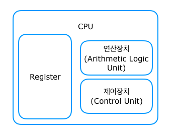
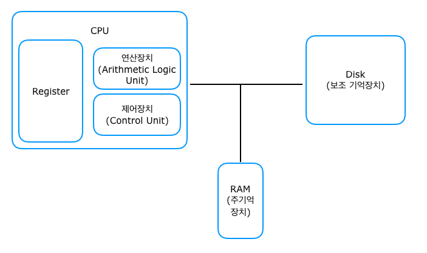

# Computer System Structure
## CPU
- ALU, CU, Resgister로 구성되어 있다.

- ALU: Arithmetic Logic Unit
  - 연산을 수행하는 산술논리장치
- CU: Control Unit
  - 제어 명령을 전달하는 컨트롤 장치
- Register
  - 결과 값을 일시적으로 기억하는 레지스터

## Memory
- CPU의 Register 용량은 매우 적기 때문에 정보를 저장해 두었다가 필요할 때 읽어들여 이용할 수 있는 주기억 장치가 필요
- 이 주기억장치에는 컴퓨터가 켜지면 운영체제, 사용자 프로그램 등이 메모리 공간에 올라가게 됨
- CPU는 주기억장치에서 프로그램들의 명령어 등을 읽어와 작업을 수행
- 주 기억장치로는 ROM, RAM등이 있음

## I/O Device
- 입출력 장치
- 사요아가 원하는 문자나 그림의 데이터를 컴퓨터로 전달하거나 출력하는 장치
- 입력 장치의 종류는 키보드, 마우스 등이 있고 출력 장치로는 모니터, 프린터 등이 있다.

### 컴퓨터 시스템 흐름
1. 컴퓨터에 전원이 들어오면 메인 메모리에 운영체제가 올라감
- 이 때 모든 운영 체제 코드가 올라가는 것이 아니라 시스템이 돌아가기 위한 핵심적인 부분이 올라가는데, 이 부분을 커널이라고 한다.
- 커널만 올라가는 이유는 모든 코드를 메모리에 올리게 되면 자원낭비가 심하기 때문

2. CPU는 메모리의 운영체제 프로그램들을 읽어 운영체제를 실행

## 출처
[wan-blog](https://wan-blog.tistory.com/32)