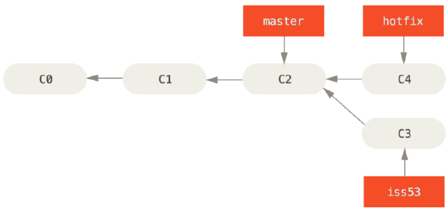
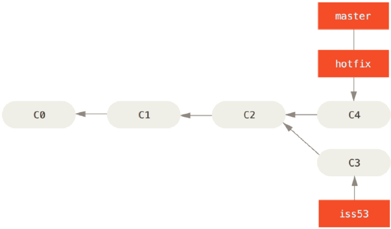
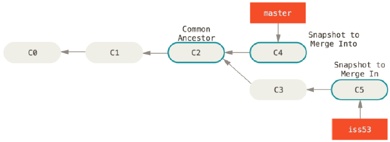
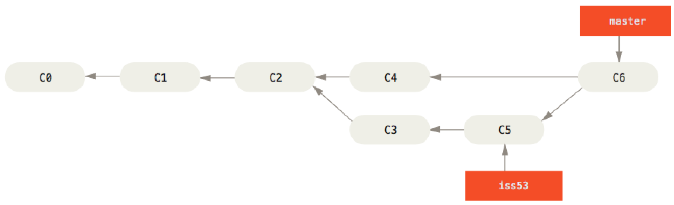
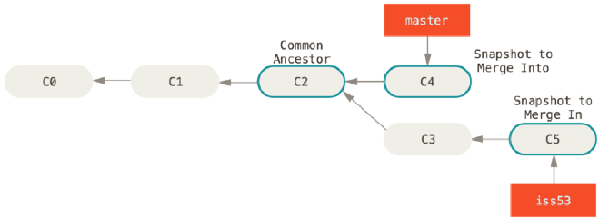
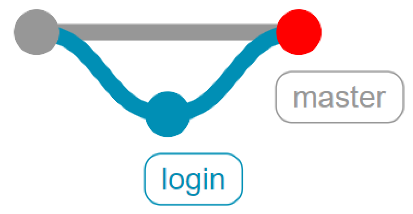
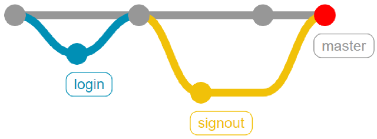

# git Branch
나뭇가지처럼 여러 갈래로 작업 공간을 나누어 독립적으로 작업할 수 있도록 도와주는 Git의 도구  

장점
- 독립 공간을 형성, 원본(master)이 안전
- 하나의 작업은 하나의 브랜치로 나누어 진행되므로 체계적으로 협업과 개발이 가능
- 쉽게 브랜치를 생성하고 브랜치 사이를 이동할 수 있음  

Master Branch
- 사용자가 사용하고 있는 버전
- 세상에 공개되어 있으므로 함부로 수정하거나 버전을 되돌리거나 삭제해서는 안됨

Branch를 왜 사용해야 하는가  
상황 예시: 상용중인 서비스에 발생한 에러를 해결하려면?
1. 브랜치를 통해 별도의 작업 공간을 만든다.
2. 브랜치에서 에러가 발생한 버전을 이전 버전으로 되돌리거나 삭제
3. 브랜치는 완전하게 독립되어 있어 작업 내용이 master 브랜치에 아무런 영향도 미치지 못함
4. 에러 해결 후 해당 내용을 master 브랜치에 반영

```bash
git branch  # branch 목록 확인
git branch -r  # 원격 저장소의 branch 목록 확인

# commit이 한번도 되지 않았다면 git branch 생성 불가
# fatal: not a valid object name: 'master' 오류 발생
git branch <branch name>  # 새로운 branch 생성

# branch 삭제
git branch -d <branch name>  # 병합된 branch만 삭제 가능
git branch -D <branch name>  # (주의) 강제 삭제(병합되지 않은 branch도 삭제 가능)

# branch 이동
git switch <branch name>

# branch를 새로 생성과 동시에 이동
git switch -c <branch name>

# 특정 commit 기준으로 branch 생성, commit ID 미작성시 최신 commit 기준으로 branch 생성
git switch -c <branch name> <commit ID>
```


설명
1. Git의 branch는 독립적인 작업 공간을 갖지만, Git이 관리하는 파일 트리에 제한
2. git add를 하지 않았던, 즉 staging area에 올라가지 않았던 파일은 Git의 버전 관리를 받지 않기 때문에 브랜치가 바뀌어도 유지
3. git switch를 하기 전, working directory의 모든 파일이 버전 관리 중인지 확인 필요

```bash
git log --oneline --graph --all
# graph를 사용하면 보기 좋게 log를 찍어줌
```


## Branch Merge
분기된 branch를 하나로 병합  
**Merge 수행 전 일단 다른 branch를 합치려고 하는 메인 branch로 switch 해야함**
```bash
git merge <합칠 branch name>
# branch1을 branch2에 합치려면?
git switch branch2
git merge branch1
```

Merge 종류  
**여기서 잠깐**  
- 일반적으로 커밋 진행 방향과 화살표 표기 방향을 다르게 그리는데, 그 이유는 커밋은 이전 커밋 이후의 변경사항만을 기록한 것이므로 이전 커밋에 종속되어 생성될 수 밖에 없기 때문에 일반적으로 화살표 방향을 이전 커밋을 가리키도록 표기  

1. Fast-forward merge
브랜치를 병합할 때 마치 빨리감기처럼 브랜치가 가리키는 커밋을 앞으로 이동시키는 것
- merge과정 없이 단순히 브랜치의 포인터가 이동



이 상태에서 master에 hotfix를 병합하면?
- hotfix가 가리키는 C4는 C2에 기반한 커밋이므로, master가 C4로 이동하게 된다.
- 이와 같이 특별한 merge 과정 없이 브랜치의 포인터가 이동하는 것을 Fast-Forward라고 함



2. 3-Way Merge(Merge commit)
브랜치를 병합할 때 각 브랜치의 커밋 두개와 공통 조상 하나를 사용하여 병합하는 것
- 두 브랜치에서 다른 파일 혹은 같은 파일의 다른 부분을 수정했을 때 가능



이 상태에서 master에 iss53을 병합하면?
- master와 iss53은 갈래가 나누어져 있기 때문에 Fast-Forward로 합쳐질 수 없음
- 따라서 공통 조상인 C2와 각자가 가리키는 커밋인 C4, C5를 비교하여 3-way merge를 진행



이때 생긴 C6은 master와 iss53이 병합되면서 발생한 Merge Commit

3. Merge Conflict
병합하는 두 브랜치에서 같은 파일의 같은 부분을 수정한 경우, Git이 어느 브랜치의 내용으로 작성해야 하는지 판단하지 못해 발생하는 충돌(conflict) 현상
- 결국 사용자가 직접 내용을 선택해서 Conflict를 해결해야 함



만약 3-way merge와 달리 master와 iss53이 같은 파일의 같은 부분을 수정하고 병합했다면?
```bash
CONFLICT (content): Merge conflict in index.html
Automatic merge failed; fix conflicts and then commit the result.
```
오류 발생  

충돌이 일어난 파일을 확인하기 위해 git status를 입력
```bash
...
both modified: index.html
...
```
index.html에서 오류가 발생했음을 확인, index.html을 열어보면
```
<<<<<<<<<<<<<
master의 내용
=======
iss53의 내용
>>>>>>>>>>>>>
```
이 나오게 된다.

## Branch Merge Scenario
사전 세팅
```bash
mkdir git_merge
cd git_merge

git init
touch test.txt
# test.txt에 master test 1을 입력 후 저장

git status
git add .
git commit -m "master test 1"
```

3가지 Merge 상황
1. fast-forward
- login 브랜치가 생성된 이후 master 브랜치에 변경 사항이 없는 상황
- 즉, master 브랜치에서 login 브랜치를 Merge할 때 login 브랜치가 master 브랜치 이후의 커밋을 가리키고 있으면 그저 master 브랜치가 login 브랜치와 동일한 커밋을 가리키도록 이동시킬 뿐

```bash
git switch -c login

touch login.txt

git add .
git commit -m "login test"

git switch master

git log --oneline --all --graph

git merge login

git log --oneline --all --graph

git branch -d login
```

2. 3-way Merge(Merge commit)
- 현재 브랜치(master)가 가리키는 커밋이 Merge할 브랜치의 조상이 아니면, git은 각 브랜치가 가리키는 커밋 2개와 공통조상 하나를 사용하여 3-way Merge한다.
- 단순히 브랜치 포인터를 최신 커밋으로 옮기는 게 아니라 3-way Merge의 결과를 별도의 커밋으로 만들고 나서 해당 브랜치가 그 커밋을 가리키도록 이동
- 그래서 이런 커밋은 부모가 여러개고 Merge commit이라고 부른다.

```bash
git switch -c signout
touch signout.txt

git add .
git commit -m "signout test 1"
git log --oneline --all --graph

git switch master
touch master.txt

git add .
git commit -m "master test 2"
git log --oneline --all --graph

git merge signout

git log --oneline --all --graph

git branch -d signout
```
3. Merge Conflict
- Merge하는 두 브랜치에서 같은 파일의 같은 부분을 동시에 수정하고 Merge하면 Git은 해당 부분을 자동으로 Merge하지 못하고 충돌이 일어남
- 반면, 동일 파일이더라도 서로 다른 부분을 수정했다면 Conflict없이 자동으로 Merge Commit된다
```bash
git switch -c hotfix

# test.txt 수정
# master test 1, hotfix에서 작성한 문장

git add .
git commit -m "hotfix test 1"
git log --graph --oneline --all

git switch master

# test.txt 수정
# master test1, master에서 작성한 문장

git add.
git commit -m "master test 3"

git log --graph --oneline --all

git merge hotfix
```
merge conflict 발생
```bash
<<<<<<< HEAD
master test 1, master에서 작성
=======
master test 1, 이건 hotfix에서 작성한 문장
>>>>>>> hotfix
```
- ======= 위쪽의 내용은 HEAD 버전(merge 명령을 실행할 때 작업하던 master 브랜치)의 내용이고 아래쪽은 hotfix 브랜치의 내용
- 충돌을 해결하려면 위쪽이나 아래쪽 내용 중에서 고르거나 새로 작성하여 Merge해야 한다. <<<<<<<<, ========, >>>>>>>>> 가 포함된 행은 삭제
충돌 확인 및 해결
- Merge 충돌이 일어났을 때 Git이 어떤 파일을 Merge할 수 없었는지 살펴보려면 git status 명령 이용
```bash
$ git status
On branch master
You have unmerged paths.
  (fix conflicts and run "git commit")
  (use "git merge --abort" to abort the merge)

Unmerged paths:
  (use "git add <file>..." to mark resolution)
        both modified:   test.txt

no changes added to commit (use "git add" and/or "git commit -a")
```
```bash
# test.txt 수정
# master test 1, 충돌 해결

git add .
git commit
# VIM 에디터 등장
# 자동으로 작성된 커밋 메세지(Merge branch 'hotfix')를 확인하고 esc를 누른 후 :wq를 입력하여 저장 및 종료

git log --oneline --all --graph

git branch -d hotfix
```