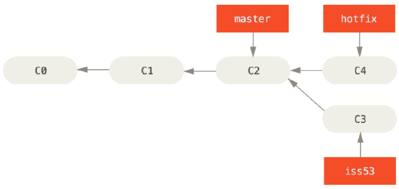
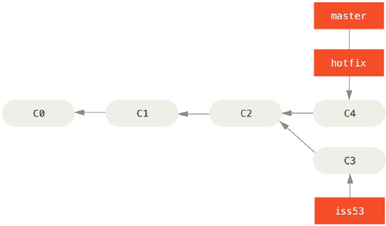
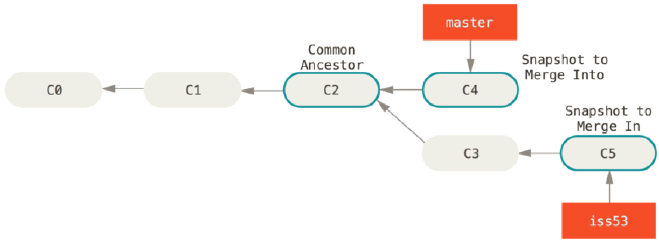

# Git

## Git이란?
 - 분산 버전 관리 시스템

## Git의 3개 영역

1. Working Directory
    * 현재 작업중인 영역
    * *Local 생각하면 편함*
2. Staging Area
    * 버전 관리를 위한 파일, 폴더를 선별하기 위한 목적
    * *add 후 파일이 잠시 거쳐가는 공간*
3. Repository
    * 버전이 저장되는 공간
    * *Github 생각하면 될 듯*

## Git 기본 명령어

* `git init` : git으로 관리하겠다고 선언
    * 이미 git으로 관리되는 영역 내부 폴더에서 다시 `git init`을 하면 안됨
    * (submodule에 대한 내용으로 응용 등급이니 나중에 확인)
* `git add 파일명or경로` : Working Directory에서 작업한 파일or폴더를 Staging Area로 전달하는 명령어  
    * commit을 찍기 위해(버전을 생성하기 위해 -> *변경 사항을 기록하기 위해*) 전달
* `git commit -m 'commit message'` : 실제 버전을 생성하는 명령어
    * [좋은 commit message 작성법](./commit_message_rule.md)  
* `git status` : 현재 git의 상태를 확인하는 명령어
    * untracked : 아직 관리된 적 없는 파일
    * modified : 관리되고 있는 파일이 수정된 경우
        * 붉은색: working directory에서 파일이 변경or생성된 경우
        * 녹색: staging area에 위치한 파일인 경우
* `git log` : commit 히스토리 보여줌
    * `--oneline`: 각각의 commit log가 한 줄로 깔끔하게
* `git config --global -l` : 현재 git 설정 정보를 알려주는 명령어


## Git 원격 저장소

* github
* gitlab
* yobi
* *etc...*

## 원격 저장소에 Push

1. 원격 저장소를 생성
2. 생성한 저장소를 로컬과 연결
    * `git remote add 별칭 원격저장소주소`
3. git push 별칭 브랜치명: 원격 저장소에 버전 정보를 업로드

* 로컬 저장소는 원격 저장소와 자동 동기화 되지 않음(~~사실 당연한 소리~~)
    * 항상 pull 하는 것을 생활화
    * 추천 순서: pull - 작업 - add - commit - push

* pull vs clone
    * pull: git 저장소가 로컬에 이미 있을 때 작업 상황 동기화
    * clone: git 저장소가 로컬에 없을 때 새로 생성
        * 원격 저장소가 로컬에 복제(.git 폴더도 같이)

### 403 에러 해결 방법
- 403 에러는 해당 레포지토리 주소에 접근 권한이 없을 경우 발생
```bash
remote: Permission to oodeng98/TIL.git denied to ???????.
fatal: unable to access 'https://github.com/oodeng98/TIL.git/': The requested URL returned error: 403
```
1. 작성자(Author) 정보 삭제
```bash
# 기존 Author 정보 확인
git config --global --list
# 기존 Author 정보 있을 시, 초기화
git config --unset --global user.email
git config --unset --global user.name
# 새로운 Author 정보 등록
git config --global user.email '내 이메일'
git config --global user.name '내 이름'
```
2. 로그인 계정 삭제
- 제어판 -> 사용자 계정 -> 자격 증명 관리자 -> Windows 자격 증명 -> github 관련 자격 증명 제거

3. Git push 실행

- 로그인하면 끝
#### [출처](https://somjang.tistory.com/entry/Git-Git-Bash-%ED%84%B0%EB%AF%B8%EB%84%90-%EA%B3%84%EC%A0%95-%EB%B3%80%EA%B2%BD-%EB%B0%A9%EB%B2%95)

## .gitignore란?
* 버전 관리를 하지 않을 파일or폴더or경로를 등록하는 파일
    * 한 번도 등록되지 않은 파일, 폴더, 경로만 사용해야 함
    * git init과 같이 .gitignore 파일 생성을 권장(*실수 덜 하려고*)
* 만약 관리되고 있는 파일을 gitignore에 등록하려면?
    * `git rm --cached 파일or폴더or경로`
    * 관리되고 있는 파일을 버전 관리 목록에서 제외하는 명령어

* gitignore를 쉽게 작성하는 방법
    * [gitignore.io](https://www.toptal.com/developers/gitignore/) 에서 설정
    * 설정 목록은 사용언어, 환경, 에디터, 프레임워크
        > Ex) Python, VisualStudioCode, Django, Jupyternotebook, Pycharm, Vue, Node
    * 생성된 내용을 그대로 복사하여 .gitignore로 사용

## git Branch
나뭇가지처럼 여러 갈래로 작업 공간을 나누어 독립적으로 작업할 수 있도록 도와주는 Git의 도구  

장점
- 독립 공간을 형성, 원본(master)이 안전
- 하나의 작업은 하나의 브랜치로 나누어 진행되므로 체계적으로 협업과 개발이 가능
- 쉽게 브랜치를 생성하고 브랜치 사이를 이동할 수 있음  

Master Branch
- 사용자가 사용하고 있는 버전
- 세상에 공개되어 있으므로 함부로 수정하거나 버전을 되돌리거나 삭제해서는 안됨

Branch를 왜 사용해야 하는가  
상황 예시: 상용중인 서비스에 발생한 에러를 해결하려면?
1. 브랜치를 통해 별도의 작업 공간을 만든다.
2. 브랜치에서 에러가 발생한 버전을 이전 버전으로 되돌리거나 삭제
3. 브랜치는 완전하게 독립되어 있어 작업 내용이 master 브랜치에 아무런 영향도 미치지 못함
4. 에러 해결 후 해당 내용을 master 브랜치에 반영

```bash
git branch  # branch 목록 확인
git branch -r  # 원격 저장소의 branch 목록 확인

# commit이 한번도 되지 않았다면 git branch 생성 불가
# fatal: not a valid object name: 'master' 오류 발생
git branch <branch name>  # 새로운 branch 생성

# branch 삭제
git branch -d <branch name>  # 병합된 branch만 삭제 가능
git branch -D <branch name>  # (주의) 강제 삭제(병합되지 않은 branch도 삭제 가능)

# branch 이동
git switch <branch name>

# branch를 새로 생성과 동시에 이동
git switch -c <branch name>

# 특정 commit 기준으로 branch 생성, commit ID 미작성시 최신 commit 기준으로 branch 생성
git switch -c <branch name> <commit ID>
```


설명
1. Git의 branch는 독립적인 작업 공간을 갖지만, Git이 관리하는 파일 트리에 제한
2. git add를 하지 않았던, 즉 staging area에 올라가지 않았던 파일은 Git의 버전 관리를 받지 않기 때문에 브랜치가 바뀌어도 유지
3. git switch를 하기 전, working directory의 모든 파일이 버전 관리 중인지 확인 필요

```bash
git log --oneline --graph --all
# graph를 사용하면 보기 좋게 log를 찍어줌
```


### Branch Merge
분기된 branch를 하나로 병합  
**Merge 수행 전 일단 다른 branch를 합치려고 하는 메인 branch로 switch 해야함**
```bash
git merge <합칠 branch name>
# branch1을 branch2에 합치려면?
git switch branch2
git merge branch1
```

Merge 종류  
**여기서 잠깐**  
- 일반적으로 커밋 진행 방향과 화살표 표기 방향을 다르게 그리는데, 그 이유는 커밋은 이전 커밋 이후의 변경사항만을 기록한 것이므로 이전 커밋에 종속되어 생성될 수 밖에 없기 때문에 일반적으로 화살표 방향을 이전 커밋을 가리키도록 표기  

1. Fast-forward merge
브랜치를 병합할 때 마치 빨리감기처럼 브랜치가 가리키는 커밋을 앞으로 이동시키는 것
- merge과정 없이 단순히 브랜치의 포인터가 이동



이 상태에서 master에 hotfix를 병합하면?
- hotfix가 가리키는 C4는 C2에 기반한 커밋이므로, master가 C4로 이동하게 된다.
- 이와 같이 특별한 merge 과정 없이 브랜치의 포인터가 이동하는 것을 Fast-Forward라고 함



2. 3-Way Merge(Merge commit)
브랜치를 병합할 때 각 브랜치의 커밋 두개와 공통 조상 하나를 사용하여 병합하는 것
- 두 브랜치에서 다른 파일 혹은 같은 파일의 다른 부분을 수정했을 때 가능


이 상태에서 master에 iss53을 병합하면?
- master와 iss53은 갈래가 나누어져 있기 때문에 Fast-Forward로 합쳐질 수 없음
- 따라서 공통 조상인 C2와 각자가 가리키는 커밋인 C4, C5를 비교하여 3-way merge를 진행


이때 생긴 C6은 master와 iss53이 병합되면서 발생한 Merge Commit

3. Merge Conflict
병합하는 두 브랜치에서 같은 파일의 같은 부분을 수정한 경우, Git이 어느 브랜치의 내용으로 작성해야 하는지 판단하지 못해 발생하는 충돌(conflict) 현상
- 결국 사용자가 직접 내용을 선택해서 Conflict를 해결해야 함



만약 3-way merge와 달리 master와 iss53이 같은 파일의 같은 부분을 수정하고 병합했다면?
```bash
CONFLICT (content): Merge conflict in index.html
Automatic merge failed; fix conflicts and then commit the result.
```
오류 발생  

충돌이 일어난 파일을 확인하기 위해 git status를 입력
```bash
...
both modified: index.html
...
```
index.html에서 오류가 발생했음을 확인, index.html을 열어보면
```
<<<<<<<<<<<<<
master의 내용
=======
iss53의 내용
>>>>>>>>>>>>>
```
이 나오게 된다.

<!-- https://lab.ssafy.com/s11/a01/only_pull_lecture/-/blob/master/Git_branch/02-branch-merging.pdf?ref_type=heads에서 Branch Merge scenario부터 정리 -->