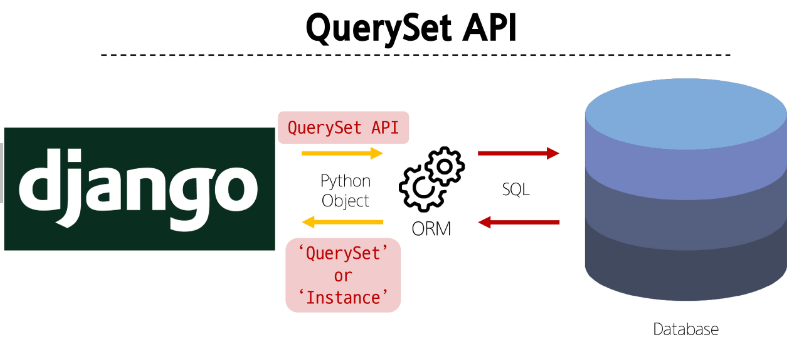

# ORM

Object Relational Mapping  
객체 지향 프로그래밍 언어를 사용하여 호환되지 않는 유형의 시스템 간에 데이터를 변환하는 기술

## QuerySet API

ORM에서 데이터를 검색, 필터링, 정렬 및 그룹화 하는 데 사용하는 도구

- API를 사용하여 SQL이 아닌 Python 코드로 데이터를 처리
- python의 모델 클래스와 인스턴스를 활용해 DB에 데이터를 저장, 조회, 수정, 삭제(CRUD)하는 것
  

QuerySet API 구문

```python
Article.objects.all()
# Model class.Manager.QuerySet_API
```

### Query

- 데이터베이스에 특정한 데이터를 보여 달라는 요청
- 쿼리문 작성
  - 원하는 데이터를 얻기 위해 데이터베이스에 요청을 보낼 코드를 작성
- 파이썬으로 작성한 코드가 ORM에 의해 SQL로 변환되어 데이터베이스에 전달되며, 데이터베이스의 응답 데이터를 ORM이 QuerySet이라는 자료 형태로 변환하여 전달

### QuerySet

- 데이터베이스에게서 전달받은 객체 목록(데이터 모음)
  - 순회가 가능한 데이터로써 1개 이상의 데이터를 불러와 사용할 수 있음
- Django ORM을 통해 만들어진 자료형
- 단, 데이터베이스가 단일한 객체를 반환할 때는 QuerySet이 아닌 class의 instance로 반환

## QuerySet API 실습

### QuerySet API 실습 사전 준비

```bash
pip install ipython
pip install django-extensions
```

```python
# settings.py

INSTALLED_APPS = [
    'django_extensions'
]
```

### Django shell

Django 환경 안에서 실행되는 python shell  
입력하는 QuerySet API 구문이 Django 프로젝트에 영향을 미침

Django shell 실행

```bash
python manage.py shell_plus
```

### Create

데이터 객체를 생성하는 3가지 방법

1. 특정 테이블에 새로운 행을 추가하여 데이터 추가

```python
article = Article()  # Article class로부터 article instance 생성
article.title = 'first'  # 인스턴스 변수 title에 값 할당
article.content = 'django'  # 인스턴스 변수 content에 값 할당

# save를 하지 않으면 DB에 값이 저장되지 않음
article.save()
Article.objects.all() # article object를 전부 확인할 수 있음
```

2. instance를 생성함과 동시에 값을 할당

```python
article = Article(title='second', content='django')

# 마찬가지로 save를 하지 않으면 DB에 값이 저장되지 않음
article.save()
```

3. QuerySet API 중 create() 메서드 활용

```python
Article.objects.create(title='third', content='django')
# save가 없어도 DB에 값이 저장된다
```

### Read

데이터 조회  
대표적인 조회 메서드

- Return new QuerySets
  - all(): 전체 데이터 조회
  ```python
  Article.objects.all()
  ```
  - filter(): 특정 조건의 데이터 조회
  ```python
  Article.objects.filter(content='django')
  ```
- Do not return QuerySets
  - get(): 단일 데이터 조회
  ```python
  Article.objects.get(pk=1)
  ```

get의 특징

- 객체를 찾을 수 없으면 DoesNotExist 예외를 발생시키고, 둘 이상의 객체를 찾으면 MultipleObjectsReturned 예외를 발생시킴
- 위와 같은 특징을 가지고 있기 때문에 primary key와 같이 고유성을 보장하는 조회에서 사용해야 함

### Update

데이터 수정  
인스턴스 변수를 변경 후 save 메서드 호출

```python
article = Article.objects.get(pk=1)
article.title = 'byebye'
article.save()
```

### Delete

데이터 삭제  
삭제하려는 데이터 조회 후 delete 메서드 호출

```python
article = Article.objects.get(pk=1)
article.delete()  # 삭제 후 반환함
Article.objects.get(pk=1)  # 삭제한 데이터는 더이상 조회할 수 없음
```

## 참고

### Field lookups

- 특정 레코드에 대한 조건을 설정하는 방법
- QuerySet 메서드 filter(), exclude() 및 get()에 대한 키워드 인자로 지정

```python
# content column에 dja가 포함된 모든 데이터 조회
Article.objects.filter(content__contains='dja')
```

### ORM, QuerySet API를 사용하는 이유

- 데이터베이스 쿼리를 추상화하여 Django 개발자가 데이터베이스와 직접 상호작용하지 않아도 되도록 함
- 데이터베이스와의 결합도를 낮추고 개발자가 더욱 직관적이고 생산적으로 개발할 수 있도록 도움

## HTTP request methods

HTTP: 네트워크 상에서 데이터를 주고받기 위한 약속
HTTP request methods

- 데이터(리소스)에 어떤 요청(행동)을 원하는지를 나타내는 것

Get Method

- 특정 리소스를 조회하는 요청
- 데이터를 전달할 때 URL에서 Query String 형식으로 보내짐

Post Method

- 특정 리소스에 변경(생성, 수정, 삭제)를 요구하는 요청
- 데이터는 전달할 떄 HTTP Body에 담겨 보내짐

### HTTP response status code

특정 HTTP 요청이 성공적으로 완료되었는지를 3자리 숫자로 표현하기로 한 것

403 Forbidden

- 서버에 요청이 전달되었지만, 권한 때문에 거절되었다는 뜻

### CSRF

- Cross Site Request Forgery
- 사용자가 자신의 의지와 무관하게 공격자가 의도한 행동을 하여 특정 웹 페이지를 보안에 취약하게 하거나 수정, 삭제 등의 작업을 하게 만드는 공격 방법

CSRF Token 적용

- DTL의 csrf_token 태크를 사용해 손쉽게 사용자에게 토큰 값 부여 가능
- 요청 시 토큰 값도 함께 서버로 전송될 수 있도록 하는 것

```python
<form action="", method='POST'>
  
  ...
```

요청 시 CSRF Token을 함께 보내야 하는 이유

- Django 서버는 해당 요청이 DB에 데이터를 하나 생성하는(DB에 영향을 주는) 요청에 대해 "Django가 직접 제공한 페이지에서 요청을 보낸 것인지"에 대한 확인 수단이 필요한 것
- 겉모습이 똑같은 위조 사이트나 정상적이지 않은 요청에 대한 방어 수단
- 기존
  - 요청 데이터 -> 게시글 작성
- 변경
  - 요청 데이터 + 인증 토큰 -> 게시글 작성

그런데 왜 POST일 때만 Token을 확인할까?

- POST는 단순 조회를 위한 GET과 달리 특정 리소스에 변경(생성, 수정, 삭제)를 요구하는 의미와 기술적인 부분을 가지고 있기 때문
- DB에 조작을 가하는 요청은 반드시 인증 수단이 필요
- 데이터베이스에 대한 변경사항을 만드는 요청이기 때문에 토큰을 사용해 최소한의 신원 확인을 하는 것

## Redirect

게시글 작성 후 완료를 알리는 페이지를 응답하는 것

- 게시글을 조회해달라는 요청이 아닌 작성해달라는 요청이기 때문에 게시글 저장 후 페이지를 응답하는 것은 POST 요청에 대한 적절한 응답이 아님
- -> 데이터 저장 후 페이지를 주는 것이 아닌 다른 페이지로 사용자를 보내야 한다.

redirect()

- 클라이언트가 인자에 작성된 주소로 다시 요청을 보내도록 하는 함수

redirect의 특징

- 해당 redirect에서 클라이언트는 detail url로 요청을 다시 보내게 됨
- 결과적으로 detail view 함수가 호출되어 detail view함수의 반환 결과인 detail 페이지를 응답 받음
- 결국 사용자는 게시글 작성 후 작성된 게시글의 detail 페이지로 이동하는 것으로 느끼게 됨

## 참고

GET과 POST
||GET|POST|
|---|---|---|
|데이터 전송 방식|URL의 Query String Parameter|HTTP body|
|데이터 크기 제한|브라우저 제공 URL의 최대 길이|제한 없음|
|사용 목적|데이터 검색 및 조회|데이터 제출 및 조작|

GET 요청이 필요한 경우

- 캐싱 및 성능

  - GET 요청은 캐시될 수 있고, 이전에 요청한 정보를 새로 요청하지 않고 사용할 수 있음
  - 특히, 동일한 검색 결과를 여러 번 요청하는 경우 GET 요청은 캐시를 활용하여 더 빠르게 응답할 수 있음

- 가시성 및 공유

  - GET 요청은 URL에 데이터가 노출되어 있기 때문에 사용자가 해당 URL을 북마크하거나 다른 사람과 공유하기 용이

- RESTful API 설계
  - HTTP 메서드의 의미에 따라 동작하도록 디자인된 API의 일관성을 유지할 수 있음

캐시

- 데이터나 정보를 임시로 저장해두는 메모리나 디스크 공간
- 이전에 접근한 데이터를 빠르게 검색하고 접근할 수 있도록 함

HTTP request methods를 활용한 효율적인 URL 구성

- 동일한 URL 한개로 method에 따라 서버에 요구하는 행동을 다르게 요구
