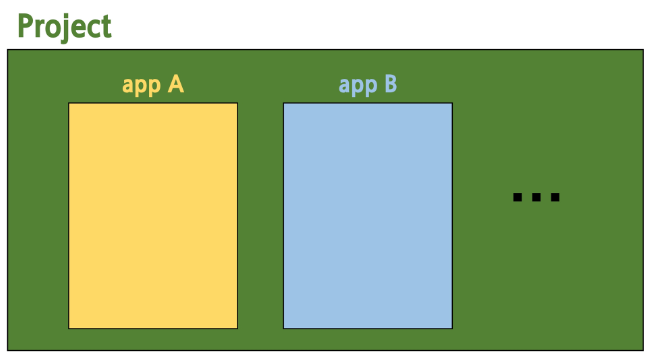
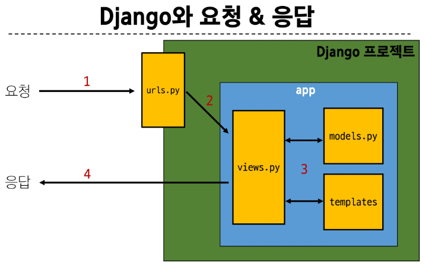
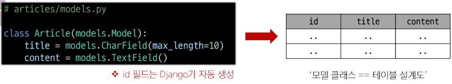
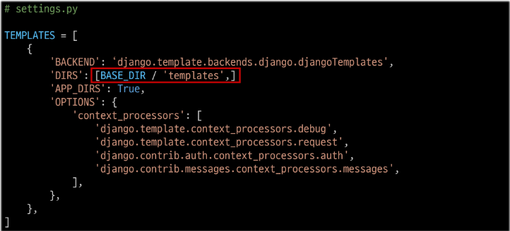

# Django

Django 프로젝트 생성 루틴

```bash
# 1. 가상환경 생성
python -m venv venv
# 2. 가상환경 활성화
source venv/Scripts/activate
# 3. Django 설치
# Python 3.10 이상일 경우 Django 5 버전이 설치됨
pip install Django
# 4. 의존성 파일 생성
pip freeze > requirements.txt
# 5. 첫 add 전에 .gitignore 파일 생성
touch .gitignore
# 6. git 저장소 생성
git init
# 7. Django 프로젝트 생성
django-admin startproject [project_name] .
# 뒤에 .을 붙이면 해당 폴더에서 프로젝트가 생성됨
# 8. Django 서버 실행
python manage.py runserver
```

9. 서버 확인
   [http://127.0.0.1:8000/](http://127.0.0.1:8000/) 접속 후 확인

## Design Pattern

소프트웨어 설계에서 발생하는 문제를 해결하기 위한 일반적인 해결책  
공통적인 문제를 해결하는데 쓰이는 형식화 된 관행  
-> '어플리케이션의 구조는 이렇게 구성하자'라는 관행

### MVC 디자인 패턴

Model, View, Controller  
어플리케이션을 구조화하는 대표적인 패턴  
데이터 & 사용자 인터페이스 & 비즈니스 로직을 분리  
-> 시각화 요소와 뒤에서 실행되는 로직을 서로 영향 없이, 독립적이고 쉽게 유지보수 할 수 있는 어플리케이션을 만들기 위해

### MTV 디자인 패턴

Model, Template, View  
Django에서 어플리케이션을 구조화하는 패턴  
기존 MVC 패턴과 동일하나 단순히 명칭을 다르게 정의한 것  
View -> Template, Controller -> View

### 프로젝트와 앱



Django project

- 어플리케이션의 집합
- DB 설정, URL 연결, 전체 앱 설정 등을 처리

Django application

- 독립적으로 작동하는 기능 단위 모듈
- 각자 특정한 기능을 담당하며 다른 앱들과 함께 하나의 프로젝트를 구성

앱을 사용하기 위한 순서

1. 앱 생성

- 앱의 이름은 복수형으로 지정하는 것을 권장

```bash
python manage.py startapp articles
```

2. 앱 등록

- 반드시 앱을 생성한 후에 등록해야 함(등록 후 생성은 불가능)

```python
# settings.py

INSTALLED_APPS = ['articles', 'django.contrib.admin', ...]
```

### 프로젝트 구조

settings.py

- 프로젝트의 모든 설정을 관리

urls.py

- 요청 들어오는 url에 따라 이에 해당하는 적절한 views를 연결

** init **.py

- 해당 폴더를 패키지로 인식하도록 설정하는 파일

asgi.py

- 비동기식 웹 서버와의 연결 관련 설정

wsgi.py

- 웹 서버와의 연결 관련 설정

manage.py

- Django 프로젝트와 다양한 방법으로 상호작용하는 커맨드라인 유틸리티

### 앱 구조

admin.py

- 관리자용 페이지 설정

models.py

- DB와 관련된 Model을 정의
- MTV 패턴의 M

views.py

- http 요청을 처리하고 해당 요청에 대한 응답을 반환
- MTV 패턴의 V

apps.py

- 앱의 정보가 작성된 곳

tests.py

- 프로젝트 테스트 코드를 작성하는 곳

## 요청과 응답



1. URLs

```python
# urls.py

from django.contrib import admin
from django.urls import path
from articles import views

urlpatterns = [
    path('admin/', admin.site.urls),
    path('index/', views.index),
]
```

http://127.0.0.1:8000/index/로 요청이 왔을 때 views 모듈의 view 함수 index를 호출  
_URL 경로는 반드시 /로 끝나야 함_

2. View

```python
# views.py

from django.shortcuts import render

def index(request):
  return render(request, 'articles/index.html')
```

- 특정 경로에 있는 template과 request 객체를 결합해 응답 객체를 반환하는 index view 함수 정의
- 모든 view 함수는 첫번째 인자로 request 요청 객체를 필수적으로 받음
- 매개변수 이름이 request가 아니어도 되지만 그렇게 작성하지 않음

3. Template

- articles 앱 폴더 안에 templates 폴더 생성
  - 폴더명은 반드시 templates여야 하며 개발자가 직접 생성해야 함
- templates 폴더 안에 articles 폴더 생성
- articles 폴더 안에 탬플릿 파일 생성

Django에서 template을 인식하는 경로 규칙

- app 폴더 / templates / articles / index.html
- app 폴더 / templates / example.html

Django는 app 폴더 / templates / 를 기본 경로로 인식하기 때문에 view 함수에서 template 경로 작성 시 이 지점 이후의 경로를 작성해야 함

## Django Template System

데이터 표현을 제어하면서, 표현과 관련된 부분을 담당

HTML의 콘텐츠를 변수 값에 따라 바꾸고 싶다면?

```python
def index(request):
  context = {
    'name' : 'jane'
  }
  return render(request, 'articles/index.html', context)
```

```html
<body>
  <h1>Hello, {{name}}</h1>
</body>
```

### DTL(Django Template Language)

Template에서 조건, 반복, 변수 등의 프로그래밍적 기능을 제공하는 시스템

1. Variable

- renter 함수의 세번째 인자로 딕셔너리 데이터 사용
- 딕셔너리 key에 해당하는 문자열이 template에서 사용 가능한 변수명이 됨
- `.`을 사용하여 변수 속성에 접근할 수 있음

2. Filters

- 표시할 변수를 수정할 때 사용(변수 + | + 필터)
- chained(연결)이 가능하며 일부 필터는 인자를 받기도 함
- 약 60개의 built-in template filters를 제공

3. Tags

- 반복 또는 논리를 수행하여 제어 흐름을 만듦
- 일부 태그는 시작과 종료 태그가 필요
- 약 24개의 built-in template tags를 제공

4. Comments

- DTL에서의 주석

## 탬플릿 상속

페이지의 공통요소를 포함하고, 하위 템플릿이 재정의 할 수 있는 공간을 정의하는  
기본 skeleton 템플릿을 작성하여 상속 구조를 구축

기본 템플릿 구조의 한계

- 만약 모든 템플릿에 bootstrap을 적용하려면?
- 모든 템플릿에 bootstrap CDN을 작성해야 하나?

'extends' tag

- 자식 템플릿이 부모 템플릿을 확장한다는 것을 알림

'block'tag

- 하위 템플릿에서 재정의 할 수 있는 블록을 정의
- 상위 템플릿에 작성하며 하위 템플릿이 작성할 수 있는 공간을 지정

## HTML form(요청과 응답)

HTMl 'form'은 HTTP 요청을 서버에 보내는 가장 편리한 방법

### 'form' element

- 사용자로부터 할당된 데이터를 서버로 전송
- 웹에서 사용자 정보를 입력하는 여러 방식
- text, password, checkbox 등 제공

### 'action' & 'method'

form의 핵심 속성 2가지  
데이터를 어디(action)로 어떤 방식(method)으로 요청할지

action

- 입력 데이터가 전송될 URL을 지정 (목적지)
- 만약 이 속성을 지정하지 않으면 데이터는 현재 form이 있는 페이지의 URL로 보내짐
  method
- 데이터를 어떤 방식으로 보낼 것인지 정의
- 데이터의 HTTP request methods(GET, POST)를 지정

### 'input' element

사용자의 데이터를 입력받을 수 있는 요소  
type 속성 값에 따라 다양한 유형의 입력 데이터를 받음

'name' attribute

- input의 핵심 속성
- 입력한 데이터에 붙이는 이름(key)
- 데이터를 제출했을 때 서버는 name 속성에 설정된 값을 통해서만 사용자가 입력한 데이터에 접근할 수 있음

Query String Parameters

- 사용자의 입력 데이터를 URL 주소에 파라미터를 통해 서버로 보내는 방법
- 문자열은 & 로 연결된 key=value 쌍으로 구성되며, 기본 URL과는 물음표('?')로 구분됨

### HTTP request 객체

form으로 전송한 데이터 뿐만 아니라 모든 요청 관련 데이터가 담겨 있음(view 함수의 첫번째 인자)

form 데이터를 가져오는 방법

```python
request.GET.get('message')
```

## Django URLs

URL dispatcher(운항 관리자, 분배기)

- URL 패턴을 정의하고 해당 패턴이 일치하는 요청을 처리할 view 함수를 연결(매핑)

## 변수와 URL

현재 URL 관리의 문제점

- 템플릿의 많은 부분이 중복되고, URL의 일부만 변경되는 상황이라면 계속해서 비슷한 URL과 템플릿을 작성해 나가야 할까?

### Variable Routing

URL 일부에 변수를 포함시키는 것  
변수는 view 함수의 인자로 전달할 수 있음

작성법

```python
# path_converter:variable_name
path<'articles/<int:num>/', views.detail>
```

## Django URLs

URL dispatcher

- URL 패턴을 정의하고 해당 패턴이 일치하는 요청을 처리할 view 함수를 연결(매핑)

### App과 URL

APP URL mapping

- 각 앱에 URL을 정의하는 것
- 프로젝트와 각 앱이 URL을 나누어 관리를 편하게 하기 위함

include()

- 프로젝트 내부 앱들의 URL을 참조할 수 있도록 매핑하는 함수
- URL의 일치하는 부분까지 잘라내고, 남은 문자열 부분은 후속 처리를 위해 include된 URL로 전달

```python
from django.contrib import admin
from django.urls import path, include

urlpatterns = [
    path('admin/', admin.site.urls),
    path('articles/', include('articles.urls')),
    path('pages/', include('pages.urls')),
]
```

### URL 이름 지정

url 구조 변경에 따른 문제점

- 기존 'articles/' 주소가 'articles/index/'로 변경됨에 따라 해당 주소를 사용하는 모든 위치를 찾아가 변경해야 함
- URL에 이름을 지어주면 이름만 기억하면 되지 않을까?

```python
path('index/', views.index, name='index)
```

-> 이 방법을 Naming URL patterns라고 함

'url' tag

```html

```

주어진 URL 패턴의 이름과 일치하는 절대 경로 주소를 반환

## URL 이름 공간

URL 이름 지정 후 남은 문제

- articles앱의 url 이름과 pages 앱의 url 이름이 같은 상황
- 단순 이름만으로는 완벽하게 분리할 수 없음
- 이름에 성을 붙이면 해결 가능

```python
app_name = 'articles'  # app_name이라는 이름은 고정
urlpatterns = [
  ...,
]
```

```html
 -> 
```

## Model

Django Model

- DB의 테이블을 정의하고 데이터를 조작할 수 있는 기능들을 제공
- 테이블 구조를 설계하는 청사진(blueprint)

### Model class



- django.db.models 모듈의 Model이라는 부모 클래스를 상속받음
- Model은 model에 관련된 모든 코드가 이미 작성되어있는 클래스
- 개발자는 가장 중요한 테이블 구조를 어떻게 설계할지에 대한 코드만 작성하도록 하기 위한 것(상속을 활용한 프레임워크의 기능 제공)
- 클래스 변수병 -> 테이블의 각 필드(열) 이름
- model Field class -> 테이블 필드의 데이터 타입
- model Field 클래스의 키워드 인자(필드 옵션) -> 테이블 필드의 제약조건 관련 설정
- 최종 테이블 이름은 app이름\_모델클래스이름(소문자로 통일됨)

### Migrations

model 클래스의 변경사항(필드 생성, 수정, 삭제 등)을 DB에 최종 반영하는 방법

Migrations 핵심 명령어 2가지

```bash
python manage.py makemigrations
# model class를 기반으로 최종 설계도(migration) 작성
python manage.py migrate
# 최종 설계도를 DB에 전달하여 반영
```

이미 생성된 테이블에 필드를 추가해야 한다면?

```python
from django.db import models


class Article(models.Model):
    title = models.CharField(max_length=10)
    content = models.TextField()
    created_at = models.DateTimeField(auto_now_add=True)
    updated_at = models.DateTimeField(auto_now=True)
```

이미 기존 테이블이 존재하기 때문에 필드를 추가할 때 필드의 기본 값 설정이 필요

1. 현재 대화를 유지하면서 직접 기본 값을 입력하는 방법

- 아무것도 입력하지 않고 enter를 누르면 Django가 제안하는 기본 값으로 설정

2. 현재 대화에서 나간 후 models.py에 기본 값 관련 설정을 하는 방법

migrations 과정 종료 후 2번째 migration파일이 생성됨을 확인  
Django는 설계도를 쌓아가면서 추후 문제가 생겼을 시 복구하거나 되돌릴 수 있도록 함

### Model Field

DB테이블의 필드(열)을 정의하며, 해당 필드에 저장되는 데이터 타입과 제약조건을 정의

CharField()

- 길이의 제한이 있는 문자열을 넣을 때 사용
- 필드의 최대 길이를 결정하는 max_length는 필수 인자

TextField()

- 글자의 수가 많을 때 사용

DateTimeField()

- 날짜와 시간을 넣을 때 사용
- auto_now: 데이터가 저장될 때 마다 자동으로 날짜시간을 저장
- auto_now_add: 데이터가 처음 생성될 때만 자동으로 현재 날짜 시간을 저장

## Admin Site

Automatic admin interface

- Django는 추가 설치 및 설정 없이 자동으로 관리자 인터페이스를 제공
- 데이터 확인 및 테스트 등을 진행하는데 매우 유용

1. admin 계정 생성

- email은 선택사항이기 때문에 입력하지 않고 진행 가능
- 비밀번호 입력 시 보안상 터미널에 출력되지 않으니 무시하고 입력 이어가기

```bash
python manage.py createsuperuser
```

2. admin에 모델 클래스 등록
   admin.py에 작성한 모델 클래스를 등록해야만 admin site에서 확인 가능

```python
from django.contrib import admin
from .models import Article


admin.site.register(Article)
```

## 참고

### 가상 환경을 사용하는 이유

의존성 관리

- 라이브러리 및 패키지를 각 프로젝트마다 독립적으로 가용 가능

팀 프로젝트 협업

- 모든 팀원이 동일한 환경과 의존성 위에서 작업하여 버전간 충돌을 방지

### LTS(Long-Term Support)

프레임워크나 라이브러리 등의 소프트웨어에서 장기간 지원되는 안정적인 버전을 의미  
기업이나 대규모 프로젝트에서는 소프트웨어 업그레이드에 많은 비용과 시간이 필요하기 대문에 안정적이고 장기간 지원되는 버전이 필요  
[https:www.djangoproject.com/download/](https:www.djangoproject.com/download/)

### Django는 Full Stack Framework인가?

맞음  
하지만 Django가 제공하는 Frontend 기능은 다른 전문적인 Frontend Framework들에 비해서 매우 미흡  
엄밀히 따지면 Full Stack 영역에서 Backend에 속함  
Full Stack 혹은 Backend Framework라 부름

### 추가 템플릿 경로 지정



BASE_DIR

- settings에서 경로지정을 편하게 하기 위해 최상단 지점을 지정해놓은 변수

### DTL 주의사항

Python처럼 일부 프로그래밍 구조를 사용할 수 있지만 명칭을 그렇게 설계했을 뿐 Python 코드로 실행되는 것이 아니며 Python과 관련 없음  
프로그래밍적 로직이 아니라 표현을 위한 것임을 명심  
프로그래밍적 로직은 되도록 view 함수에서 작성 및 처리할 것  
[공식문서](https://docs.djangoproject.com/en/4.2/ref/templates/builtins/)를 참고해 다양한 태그와 필터 사용해보기

### Trailing Slashes

Django는 URL 끝에 '/'가 없다면 자동으로 붙임  
기술적인 측면에서, foo.com/bar와 foo.com/bar/는 서로 다른 URL

- 검색 엔진 로봇이나 웹트래픽 분석 도구에서는 이 두 주소를 서로 다른 페이지로 보기 때문  
  그래서 Django는 검색 엔진이 혼동하지 않게 하기 위해 무조건 붙이는 것을 선택  
  그러나 모든 프레임워크가 이렇게 동작하는 것은 아니니 주의

### instance를 가져왔을 때 object..이 아니라 특정 이름이 보이도록 하고 싶다면?

```python
# models.py

class Author(models.Model):
    fieldname = ...
    def __str__(self):
        return self.fieldname
# 이렇게 하면 object..대신 해당 instance의 fieldname 값이 대신 보인다.
```
