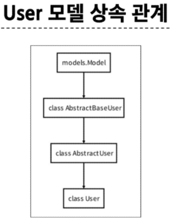

# Authentication System

## Cookie & Session

HTTP

- HTML 문서와 같은 리소스들을 가져올 수 있도록 해주는 규약
- 웹(WWW)에서 이루어지는 모든 데이터 교환의 기초

HTTP 특징

- 비 연결 지향(connectionless)
  - 서버는 요청에 대한 응답을 보낸 후 연결을 끊음
- 무상태(stateless)
  - 연결을 끊는 순간 클라이언트와 서버 간의 통신이 끝나며 상태 정보가 유지되지 않음

=> 상태를 유지하기 위한 기술이 필요

### Cookie

서버가 사용자의 웹 브라우저에 전송하는 작은 데이터 조각  
클라이언트 측에서 저장되는 작은 데이터 파일이며, 사용자 인증, 추적, 상태 유지 등에 사용되는 데이터 저장 방식


쿠키 사용 원리

1. 브라우저(클라이언트)는 쿠키를 KEY-VALUE의 데이터 형식으로 저장
2. 이렇게 쿠키를 저장해 놓았다가, 동일한 서버에 재요청 시 저장된 쿠키를 함께 전송  
   =>쿠키는 두 요청이 동일한 브라우저에서 들어왔는지 아닌지를 판단할 때 주로 사용됨

- 이를 이용해 사용자의 로그인 상태를 유지할 수 있음
- 상태가 없는(stateless) HTTP 프로토콜에서 상태 정보를 기억시켜주기 때문

쿠키 사용 목적

1. 세션 관리(Session management)

- 로그인, 아이디 자동완성, 공지 하루 안보기, 팝업 체크, 장바구니 등의 정보 관리

2. 개인화(Personalization)

### Session

서버측에서 생성되어 클라이언트와 서버 간의 상태를 유지  
상태 정보를 저장하는 데이터 저장 방식  
=> 쿠키에 세션 데이터를 저장하여 매 요청시마다 세션 데이터를 함께 보냄

세션 작동 원리

1. 클라이언트가 로그인을 하면 서버가 session 데이터를 생성 후 저장
2. 생성된 session 데이터에 인증할 수 있는 session id를 발급
3. 발급한 session id를 클라이언트에 응답
4. 클라이언트는 응답 받은 session id를 쿠키에 저장
5. 클라이언트가 다시 동일한 서버에 접속하면 요청과 함께 쿠키(session id가 저장된)를 서버에 전달
6. 쿠키는 요청 때마다 서버에 함께 전송되므로 서버에서 session id를 확인해 로그인 되어있다는 것을 알도록 함

서버 측에서는 세션 데이터를 생성 후 저장하고 이 데이터에 접근할 수 있는 세션 ID를 생성  
이 ID를 클라이언트 측으로 전달하고, 클라이언트는 쿠키에 이 ID를 저장  
이후 클라이언트가 같은 서버에 재요청 시마다 저장해 두었던 쿠키도 요청과 함께 전송  
=> 예를 들어 로그인 상태 유지를 위해 로그인되어있다는 사실을 입증하는 데이터를 매 요청마다 계속해서 보내는 것

쿠키와 세션의 목적

- 서버와 클라이언트 간의 상태를 유지

### 참고

쿠키 종류별 Lifetime

1. Session cookie

- 현재 세션이 종료되면 삭제됨
- 브라우저 종료와 함께 세션이 삭제됨

2. Persistent cookies

- Expires 속성에 지정된 날짜 혹은 Max_Age 속성에 지정된 기간이 지나면 삭제됨

세션 in Django

- Django는 'database-backed sessions' 저장 방식을 기본 값으로 사용
- session 정보는 DB의 django_session 테이블에 저장됨
- Django는 요청 안에 특정 session id를 포함하는 쿠키를 사용해서 각각의 브라우저와 사이트가 연결된 session 데이터를 알아냄  
  => Django는 우리가 session 메커니즘(복잡한 작동원리)의 대부분을 생각하지 않게끔 많은 도움을 줌

## Authentication System

Django Authentication System

- 사용자 인증과 관련된 기능을 모아 놓은 시스템

Authentication

- 사용자가 자신이 누구인지 확인하는 것

### 사전 준비

accounts app 생성 및 등록  
auth와 관련된 경로나 키워드들은 django 내부적으로 accounts라는 이름으로 사용하고 있기 때문에 되도록 'accounts'로 지정하는 것을 권장

### Custom User model

Custom User model로 대체하기  
django가 기본적으로 제공하는 User model이 아닌 직접 작성한 User model을 사용하기 위해

왜 User 클래스를 대체해야 하는가?

- 우리는 지금까지 User 클래스 정의 없이 내장된 auth 앱에 작성된 User 클래스를 사용했음
- 별도의 설정 없이 사용할 수 있어 간편하지만, 개발자가 직접 수정할 수 없는 문제가 존재

#### 대체하기

1. AbstractUser 클래스를 상속받는 커스텀 User 클래스 작성  
   기존 User 클래스도 AbstarctUser를 상속받기 때문에 이렇게 하면 커스텀 User 클래스도 기존 User 클래스와 완전히 같은 모습을 가지게 됨

```python
# accounts/models.py
from django.contrib.auth.models import AbstractUser

class User(AbstractUser):
    pass
```

2. django 프로젝트가 사용하는 기본 User 모델을 우리가 작성한 User 모델로 지정  
   수정 전 기본 값은 'auth.User'

```python
# settings.py

AUTH_USER_MODEL = 'accounts.User'  # Django 프로젝트의 User를 나타내는 데 사용하는 모델을 지정
```

**주의**
프로젝트 중간에 AUTH_USER_MODEL을 변경할 수 없음

- 이미 프로젝트가 진행되고 있을 경우 데이터베이스 초기화 후 진행

=> 프로젝트를 시작하며 반드시 User 모델을 대체해야 한다.

- Django는 새 프로젝트를 시작하는 경우 커스텀 User 모델을 설정하는 것을 강력하게 권장
- 커스텀 User 모델은 기본 User 모델과 동일하게 작동하면서도 필요한 경우 나중에 맞춤 설정할 수 있기 때문
- 단, User 모델 대체 작업은 프로젝트의 모든 migrations 혹은 첫 migrate를 실행하기 전에 이 작업을 마쳐야 함

3. admin site에 대체한 User 모델 등록
   기본 User 모델이 아니기 때문에 등록하지 않으면 출력되지 않기 때문

```python
# accounts/admin.py
from django.contrib import admin
from django.contrib.auth.admin import UserAdmin
from .models import User

admin.site.register(User, UserAdmin)
# admin.site.register(User)  # 이렇게 해도 무방하다
```

### Login

Session을 Create하는 과정

AuthenticationForm()

- 로그인 인증에 사용할 데이터를 입력 받는 built-in form
<!-- 56page부터 다시 정리 -->

### Logout

Session을 Delete하는 과정

logout(request)

- 현재 요청에 대한 Session Data를 DB에서 삭제
- 클라이언트의 쿠키에서도 Session id를 삭제

<!-- 69page까지 정리 -->

### Template with Authentication data

템플릿에서 인증 관련 데이터를 출력하는 방법

현재 로그인 되어있는 유저 정보 출력하기

- user라는 context 데이터를 사용할 수 있는 이유는?
- django가 미리 준비한 context 데이터가 존재하기 때문(context processors)

context processors

- 템플릿이 렌더링 될 때 호출 가능한 context data list
- 작성된 context data는 기본적으로 템플릿에서 사용 가능한 변수로 포함됨
- django에서 자주 사용하는 데이터 목록을 미리 템플릿에 로드해둔 것

```python
# settings.py

TEMPLATES = [
    {
        'OPTIONS': {
            'context_processors': [
                'django.template.context_processors.debug',
                'django.template.context_processors.request',
                'django.contrib.auth.context_processors.auth',
                'django.contrib.messages.context_processors.messages',
            ],
        },
    },
]
```

### 참고



'AbstractUser' class

- 관리자 권한과 함께 완전한 기능을 가지고 있는 User model을 구현하는 추상 기본클래스

Abstract base classes(추상 기본 클래스)

- 몇 가지 공통 정보를 여러 다른 모델에 넣을 때 사용하는 클래스
- 데이터베이스 테이블을 만드는 데 사용되지 않으며, 대신 다른 모델의 기본 클래스로 사용되는 경우 해당 필드가 하위 클래스의 필드에 추가됨

User 모델 대체하기 TIP

- User 모델 대체 순서 숙지가 어려우면 해당 공식문서를 보며 순서대로 진행하는 것을 권장
