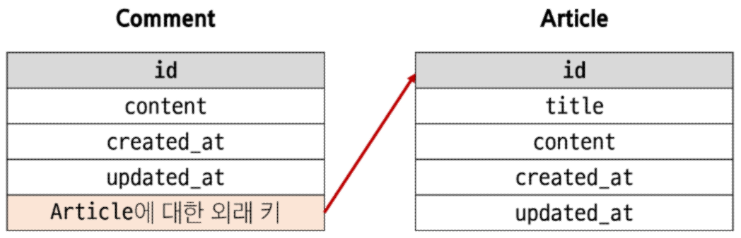

# Many to one relationships

한 테이블의 0개 이상의 레코드가 다른 테이블의 레코드 한 개와 관련된 관계  
ex)Comment(N) - Article(1)

- 0개 이상의 댓글은 1개의 게시글에 작성될 수 있다.  
  

ForeignKey()

- N:1 관계 설정 모델 필드

## 댓글 모델 정의

- ForeignKey 클래스의 인스턴스 이름은 참조하는 모델 클래스 이름의 단수형으로 작성하는 것을 권장
  - 참조 대상 클래스 이름 + '\_' + 클래스 이름 형식으로 만들어지기 때문
- 외래 키는 ForeignKey 클래스를 작성하는 위치와 관계없이 테이블 필드 마지막에 생성됨

```python
ForeignKey(to, on_delete)
# 참조하는 모델 class 이름, 외래 키가 참조하는 객체가 사라졌을 때, 외래 키를 가진 객체를 어떻게 처리할 지 정의하는 설정(데이터 무결성을 위함)
# https://docs.djangoproject.com/en/5.0/ref/models/fields/#arguments
```

on_delete의 "CASCADE"

- 부모 객체(참조된 객체)가 삭제됐을 때 이를 참조하는 객체도 삭제

## 댓글 생성 연습

```python
# 게시글 생성
Article.objects.create(title='title', content='content')

comment = Comment()
comment.content = 'first comment'
comment.save()  # 오류 발생

article = Article.objects.get(pk=1)
comment.article = article  # comment.article_id = article.pk처럼 pk 값을 직접 외래 키 column에 넣어줄 수 있지만 권장하지 않음
comment.save()
```

## 관계 모델 참조

### 역참조

N:1 관계에서 1에서 N을 참조하거나 조회하는 것

- N은 외래 키를 가지고 있어 물리적으로 참조가 가능하지만 1은 N에 대한 참조 방법이 존재하지 않아 별도의 역참조 기능이 필요

역참조 사용 예시

```python
article.comment_set.all()
# 모델 인스턴스.related_manager.QuerySet API()
# 특정 게시글에 작성된 댓글 전체를 조회하는 명령
```

related manager

- N:1 혹은 M:N 관계에서 역참조 시에 사용하는 매니저
- objects 매니저를 통해 QuerySet API를 사용했던 것 처럼 related manager를 통해 QuerySet API를 사용할 수 있게 됨

related manager 이름 규칙

- N:1 관계에서 생성되는 Related manager의 이름은 참조하는 "모델명\_set" 이름 규칙으로 만들어짐
- 특정 댓글의 게시글 참조
  - comment.article
- 특정 게시글의 댓글 목록 참조
  - article.comment_set.all()

## 댓글 구현

### CREATE

CommentForm 정의

```python
# articles.forms.py
from .models import Comment


class CommentForm(forms.ModelForm):
    class Meta:
        model = Comment
        fields = ('content', )  # 외래 키 값을 설정하지 못하도록
```

comment_create 함수 생성

```python
# articles.views.py
def create_comment(request, pk):
    article = Article.objects.get(pk=pk)
    comment_form = CommentForm(request.POST)
    if comment_form.is_valid():
        comment = comment_form.save(commit=False)  # DB에 저장하지 않고 인스턴스만 반환
        comment.article = article
        comment.save()
        return redirect('articles:detail', pk)
    context = {
        'article': article,
        'comment_form': comment_form,
    }
    return render(request, 'articles/datail.html', context)
```

### READ

```python
def detail(request, pk):
    article = Article.objects.get(pk=pk)
    comments = article.comment_set.all()
    comment_form = CommentForm()
    context = {
        'article': article,
        'comments': comments,
        'comment_form': comment_form,
    }
    return render(request, 'articles/detail.html', context)
```

### DELETE

```python
# articles/urls.py

app_name = 'articles'
urlpatterns = [
    path('', views.index, name='index'),
    path('<int:pk>/', views.detail, name='detail'),
    path('create/', views.create, name='create'),
    path('<int:pk>/delete/', views.delete, name='delete'),
    path('<int:pk>/update/', views.update, name='update'),
    path('<int:pk>/create_comment/', views.create_comment, name='create_comment'),
    path('<int:article_pk>/comments/<int:comment_pk>/delete/', views.delete_comment, name='delete_comment'),
    # 인자가 2개가 필요가 없는데 왜 2개를 사용하는가?
    # url patterns의 전체적인 구조를 유지하기 위해
    # 위에 있는 링크들은 대부분 첫번째 변수는 게시글 조회를 위해 사용되고 있으므로
    # 인자를 1개만 사용하면 해당 구조가 깨져버림
]
```

## 참고

댓글 개수 출력하기

- DTL filter - 'length' 사용

```html
{{ comments|length }} {{ article.comment_set.all|length }}
```

- QuerySet API - 'count()'사용

```html
{{ article.comment_set.count }}
```

## User와 다른 모델 간의 모델 관계 설정

### User(1) & Article(N)

- 0개 이상의 게시글은 1명의 회원에 의해 작성될 수 있음

#### user 외래 키 정의

```python
# articles/models.py
from django.conf import settings


class Article(models.Model):
    user = models.ForeignKey(settings.AUTH_USER_MODEL, on_delete=models.CASCADE)
    title = models.CharField(max_length=10)
    content = models.TextField()
    created_at = models.DateTimeField(auto_now_add=True)
    updated_at = models.DateTimeField(auto_now=True)
```

|           | get_user_model()                | settings.AUTH_USER_MODEL |
| --------- | ------------------------------- | ------------------------ |
| 반환 값   | User Object(객체)               | 'accounts.User'(문자열)  |
| 사용 위치 | models.py가 아닌 다른 모든 위치 | models.py                |

이렇게 사용하는 이유

- django 프로젝트 내부적인 구동 순서와 반환 값에 따른 이유
- django 실행 순서상 models.py의 순서가 빠른 편
- get_user_model()을 사용하기 위해선 객체를 생성할 수 있어야 하는데 models.py의 순서에는 해당 객체가 존재하지 않아서 오류가 생김

Migration

- 기존에 테이블이 있는 상태에서 Foreign Key를 추가하면 makemigrations에서 문제 발생
- 기본적으로 모든 필드에는 NOT NULL 제약조건이 있기 때문에 데이터가 없이는 새로운 필드가 추가되지 못함

```bash
$ python manage.py makemigrations
It is impossible to add a non-nullable field 'user' to article without specifying a default. This is because
the database needs something to populate existing rows.
Please select a fix:
 1) Provide a one-off default now (will be set on all existing rows with a null value for this column)
 2) Quit and manually define a default value in models.py.
Select an option:
```

- 1을 입력하고 Enter 진행
- 추가하는 외래 키 필드에 어떤 데이터를 넣을 것인지 직접 입력해야 함

```bash
Please enter the default value as valid Python.
The datetime and django.utils.timezone modules are available, so it is possible to provide e.g. timezone.now
as a value.
Type 'exit' to exit this prompt
```

- 마찬가지로 1을 입력하고 Enter 진행
  - 기존에 작성된 게시글이 있다면 모두 1번 회원이 작성한 것으로 처리

#### 게시글 CREATE

기존 ArticleForm의 출력이 변화되었을 것(외래 키가 추가되었으므로)  
User 모델에 대한 외래 키 데이터 입력을 받기 위해 불필요한 input이 출력됨

```python
# form에서 외래 키 입력 부분 제외
# articles/forms.py


class ArticleForm(forms.ModelForm):
    class Meta:
        model = Article
        # fields = '__all__'
        fields = ('title', 'content', )
```

```python
# 앞서 테이블에서 외래 키를 따로 입력해줬던 과정 동일하게 진행, 단 pk를 받아올 필요가 없다는 차이가 존재
# articles/views.py
@login_required
def create(request):
    if request.method == 'POST':
        form = ArticleForm(request.POST)
        if form.is_valid():
            article = form.save(commit=False)
            article.user = request.user
            article.save()
            return redirect('articles:detail', article.pk)
    else:
        ...
```

#### 게시글 READ

각 게시글 작성자의 이름 출력

```html
<!-- articles/index.html -->

<p>작성자: {{ article.user }}</p>
... 
```

#### 게시글 UPDATE

본인의 게시글만 수정할 수 있도록 개선

```python
# articles/views.py

@login_required
def update(request, pk):
    article = Article.objects.get(pk=pk)
    if request.user == article.user:  # 여기서 비교
        if request.method == 'POST':
            form = ArticleForm(request.POST, instance=article)
            if form.is_valid():
                form.save()
                return redirect('articles:detail', article.pk)
        else:
            form = ArticleForm(instance=article)
    else:
        return redirect('articles:index')  # 게시글 작성자가 아니면 return
    context = {
        'form': form,
        'article': article,
    }
    return render(request, 'articles/update.html', context)
```

해당 게시글 작성자가 아니라면 수정/삭제 버튼을 출력하지 않도록 설정

```html
<!-- articles/detail.html -->

  <a href="">UPDATE</a>
  <form action="" method="POST">
    
    <input type="submit" value="DELETE">
  </form>

```

#### 게시글 DELETE

본인의 게시글만 삭제할 수 있도록 설정

```python
@login_required
def delete(request, pk):
    article = Article.objects.get(pk=pk)
    if request.user == article.user:  # 삭제를 요청한 사용자와 게시글 작성자 비교
        article.delete()
    return redirect('articles:index')
```

### User(1) & Comment(N)

- 0개 이상의 댓글은 1명의 회원에 의해 작성될 수 있음

#### user 외래 키 정의

```python
# articles/models.py

class Comment(models.Model):
    article = models.ForeignKey(Article, on_delete=models.CASCADE)
    user = models.ForeignKey(settings.AUTH_USER_MODEL, on_delete=models.CASCADE)
    content = models.CharField(max_length=200)
    created_at = models.DateTimeField(auto_now_add=True)
    updated_at = models.DateTimeField(auto_now=True)
```

Article에서와 마찬가지로 makemigrations->migrate 과정 진행

#### 댓글 CREATE

댓글 작성 시 작성자 정보가 함께 저장될 수 있도록 설정

```python
# articles/views.py

def comments_create(request, pk):
    article = Article.objects.get(pk=pk)
    comments = article.comment_set.all()
    comment_form = CommentForm(request.POST)
    if comment_form.is_valid():
        comment = comment_form.save(commit=False)
        comment.article = article
        comment.user = request.user
        comment.save()
        return redirect('articles:detail', article.pk)
    ...
```

#### 댓글 READ

댓글 출력 시 댓글 작성자와 함께 출력

```html
<!-- articles/detail.html -->

    <li>
    {{ comment.user }} - {{ comment.content }}
    <form action="" method="POST" style="display: inline;">
        
        <input type="submit" value="삭제">
    </form>
    </li>

```

#### 댓글 DELETE

본인의 댓글만 삭제할 수 있도록 설정

```python
# articles/views.py

def comments_delete(request, article_pk, comment_pk):
    comment = Comment.objects.get(pk=comment_pk)
    if request.user == comment.user:
        comment.delete()
    return redirect('articles:detail', article_pk)
```

해당 댓글의 작성자가 아니라면 댓글 삭제 버튼을 출력하지 않음

```html
<!-- articles/detail.html -->
<ul>

    <li>
    {{ comment.user }} - {{ comment.content }}
    
        <form action="" method="POST" style="display: inline;">
        
        <input type="submit" value="삭제">
        </form>
    
    </li>

</ul>
```
