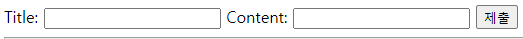

# Django Form

## 개요
HTML 'form'  
- 지금까지 사용자로부터 데이터를 받기 위해 활용한 방법  
- 그러나 비정상적, 혹은 악의적인 요청을 필터링 할 수 없음  
- -> 유효한 데이터인지에 대한 확인 필요  

유효성 검사  
- 수집한 데이터가 정확하고 유효한지 확인하는 과정

유효성 검사 구현
- 유효성 검사를 구현하기 위해서는 입력 값, 형식, 중복, 범위, 보안 등 많은 것들을 고려해야 함
-  이런 과정과 기능을 직접 개발하는 것이 아닌 Django가 제공하는 Form을 사용

## Django Form
사용자 입력 데이터를 수집하고, 처리 및 유효성 검사를 수행하기 위한 도구  
-> 유효성 검사를 단순화하고 자동화 할 수 있는 기능을 제공

```python
# app_name/forms.py
from django import forms

class ArticleForm(forms.form):
    title = forms.CharField(max_length=10)
    content = forms.CharField()
```

```python
# app_name/views.py
from .forms import ArticleForm

def new(request):
    form = ArticleForm()
    context = {
        'form': form
    }
    return render(request, 'app_name/new.html', context)
```
```html
<form ...>
    
    {{ form }}
    <!-- {{ form.as_p }} -->
    <!-- label, input 쌍을 특정 HTML 태그(현재는 p)로 감싸는 옵션 -->
    <input type="submit">
</form>
```


## Widgets
HTML 'input' element의 표현을 담당  
단순히 input 요소의 속성 및 출력되는 부분을 변경하는 것
```python
# app_name/forms.py
from django import forms

class ArticleForm(forms.Form):
    title = forms.CharField(max_length=10)
    content = forms.CharField(widget=forms.Textarea)
```

## Django ModelForm
Form
- 사용자 입력 데이터를 DB에 저장하지 않을 때
- ex. 로그인

ModelForm
- 사용자 입력 데이터를 DB에 저장해야 할 때
- ex. 게시글 작성, 회원가입  
Model과 연결된 Form을 자동으로 생성해주는 기능 제공

### Meta class
ModelForm의 정보를 작성하는 곳
```python
from django import forms
from .models import model_name

# class ArticleForm(forms.Form):
#     title = forms.CharField(max_length=10)
#     content = forms.CharField(widget=forms.Textarea)

class ArticleForm(forms.ModelForm):
    class Meta:  # 이름은 왜 Meta인가? DB의 Meta Data라는 용어에서 따옴
        model = model_name  # 어떤 모델과 연동?
        fields = '__all__'  # 그 모델에서 어떤 필드를 사용?
        # exclude = ('title', )  # 일부 필드 제거
        # __all__은 전체 필드 다 사용
```
exclude 속성을 사용하여 모델에서 포함하지 않을 필드를 지정할 수 있음  
```python
def create(request):
    form = ArticleForm(request.POST)
    if form.is_valid():
        article = form.save()
        return redirect('articles:detail', article.pk)
    context = {
        'form': form
    }
    return render(request, 'articles/new.html', context)
```
```python
is_valid()
```
여러 유효성 검사를 실행하고, 데이터가 유효한지 여부를 Boolean으로 반환

```python
def edit(request, pk):
    article = Article.objects.get(pk=pk)
    form = ArticleForm(instance=article)
    context = {
        'article': article,
        'form': form
    }
    return render(request, 'articles/edit.html', context)


def update(request, pk):
    article = Article.objects.get(pk=pk)
    form = ArticleForm(request.POST, instance=article)
    if form.isvalid():
        form.save()
        return redirect('articles:detail', article.pk)
    context = {
        'article': article, 
        'form': form
    }
    return render(request, 'articles/edit.html', context)
```

save() 메서드가 생성과 수정을 구분하는 법
- 키워드 인자 instance 여부를 통해 생성할 지, 수정할 지를 결정
```python
# create
form = ArticleForm(request.POST)
form.save

# UPDATE
form = ArticleForm(request.POST, instance=article)
form.save()
```

## Handling HTTP requests

### view 함수 구조 변화
new & create view 함수 간 공통점과 차이점  
공통점
- 데이터 생성을 구현하기 위함  
차이점
- new는 GET method 요청만, create는 POST method 요청만을 처리

둘을 합쳐보자
```python
def create(request):
    if request.method == 'POST':
        form = ArticleForm(request.POST)
        if form.is_valid():
            article = form.save()
            return redirect('articles:detail', article.pk)
    else:
        form = ArticleForm()
    context = {
        'form': form
    }
    return render(request, 'articles/new.html', context)
```

## 참고
Widget 응용
```

```