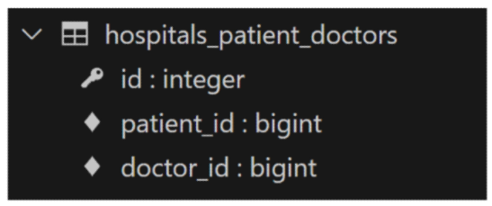

# Many to many relationships
한 테이블의 0개 이상의 레코드가 다른 테이블의 0개 이상의 레코드와 관련된 경우
- 양쪽 모두에서 N:1관계를 가지는 것

## N:1의 한계
한 명의 의사에게 여러 환자가 예약할 수 있도록 설계
```python
class Doctor(models.Model):
    name = models.TextField()
    def __str__(self):
        return f'{self.pk}번 의사 {self.name}'


class Patient(models.Model):
    doctor = models.ForeignKey(Doctor, on_delete=models.CASCADE)
    name = models.TextField()
    def __str__(self):
        return f'{self.pk}번 환자 {self.name}'
```
1번 환자 carol이 두 의사 모두에게 진료를 받고자 한다면 환자 테이블에 1번 환자 데이터가 중복으로 입력될 수 밖에 없음


- 동일한 환자지만 다른 의사에게도 진료 예약을 하기 위해서는 객체를 하나 더 만들어서 진행해야 함
- 또한 외래 키 컬럼에 '1, 2' 형태로 저장하는 것은 DB 타입 문제로 불가능  

=> 예약 테이블을 따로 만들어서 관리

## 중개 모델
환자의 외래 키를 삭제하고 별도의 예약 모델을 새로 생성
- 예약 모델은 의사와 환자에 각각 N:1 관계를 가짐  
```python
# 외래키 삭제
class Patient(models.Model):
    name = models.TextField()
    def __str__(self):
        return f'{self.pk}번 환자 {self.name}'


# 중개모델 작성
class Reservation(models.Model):
    doctor = models.ForeignKey(Doctor, on_delete=models.CASCADE)
    patient = models.ForeignKey(Patient, on_delete=models.CASCADE)
    def __str__(self):
        return f'{self.doctor_id}번 의사의 {self.patient_id}번 환자'
```


**Django에서는 'ManyToManyField'로 중개 모델을 자동으로 생성**

## ManyToManyField()
M:N 관계 설정 모델 필드
1. 환자 모델에 ManyToManyField 작성
- 의사 모델에 작성해도 상관 없으며 참조/역참조 관계만 잘 기억할 것
```python
class Doctor(models.Model):
    name = models.TextField()

    def __str__(self):
        return f'{self.pk}번 의사 {self.name}'


class Patient(models.Model):
    # ManyToManyField 작성
    doctors = models.ManyToManyField(Doctor)
    name = models.TextField()

    def __str__(self):
        return f'{self.pk}번 환자 {self.name}'


# Reservation Class 주석 처리
```
2. Migration 진행 후 생성된 테이블 확인


3. 의사, 환자 생성 및 관계 설정
```python
doctor1 = Doctor.objects.create(name='allie')
patient1 = Patient.objects.create(name='carol')
patient2 = Patient.objects.create(name='duke')

# patient1이 doctor1에게 예약
patient1.doctors.add(doctor1)
# patient1이 자신이 예약한 의사 목록 확인
patient1.doctors.all()
# doctor1이 자신에게 예약된 환자 목록 확인
doctor1.patient_set.all()
# doctor1이 patient2를 예약
doctor1.patient_set.add(patient2)
# 예약 취소하기
# doctor1이 patient1 진료 예약 취소
doctor1.patient_set.remove(patient1)
# patient2가 doctor1의 진료 예약 취소
patient2.doctor.remove(doctor1)
```
만약 예약 정보에 병의 증상, 예약일 등 추가 정보가 포함되어야 한다면?


## 'through' argument
중개 테이블에 추가 데이터를 사용해 M:N관계를 형성하려는 경우에 사용  
Reservation Class 재작성 및 through 설정
```python
class Patient(models.Model):
    doctors = models.ManyToManyField(Doctor, through='Reservation')
    name = models.TextField()
    def __str__(self):
        return f'{self.pk}번 환자 {self.name}'


class Reservation(models.Model):
    doctor = models.ForeignKey(Doctor, on_delete=models.CASCADE)
    patient = models.ForeignKey(Patient, on_delete=models.CASCADE)
    symptom = models.TextField()
    reserved_at = models.DateTimeField(auto_now_add=True)
    def __str__(self):
        return f'{self.doctor.pk}번 의사의 {self.patient.pk}번 환자'
```

예약 생성 방법
```python
# 방법 1
reservation1 = Reservation(doctor=doctor1, patient=patient1, symptom='headache')
reservation1.save()

# 방법 2
patient2.doctors.add(doctor1, through_defaults={'symptom': 'flu'})
```

M:N 관계 주요 사항
- M:N 관계로 맺어진 두 테이블에는 물리적인 변화가 없음
- ManyToManyField는 중개 테이블을 자동으로 생성
- ManyToManyField는 M:N 관계를 밎는 두 모델 어디에 위치해도 상관 없음
  - 단, 필드 작성 위치에 따라 참조와 역참조 방향을 주의할 것
- N:1은 완전한 종속의 관계였지만 M:N은 종속적인 관계가 아니며 의사에게 진찰받는 환자, 환자를 진찰하는 의사 이렇게 2가지 형태 모두 표현 가능

## ManyToManyField(to, **options)
M:N 관계 설정 시 사용하는 모델 필드  
ManyToManyField의 대표 인자 3가지
1. related_name
- 역참조시 사용하는 manager name을 변경
```python
class Patient(models.Model):
    doctors = models.ManyToManyField(Doctor, related_name='patients')
    name = models.TextField()
# 변경 전
doctor.patient_set.all()
# 변경 후
doctor.patients.all()
```
2. symmetrical
- 관계 설정 시 대칭 유무 설정
- ManyToManyField가 동일한 모델을 가리키는 정의에서만 사용
- 기본 값: True
  - True인 경우
    - source 모델의 instance가 target 모델의 instance를 참조하면 자동으로 target 모델의 instance도 source 모델의 instance를 참조하도록 함(대칭)
    - 즉, 내가 누군가의 친구라면 누군가도 내 친구가 됨
  - False인 경우
    - True와 반대(대칭되지 않음)
```python
class Person(models.Model):
    friends = models.ManyToManyField('self')
```
3. through
- 사용하고자 하는 중개 모델 지정
- 일반적으로 추가 데이터를 M:N관계와 연결하려는 경우에 활용
```python
class Patient(models.Model):
    doctors = models.ManyToManyField(Doctor, through='Reservation')

class Reservation(models.Model):
    doctor = models.ForeignKey(Doctor, on_delete=models.CASCADE)
    patient = models.ForeignKey(Patient, on_delete=models.CASCADE)
    ...
```

M:N에서의 대표 methods
- add()
  - 지정된 객체를 관련 객체 집합에 추가
  - 이미 존재하는 관계에 사용하면 관계가 복제되지 않음
- remove()
  - 관련 객체 집합에서 지정된 모델 객체를 제거

## 좋아요 기능 구현
Article(M) - User(N)  
0개 이상의 게시글은 0명 이상의 회원과 관련
- 게시글은 회원으로부터 0개 이상의 좋아요를 받을 수 있고, 회원은 0개 이상의 게시글에 좋아요를 누를 수 있음

### 모델 관계 설정
1. Article class에 ManyToManyField 작성
```python
class Article(models.Model):
    user = models.ForeignKey(settings.AUTH_USER_MODEL, on_delete=models.CASCADE)
    like_users = models.ManyToManyField(settings.AUTH_USER_MODEL)
    ...
```
2. related_name 설정
그냥 Migration을 진행하면 에러 발생  
- N:1
  - 유저가 작성한 게시글
  - user.article_set.all()
- M:N
  - 유저가 좋아요 한 게시글
  - user.article_set.all()  
역참조 매니저 충돌
- like_users 필드 생성 시 자동으로 역참조 매니저 .article_set이 생성됨
- 그러나 이전 N:1(Article-User) 관계에서 이미 같은 이름의 매니저를 사용 중
- user와 관계된 ForeignKey 혹은 ManyToManyField 둘 중 하나에 related_name 작성 필요

```python
class Article(models.Model):
    user = models.ForeignKey(settings.AUTH_USER_MODEL, on_delete=models.CASCADE)
    like_users = models.ManyToManyField(settings.AUTH_USER_MODEL, related_name='like_articles')
    ...
```

User-Article 간 사용 가능한 전체 related manager
- article.user
  - 게시글을 작성한 유저 - N:1
- user.article_set
  - 유저가 작성한 게시글(역참조) - N:1
- article.like_users
  - 게시글을 좋아요 한 유저 - M:N
- user.like_articles
  - 유저가 좋아요 한 게시글(역참조) - M:N


## 팔로우 기능 구현
### 프로필
각 회원의 개인 프로필 페이지에 팔로우 기능을 구현하기 위해 프로필 페이지를 먼저 구현

### 팔로우 기능 구현
User(M) - User(N)
- 0명 이상의 회원은 0명 이상의 회원과 관련
- 회원은 0명 이상의 팔로워를 가질 수 있고, 0명 이상의 다른 회원들을 팔로잉 할 수 있음
<!-- 0409 14page부터 진행 -->
1. ManyToManyField 작성
```python
# accounts/models.py

class User(AbstractUser):
    followings = models.ManyToManyField("self", symmetrical=False, related_name='followers')
```
- 참조: 내가 팔로우하는 사람들(followings)
- 역참조: 상대방 입장에서 팔로워들(followers)
- 바뀌어도 상관은 없으나 관계 조회 시 생각하기 편한 방향으로 정한 것  
2. view 함수 작성
```python
# accounts/views.py

@login_required
def follow(request, user_pk):
    User = get_user_model()
    person = User.objects.get(pk=user_pk)
    if person != request.user:
        if request.user in person.followers.all():
            person.followers.remove(request.user)
        else:
            person.followers.add(request.user)
    return redirect('accounts:profile', person.username)
```
## exists()
QuerySet에 결과가 포함되어 있으면 True를 반환하고 결과가 포함되어 있지 않으면 False를 반환
- 큰 QuerySet에 있는 특정 객체 검색에 유용
```python
# accounts/views.py

@login_required
def follow(request, user_pk):
    ...
    # if request.user in person.followers.all():
    if person.followers.filter(pk=request.user.pk).exists():
        person.followers.remove(request.user)
    else:
        person.followers.add(request.user)
    return redirect('accounts:profile', person.username)
```


## Fixtures
Django가 데이터베이스로 가져오는 방법을 알고 있는 데이터 모음  
사용 목적: 초기 데이터 제공  

사전 준비
- M:N까지 모두 작성된 Django 프로젝트에서 유저, 게시글, 댓글 등 각 데이터를 최소 2~3개 이상 생성  

fixtures 관련 명령어
- dumpdata: 생성(데이터 추출)
  - 데이터베이스의 모든 데이터를 추출
  ```bash
  python managy.py dumpdata [[app_name[.ModelName]] [app_name[.ModelName]] ...] > filename.json
  <!-- 예시 -->
  python managy.py dumpdata --indent 4 articles.article > articles.json
  ```
- loaddata: 로드(데이터 입력)
  - Fixtures 데이터를 데이터베이스로 불러오기
  - Fixtures 파일 기본 경로
    - app_name/fixtures/
    - Django는 설치된 모든 app의 디렉토리에서 fixtures 폴더 이후의 경로로 fixtures 파일을 찾아 load
    ```bash
    python manage.py loaddata articles.json users.json comments.json
    ```
  - loaddata 순서 주의사항
    - 만약 loaddata를 한번에 실행하지 않고 별도로 실행한다면 모델 관계에 따라 load 순서가 중요할 수 있음
      - comment는 article에 대한 key 및 user에 대한 key가 필요
      - article은 user에 대한 key가 필요
    - 이렇게 되면 user->article->comment 순서로 데이터를 load해야 오류가 발생하지 않음
### 참고
모든 모델을 한번에 dump하기
```bash
# 3개의 모델을 하나의 json 파일로
python manage.py dumpdata --indent 4 articles.article articles.comment accounts.user > data.json
# 모든 모델을 하나의 json 파일로
python manage.py dumpdata --indent 4 > data.json
```
loaddata 시 encoding codec 관련 에러가 발생하는 경우  
1. dumpdataa 시 추가 옵션 작성
```bash
python -Xutf8 manage.py dumpdata ...
```
2. 메모장 활용
- 메모장으로 json 파일 열기
- 다른 이름으로 저장
- 인코딩을 UTF8로 선택 후 저장

웬만하면 Fixtures 파일을 직접 만들지 말 것

## Improve query
query 개선하기
- 같은 결과를 얻기 위해 DB측에 보내는 query개수를 점차 줄여 조회하기  

### annotate  
SQL의 GROUP BY를 사용  

문제 상황: 각 게시글마다 댓글 개수를 반복 평가
```html
<p>댓글 개수: {{ article.comment_set.count }}</p>
```
문제 해결
- 게시글을 조회하면서 댓글 개수까지 한번에 조회해서 가져오기
```python
# views.py

def index_1(request):
    # articles = Article.objects.order_by('-pk')
    articles = Article.objects.annotate(Count('comment')).order_by('-pk')
    context = {
        'articles': articles,
    }
    return render(request, 'articles/index_1.html', context)
```
```html
<p>댓글 개수: {{ article.comment__count }}</p>
```

### select_rated
SQL의 INNER JOIN을 사용
- 1:1 또는 N:1 참조 관계에서 사용  
문제 상황: 각 게시글마다 작성한 유저명까지 반복 평가
```html

  <h3>작성자 : {{ article.user.username }}</h3>
  <p>제목 : {{ article.title }}</p>
  <hr>

```
문제 해결
- 게시글을 조회하면서 유저 정보까지 한번에 조회해서 가져오기
```python
def index_2(request):
    # articles = Article.objects.order_by('-pk')
    articles = Article.objects.select_related('user').order_by('-pk')
    context = {
        'articles': articles,
    }
    return render(request, 'articles/index_2.html', context)
```

### prefetch_related
M:N 또는 N:1 역참조 관계에서 사용
- SQL이 아닌 Python을 사용한 JOIN을 진행  

문제 상황
- 각 게시글 출력 후 각 게시글의 댓글 목록까지 개별적으로 모두 평가
```html

  <p>제목 : {{ article.title }}</p>
  <p>댓글 목록</p>
  
    <p>{{ comment.content }}</p>
  
  <hr>

```
문제 해결
- 게시글을 조회하면서 참조된 댓글까지 한번에 조회해서 가져오기
```python
def index_3(request):
    # articles = Article.objects.order_by('-pk')
    articles = Article.objects.prefetch_related('comment_set').order_by('-pk')
    context = {
        'articles': articles,
    }
    return render(request, 'articles/index_3.html', context)
```

### select_related & prefetch_related
문제 상황
- 게시글 + 각 게시글의 댓글 목록 + 댓글의 작성자를 단계적으로 평가
```html

  <p>제목 : {{ article.title }}</p>
  <p>댓글 목록</p>
  
    <p>{{ comment.user.username }} : {{ comment.content }}</p>
  
  <hr>

```
문제 해결 1단계
- 게시글을 조회하면서 참조된 댓글까지 한번에 조회
```python
def index_4(request):
    # articles = Article.objects.order_by('-pk')
    articles = Article.objects.prefetch_related('comment_set').order_by('-pk')
    ...
```
문제 해결 2단계
- 게시글 + 각 게시글의 댓글 목록 + 댓글의 작성자를 한번에 조회
```python
def index_4(request):
    # articles = Article.objects.order_by('-pk')
    # articles = Article.objects.prefetch_related('comment_set').order_by('-pk')
    articles = Article.objects.prefetch_related(
        Prefetch('comment_set', queryset=Comment.objects.select_related('user'))
    ).order_by('-pk')
    ...
```