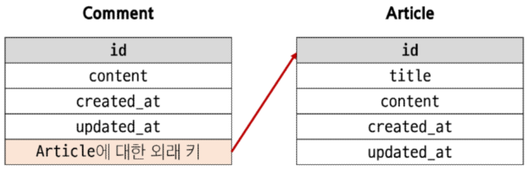

# Many to one relationships
한 테이블의 0개 이상의 레코드가 다른 테이블의 레코드 한 개와 관련된 관계  
ex)Comment(N) - Article(1)  
- 0개 이상의 댓글은 1개의 게시글에 작성될 수 있다.  


ForeignKey()
- N:1 관계 설정 모델 필드  

## 댓글 모델 정의
- ForeignKey 클래스의 인스턴스 이름은 참조하는 모델 클래스 이름의 단수형으로 작성하는 것을 권장
  - 참조 대상 클래스 이름 + '_' + 클래스 이름 형식으로 만들어지기 때문
- 외래 키는 ForeignKey 클래스를 작성하는 위치와 관계없이 테이블 필드 마지막에 생성됨
```python
ForeignKey(to, on_delete)
# 참조하는 모델 class 이름, 외래 키가 참조하는 객체가 사라졌을 때, 외래 키를 가진 객체를 어떻게 처리할 지 정의하는 설정(데이터 무결성을 위함)
# https://docs.djangoproject.com/en/5.0/ref/models/fields/#arguments
```
on_delete의 "CASCADE"
- 부모 객체(참조된 객체)가 삭제됐을 때 이를 참조하는 객체도 삭제

## 댓글 생성 연습
```python
# 게시글 생성
Article.objects.create(title='title', content='content')

comment = Comment()
comment.content = 'first comment'
comment.save()  # 오류 발생

article = Article.objects.get(pk=1)
comment.article = article  # comment.article_id = article.pk처럼 pk 값을 직접 외래 키 column에 넣어줄 수 있지만 권장하지 않음
comment.save()
```

## 관계 모델 참조

### 역참조
N:1 관계에서 1에서 N을 참조하거나 조회하는 것
- N은 외래 키를 가지고 있어 물리적으로 참조가 가능하지만 1은 N에 대한 참조 방법이 존재하지 않아 별도의 역참조 기능이 필요  

역참조 사용 예시
```python
article.comment_set.all()
# 모델 인스턴스.related_manager.QuerySet API()
# 특정 게시글에 작성된 댓글 전체를 조회하는 명령
```
related manager
- N:1 혹은 M:N 관계에서 역참조 시에 사용하는 매니저
- objects 매니저를 통해 QuerySet API를 사용했던 것 처럼 related manager를 통해 QuerySet API를 사용할 수 있게 됨  

related manager 이름 규칙
- N:1 관계에서 생성되는 Related manager의 이름은 참조하는 "모델명_set" 이름 규칙으로 만들어짐
- 특정 댓글의 게시글 참조
  - comment.article
- 특정 게시글의 댓글 목록 참조
  - article.comment_set.all()

## 댓글 구현

### CREATE
CommentForm 정의
```python
# articles.forms.py
from .models import Comment


class CommentForm(forms.ModelForm):
    class Meta:
        model = Comment
        fields = ('content', )  # 외래 키 값을 설정하지 못하도록
```

comment_create 함수 생성
```python
# articles.views.py
def create_comment(request, pk):
    article = Article.objects.get(pk=pk)
    comment_form = CommentForm(request.POST)
    if comment_form.is_valid():
        comment = comment_form.save(commit=False)  # DB에 저장하지 않고 인스턴스만 반환
        comment.article = article
        comment.save()
        return redirect('articles:detail', pk)
    context = {
        'article': article, 
        'comment_form': comment_form, 
    }
    return render(request, 'articles/datail.html', context)
```

### READ
```python
def detail(request, pk):
    article = Article.objects.get(pk=pk)
    comments = article.comment_set.all()
    comment_form = CommentForm()
    context = {
        'article': article,
        'comments': comments, 
        'comment_form': comment_form, 
    }
    return render(request, 'articles/detail.html', context)
```

### DELETE
```python
# articles/urls.py

app_name = 'articles'
urlpatterns = [
    path('', views.index, name='index'),
    path('<int:pk>/', views.detail, name='detail'),
    path('create/', views.create, name='create'),
    path('<int:pk>/delete/', views.delete, name='delete'),
    path('<int:pk>/update/', views.update, name='update'),
    path('<int:pk>/create_comment/', views.create_comment, name='create_comment'),
    path('<int:article_pk>/comments/<int:comment_pk>/delete/', views.delete_comment, name='delete_comment'),
    # 인자가 2개가 필요가 없는데 왜 2개를 사용하는가?
    # url patterns의 전체적인 구조를 유지하기 위해
    # 위에 있는 링크들은 대부분 첫번째 변수는 게시글 조회를 위해 사용되고 있으므로
    # 인자를 1개만 사용하면 해당 구조가 깨져버림
]
```

## 참고
댓글 개수 출력하기
- DTL filter - 'length' 사용
```html
{{ comments|length }}
{{ article.comment_set.all|length }}
```
- QuerySet API - 'count()'사용
```html
{{ article.comment_set.count }}
```