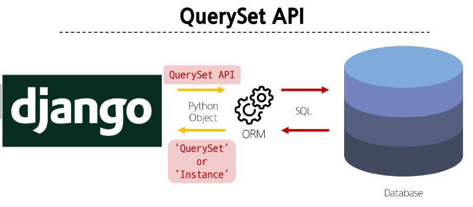

# ORM
Object Relational Mapping  
객체 지향 프로그래밍 언어를 사용하여 호환되지 않는 유형의 시스템 간에 데이터를 변환하는 기술

## QuerySet API
ORM에서 데이터를 검색, 필터링, 정렬 및 그룹화 하는 데 사용하는 도구
- API를 사용하여 SQL이 아닌 Python 코드로 데이터를 처리
- python의 모델 클래스와 인스턴스를 활용해 DB에 데이터를 저장, 조회, 수정, 삭제(CRUD)하는 것


QuerySet API 구문
```python
Article.objects.all()
# Model class.Manager.QuerySet_API
```

### Query
- 데이터베이스에 특정한 데이터를 보여 달라는 요청
- 쿼리문 작성
  - 원하는 데이터를 얻기 위해 데이터베이스에 요청을 보낼 코드를 작성
- 파이썬으로 작성한 코드가 ORM에 의해 SQL로 변환되어 데이터베이스에 전달되며, 데이터베이스의 응답 데이터를 ORM이 QuerySet이라는 자료 형태로 변환하여 전달

### QuerySet
- 데이터베이스에게서 전달받은 객체 목록(데이터 모음)
  - 순회가 가능한 데이터로써 1개 이상의 데이터를 불러와 사용할 수 있음
- Django ORM을 통해 만들어진 자료형
- 단, 데이터베이스가 단일한 객체를 반환할 때는 QuerySet이 아닌 class의 instance로 반환

## QuerySet API 실습

### QuerySet API 실습 사전 준비
```bash
pip install ipython
pip install django-extensions
```
```python
# settings.py

INSTALLED_APPS = [
    'django_extensions'
]
```

### Django shell
Django 환경 안에서 실행되는 python shell  
입력하는 QuerySet API 구문이 Django 프로젝트에 영향을 미침  

Django shell 실행
```bash
python manage.py shell_plus
```
<!-- Django ORM 0325 22page부터 다시 정리 -->