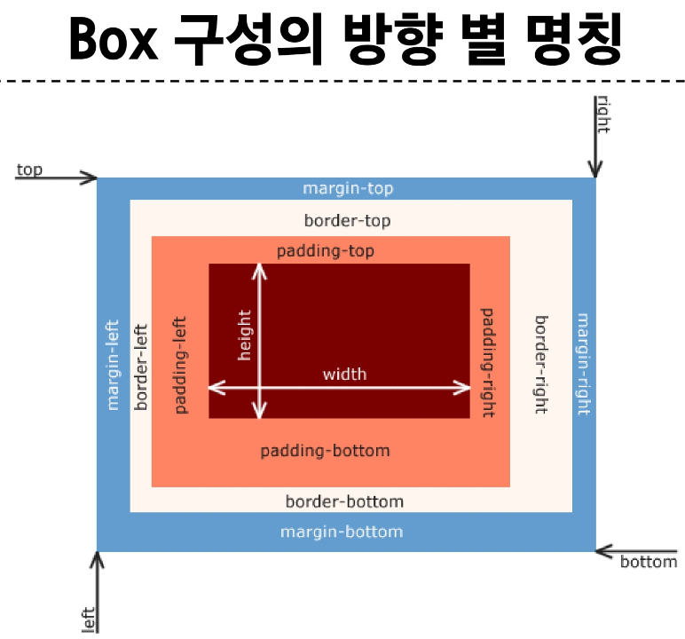
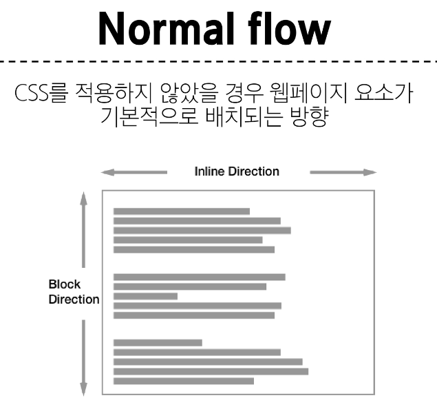
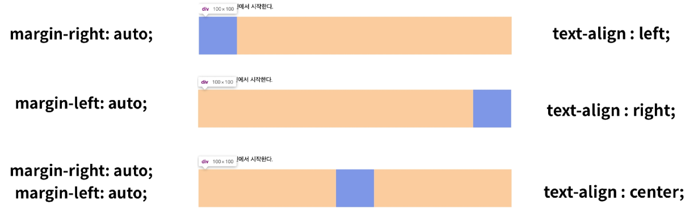
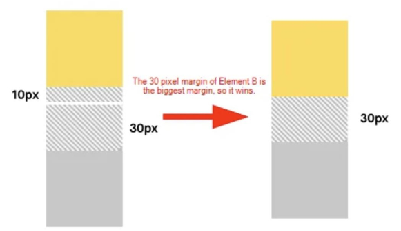
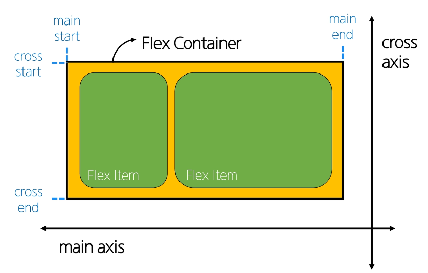
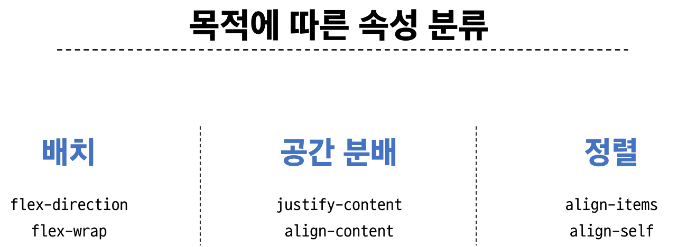

# CSS Layout
각 요소의 위치와 크기를 조정하여 웹 페이지의 디자인을 결정하는 것  
display, position, float, flexbox 등

## CSS Box Model
모든 HTML 요소를 사각형 박스로 표현하는 개념
- 내용(content), 안쪽 여백(padding), 테두리(border), 외부 간격(margin)으로 구성되는 개념

width & height 속성
- 요소의 너비와 높이를 지정  
- 이때 지정되는 요소의 너비와 높이는 컨텐츠 영역을 대상으로 함
```html
& { 
    box-sizing: content-box; 
    <!-- default값 -->
    box-sizing: border-box;
    <!-- 이렇게 하면 박스 영역을 대상으로 함 -->
}
```

### 박스 타입
Block & Inline


#### block 타입 특징
- 항상 새로운 행으로 나뉨
- width와 height 속성을 사용하여 너비와 높이를 지정할 수 있음
- 기본적으로 width속성을 지정하지 않으면 박스는 inline 방향으로 사용 가능한 공간을 모두 차지
- 대표적인 block 타입 태그
  - h1~6, p, div

#### inline 타입 특징
- 새로운 행으로 나뉘지 않음
- width와 height 속성을 사용할 수 없음
- 수직 방향
  - padding, margins, borders가 적용되지만 다른 요소를 밀어낼 순 없음
- 수평 방향
  - padding, margins, borders가 적용되어 다른 요소를 밀어낼 수 있음
- 대표적인 inline 타입 태그
  - a, img, span



### 기타 display 속성

#### 1. inline block
- inline과 block 요소 사이의 중간 지점을 제공하는 display 값
- block 요소의 특징을 가짐
  - width, height 속성 사용 가능
  - padding, margin 및 border로 인해 다른 요소가 밀려남
- 요소가 줄 바꿈 되는 것을 원하지 않으면서 너비와 높이를 적용하고 싶은 경우에 사용
#### 2. none
- 요소를 화면에 표시하지 않고, 공간조차 부여되지 않음

### 참고
shorthand 속성 - border
```html
border: 2px solid black;
<!-- 작성 순서는 영향을 주지 않음 -->
<!-- border-width, border-style, border-color를 한번에 설정 -->
```
shorthand 속성 - margin & padding
```html
<!-- 상우하좌 -->
margin: 10px 20px 30px 40px;
<!-- 상 좌우 하 -->
margin: 10px 20px 30px;
<!-- 상하 좌우 -->
margin: 10px 20px;
<!-- 공통 -->
margin: 10px;
```
Margin collapsing(마진 상쇄)
- 두 block 타입 요소의 margin top과 bottom이 만나 더 큰 margin으로 결합되는 현상
- 웹 개발자가 레이아웃을 더욱 쉽게 관리할 수 있도록 함
- 각 요소에 대한 상/하 margin을 각각 설정하지 않고 한 요소에 대해서만 설정하기 위함


## CSS Position
요소를 Normal Flow에서 제거하여 다른 위치로 배치하는 것
- 다른 요소 위에 올리기, 화면의 특정 위치에 고정시키기 등

### Position 유형
1. static
- 기본값
- 요소를 Normal Flow에 따라 배치
2. relative
- 요소를 Normal Flow에 따라 배치
- 자기 자신을 기준으로 이동
- 요소가 차지하는 공간은 static일 때와 같음
3. absolute
- 요소를 Noraml Flow에서 제거
- 가장 가까운 relative 부모 요소를 기준으로 이동
- 문서에서 요소가 차지하는 공간이 없어짐
4. fixed
- 요소를 Normal Flow에서 제거
- 현재 화면영역(viewport)를 기준으로 이동
- 문서에서 요소가 차지하는 공간이 없어짐
5. sticky
- 요소를 Normal Flow에 따라 배치
- 요소가 일반적인 문서 흐름에 따라 배치되다가 스크롤이 특정 임계점에 도달하면 그 위치에 고정됨(fixed)
- 만약 다음 sticky 요소가 나오면 다음 sticky 요소가 이전 sticky 요소의 자리를 대체
  - 이전 sticky 요소가 고정되어 있던 위치와 다음 sticky 요소가 고정되어야 할 위치가 겹치게 되기 때문

### z-index
요소가 겹쳤을 때 어떤 요소 순으로 위에 나타낼 지 결정
- 정수 값을 사용해 Z축 순서를 지정
- 더 큰 값을 가진 요소가 작은 값의 요소를 덮음

### 참고
Position의 역할
- 전체 페이지에 대한 레이아웃을 구성하는 것이 아닌 페이지 특정 항목의 위치를 조정하는 것

## CSS Flexbox
요소를 행과 열 형태로 배치하는 1차원 레이아웃 방식
- 공간 배열 & 정렬  

Flexbox 구성 요소


main axis(주 축)
- flex item들이 배치되는 기본 축
- main start에서 시작하여 main end 방향으로 배치
cross axis(교차 축)
- main axis에 수직인 축
- cross start에서 시작하여 cross end 방향으로 배치(기본 값)

### Flex Container
- display: flex 혹은 display: inline-flex가 설정된 부모 요소
- 이 컨테이너의 1차 자식 요소들이 Flex Item이 됨
- flexbox 속성 값들을 사용하여 자식 요소 Flex Item들을 배치하는 주체

1. Flex Container 지정
- flex item은 기본적으로 행(주 축의 기본값인 가로 방향)으로 나열
- flex item은 주 축의 시작 선에서 시작
- flex item은 교차 축의 크기를 채우기 위해 늘어남

2. flex-direction
- flex item이 나열되는 방향을 지정
- column으로 지정할 경우 주 축이 변경됨
- "-reverse"로 지정하면 flex item 배치의 시작 선과 끝 선이 서로 바뀜

3. flex-wrap
- flex item 목록이 flex container의 한 행에 들어가지 않을 경우 다른 행에 배치할지 여부 설정

4. justify-content
- 주 축을 따라 flex item과 주위에 공간을 분배

5. align-content
- 교차 축을 따라 flex item과 주위에 공간을 분배
- flex-wrap이 wrap 또는 wrap-reverse로 설정된 여러 행에만 적용됨
- 한 줄짜리 행에는 효과 없음(flex-wrap이 nowrap으로 설정된 경우)

6. align-items
- 교차 축을 따라 flex item 행을 정렬

7. align-self
- 교차 축을 따라 개별 flex item을 정렬

Flexbox 속성
- Flex Container 관련 속성
  - display, flex-direction, flex-wrap, justify-content, align-items, align-content
- Flex Item 관련 속성
  - align-self, flex-grow, flex-basis, order



8. flex-grow
- 남는 행 여백을 비율에 따라 각 flex item에 분배
- flex-grow의 반대는 flex-shrink


9. flex-basis
- flex item의 초기 크기 값을 지정
- flex-basis와 width 값을 동시에 적용한 경우 flex-basis가 우선

### 참고
justify-items 및 justify-self 속성이 없는 이유
- 필요 없기 때문
- margin auto를 통해 정렬 및 배치가 가능