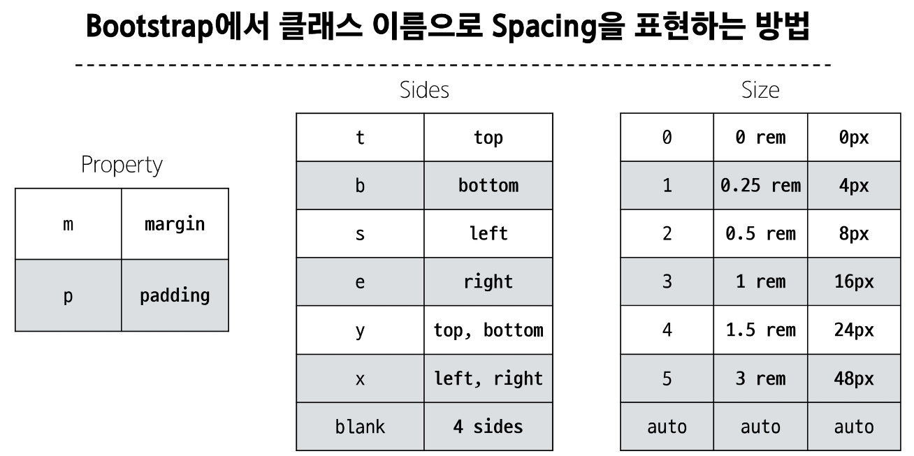
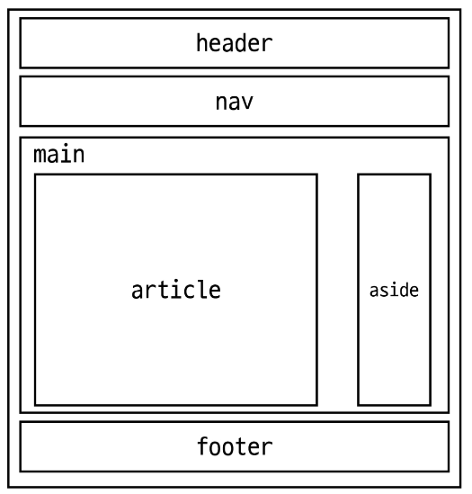

# Bootstrap
CSS 프론트엔트 프레임워크
- 미리 만들어진 다양한 디자인 요소들을 제공하여 웹 사이트를 빠르고 쉽게 개발할 수 있도록 함

CDN
- Content Delivery Network
- 지리적 제약 없이 빠르고 안전하게 컨텐츠를 전송할 수 있는 전송 기술
- 서버와 사용자 사이의 물리적인 거리를 줄여 컨텐츠 로딩에 소요되는 시간을 최소화(웹 페이지 로드 속도를 높임)
- 지리적으로 사용자와 가까운 CDN 서버에 컨텐츠를 저장해서 사용자에게 전달

Bootstrap 기본 사용법
```html
<p class="mt-5">Hello World</p>
<!-- {property}{sides}-{size} -->
```


## Reset CSS
모든 HTML 요소 스타일을 일관된 기준으로 재설정하는 간결하고 압축된 규칙 세트
- HTML Element, Table, List 등의 요소들에 일관성 있게 스타일을 적용시키는 기본 단계

Reset CSS 사용 배경
- 모든 브라우저는 각자의 "user agent stylesheet"를 가지고 있음
  - 웹사이트를 보다 읽기 편하게 하기 위해
- 문제는 이 설정이 브라우저마다 상이하다는 것
- 모든 브라우저에서 웹사이트를 동일하게 보이게 만들어야 하는 개발자에겐 매우 골치아픈 일
-> 모두 똑같은 스타일 상태로 만들고 스타일 개발을 시작하자

## Bootstrap 활용

### Typography
제목, 본문, 텍스트, 목록 등  
[예시 html](./practice/05-bootstrap/01-typhography.html)

### Bootstrap Color system
Text, Border, Background 및 다양한 요소에 사용하는 Bootstrap의 색상 키워드  
[예시 html](./practice/05-bootstrap/02-colors.html)

### Bootstrap Component
Bootstrap에서 제공하는 UI 관련 요소
- 버튼, 네비게이션 바, 카드, 폼, 드롭다운 등  

[예시 html](./practice/05-bootstrap/04-components.html)  
Component 이점
- 일관된 디자인을 제공하여 웹사이트의 구성 요소를 구축하는데 유용하게 활용

### 참고
Bootstrap을 사용하는 이유
- 가장 많이 사용되는 CSS 프레임워크
- 사전에 디자인된 다양한 컴포넌트 및 기능
  - 빠른 개발과 유지보수
- 손쉬운 반응형 웹 디자인 구현
- 커스터마이징이 용이
- 크로스 브라우징 지원
  - 모든 주요 브라우저에서 작동하도록 설계되어 있음

## Semantic Web
웹 데이터를 의미론적으로 구조화된 형태로 표현하는 방식

### HTML Semantic Element
기본적인 모양과 기능 이외에 의미를 가지는 HTML 요소
- 검색엔진 및 개발자가 웹 페이지 컨텐츠를 이해하기 쉽도록

대표적인 Semantic Element
- header
- nav
- main
- article
- section
- aside
- footer



### CSS 방법론
CSS를 효율적이고 유지보수가 용이하게 작성하기 위한 일련의 가이드라인

OOCSS
- Object Oriented CSS
- 객체 지향적 접근법을 적용하여 CSS를 구성하는 방법론  

OOCSS 기본 원칙
1. 구조와 스킨을 분리
- 구조와 스킨을 분리함으로써 재사용 가능성을 높임
2. 컨테이너와 컨텐츠를 분리
- 객체에 직접 적용하는 대신 객체를 둘러싸는 컨테이너에 스타일을 적용
- 스타일을 정의할 때 위치에 의존적인 스타일을 사용하지 않도록 함
- 컨텐츠를 다른 컨테이너로 이동시키거나 재배치할 때 스타일이 깨지는 것을 방지

### 참고
책임과 역할
- HTML: 컨텐츠의 구조와 의미
- CSS: 레이아웃과 디자인

의미론적인 마크업이 필요한 이유
- 검색엔진 최적화
  - 검색 엔진이 해당 웹사이트를 분석하기 쉽게 만들어 검색 순위에 영향을 줌
- 웹 접근성
  - 웹사이트, 도구, 기술이 고령자나 장애를 가진 사용자들이 사용할 수 있도록 설계 및 개발하는 것