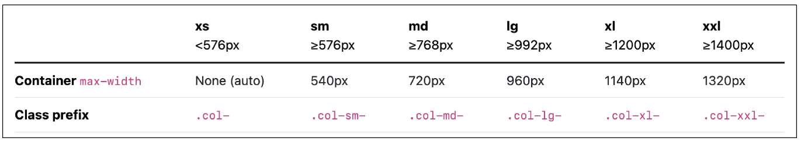

# Responsive Web

## Bootstrap Grid system

웹페이지의 레이아웃을 조정하는 데 사용되는 12개의 칼럼으로 구성된 시스템

- 반응형 디자인을 지원해 웹페이지를 모바일, 태블릿, 데스크탑 등 다양한 기기에서 적절하게 표시할 수 있도록 도움

반응형 웹 디자인

- 디바이스 종류나 화면 크기에 상관없이, 어디서든 일관된 레이아웃 및 사용자 경험을 제공하는 디자인 기술

## Grid system 구조

1. Container: column들을 담고 있는 공간
2. Column: 실제 컨텐츠를 포함하는 부분
3. Gutter: 컬럼과 컬럼 사이의 여백 영역

1개의 row 안에 12개의 column 영역이 구성

- 각 요소는 12개 중 몇 개를 차지할 것인지 지정

Gutters

- Grid system에서 column 사이 여백 영역
- x축은 padding, y축은 margin으로 여백 생성

### 참고

The Grid System

- CSS가 아닌 편집 디자인에서 나온 개념으로 구성 요소를 잘 배치해서 시각적으로 좋은 결과물을 만들기 위함
- 기본적으로 안쪽에 있는 요소들의 오와 열을 맞추는 것에서 기인
- 정보 구조와 배열을 체계적으로 작성하여 정보의 질서를 부여하는 시스템

## Grid system for responsive web

### Responsive Web Design

- 디바이스 종류나 화면 크기에 상관없이 어디서든 일관된 레이아웃 및 사용자 경험을 제공하는 디자인 기술
- Bootstrap grid system에서는 12개의 column과 6개 breakpoints를 사용하여 반응형 웹 디자인을 구현

### Grid system breakpoints

웹페이지를 다양한 화면 크기에서 적절하게 배치하기 위한 분기점

- 화면 너비에 따라 6개의 분기점 제공(xs, sm, md, lg, xl, xxl)  
  각 breakpoints마다 설정된 최대 너비 값 이상으로 화면이 커지면 grid system 동작이 변경됨
  

Grid System은 화면 크기에 따라 12개의 칸을 각 요소에 나누어 주는 것

### 참고

Grid cards

- row-cols 클래스를 사용하여 행당 표시할 열(카드) 수를 손쉽게 제어할 수 있음  
  [예시 html](./practice/08-grid-system-for-responsive-web/02-grid-cards.html)
