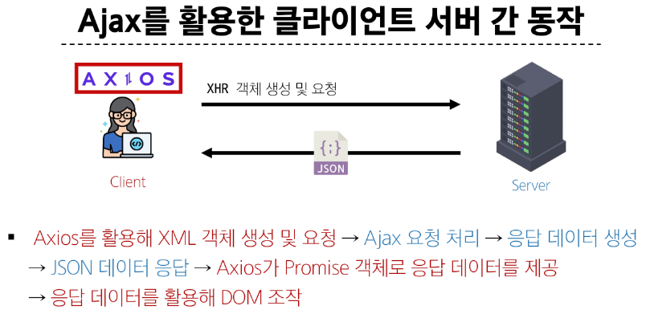
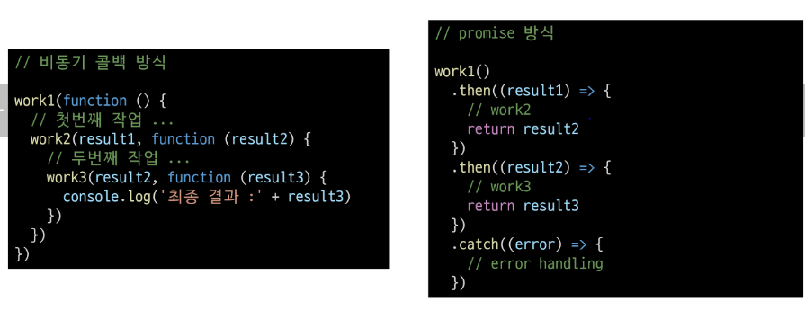

# Asynchronous JavaScript

Synchronous(동기)

- 프로그램의 실행 흐름이 순차적으로 진행
  > 하나의 작업이 완료된 후에 다음 작업이 실행되는 방식

Synchronous 예시

1. 메인 작업이 모두 수행되어야 마지막 작업이 수행됨

```python
print('첫번째 작업')
for i in range(10):
  print('메인 작업')
print('마지막 작업')
```

2. 함수의 작업이 완료될 때 까지 기다렸다가 값을 반환해야 계속 진행 가능

```js
const makeGreeting = function (name) {
  return `Hello, my name is ${name}!`;
};

const name = "Alice";
const greeting = makeGreeting(name);

console.log(greeting); // 'Hello, my name is Alice!'
```

Asynchronous(비동기)

- 프로그램의 실행 흐름이 순차적이지 않으며, 작업이 완료되기를 기다리지 않고 다음 작업이 실행되는 방식
  > 작업의 완료 여부를 신경쓰지 않고 동시에 다른 작업들을 수행할 수 있음

Asynchronous 예시

1. Gmail에서 메일 전송을 누르면 목록 화면으로 전환되지만 실제로 메일을 보내는 작업은 병렬적으로 별도로 처리됨
2. 브라우저는 웹페이지를 먼저 처리되는 요소부터 그려 나가며 처리가 오래 걸리는 것들은 별도로 처리가 완료되는 대로 병렬적으로 진행
3. js 비동기 예시

```js
const slowRequest = function (callBack) {
  console.log("1. 오래 걸리는 작업 시작 ...");
  setTimeout(function () {
    callBack();
  }, 3000);
};

const myCallBack = function () {
  console.log("2. 콜백함수 실행됨");
};

slowRequest(myCallBack);

console.log("3. 다른 작업 실행");

// 출력 결과
// 1. 오래 걸리는 작업 시작 ...
// 3. 다른 작업 실행
// 2. 콜백함수 실행됨
```

Asynchronous 특징

- 병렬적 수행
- 당장 처리를 완료할 수 없고 시간이 필요한 작업들은 별도로 요청을 보낸 뒤 응답이 빨리 오는 작업부터 처리

## JavaScript와 비동기

Single Thread 언어, JavaScript

- Thread: 작업을 처리할 때 실제로 작업을 수행하는 주체
- multi thread라면 업무를 수행할 수 있는 주체가 여러개라는 의미
  > JavaScript는 한번에 여러 일을 수행할 수 없음
  > 그러면 어떻게 비동기 처리를 할 수 있는가?

JavaScript Runtime

- JavaScript가 동작할 수 있는 환경(Runtime)
- JavaScript 자체는 Single Thread이므로 비동기 처리를 할 수 있도록 도와주는 환경이 필요
- JavaScript에서 비동기 관련 작업은 브라우저 혹은 Node와 같은 환경에서 처리

브라우저 환경에서의 JavaScript 비동기 처리 관련 요소

1. JavaScript Engine의 Call Stack

- 요청이 들어올 때 마다 순차적으로 처리하는 Stack(LIFO)
- 기본적인 JavaScript의 Single Thread 작업 처리

2. Web API

- JavaScript 엔진이 아닌 브라우저에서 제공하는 runtime 환경
- 시간이 소요되는 작업을 처리(setTimeout, DOM event, 비동기 요청 등)

3. Task Queue

- 비동기 처리된 Callback 함수가 대기하는 Queue(FIFO)

4. Event Loop

- 테스크가 들어오길 기다렸다가 테스크가 들어오면 이를 처리하고 처리할 테스크가 없으면 잠드는 끊임없이 돌아가는 자바스크립트 내 루프
- Call Stack과 Task Queue를 지속적으로 모니터링
- Call Stack이 비어있는지 확인 후 비어있다면 Task Queue에서 대기중인 오래된 작업을 Call Stack으로 Push

브라우저 환경에서의 JavaScript 비동기 처리 동작 방식

1. 모든 작업은 Call Stack(LIFO)으로 들어간 후 처리
2. 오래 걸리는 작업은 Call Stack으로 들어오면 Web API로 보내 별도로 처리
3. Web API에서 처리가 끝난 작업들은 곧바로 Call Stack으로 들어가지 못하고 Task Queue(FIFO)에 순서대로 들어감
4. Event Loop가 Call Stack이 비어있는 것을 계속 체크하고 Call Stack이 빈다면 Task Queue에서 가장 오래된(가장 먼저 처리되어 들어온) 작업을 Call Stack으로 보냄

정리

- JavaScript는 한번에 하나의 작업을 수행하는 Single thread 언어로 동기적 처리를 진행
- 하지만 브라우저 환경에서는 Web API에서 처리된 작업이 지속적으로 Task Queue를 거쳐 Event Loop에 의해 Call Stack으로 들어와 순차적으로 실행됨으로써 비동기 작업이 가능한 환경이 됨

## Ajax

Asynchronous JavaScript and XML

- XMLHttpRequest기술을 사용해 복잡하고 동적인 웹 페이지를 구성하는 프로그래밍 방식
- 비동기적인 웹 어플리케이션 개발을 위한 기술
- 브라우저와 서버 간의 데이터를 비동기적으로 교환하는 기술
- Ajax를 사용하면 페이지 전체를 새로고침 하지 않고도 동적으로 데이터를 불러와 화면을 갱신할 수 있음
  > Ajax의 x는 XML이라는 데이터 타입을 의미하긴 하지만, 요즘은 더 가벼운 용량과 JavaScript의 일부라는 장점 때문에 JSON을 많이 사용

Ajax 목적

- 전체 페이지가 다시 로드되지 않고 HTML 페이지 일부 DOM만 업데이트
  > 웹 페이지 일부가 다시 로드되는 동안에도 코드가 계속 실행되어 비동기식으로 작업할 수 있음

XMLHttpRequest 객체

- 서버와 상호작용할 때 사용하는 객체
- 페이지의 새로고침 없이도 데이터를 가져올 수 있음
- 특징
  - JavaScript를 사용하여 서버에 HTTP 요청을 할 수 있는 객체
  - 브라우저와 서버 간의 네트워크 요청을 전송할 수 있음
  - 사용자의 작업을 방해하지 않고 페이지의 일부를 업데이트할 수 있음
    > 이름에 XML이라는 데이터 타입이 들어가긴 하지만 XML뿐만 아니라 모든 종류의 데이터를 가져올 수 있음

기존 기술과의 차이

- 기존 방식
  1. 클라이언트에서 form을 채우고 이를 서버로 제출(submit)
  2. 서버는 요청 내용에 따라 데이터 처리 후 새로운 웹페이지를 작성하여 응답으로 전달
     > 결과적으로 모든 요청에 따라 새로운 페이지를 응답받기 때문에 계속해서 새로고침이 발생
     > 기존 페이지와 유사한 내용을 가지고 있는 경우 중복된 코드를 다시 전송받음으로써 대역폭을 낭비
- Ajax
  1. XHR 객체 생성 및 요청
  2. 서버는 새로운 페이지를 응답으로 만들지 않고 필요한 부분에 대한 데이터만 처리 후 응답(JSON 및 기타 데이터)
     > 새로운 페이지를 받는 것이 아닌 필요한 부분의 데이터만 받아 기존 페이지의 일부를 수정(새로고침 X)
     > 서버에서 모두 처리되던 데이터 처리의 일부분이 이제는 클라이언트 쪽에서 처리되므로 교환되는 데이터 양과 처리량이 줄어듦

이벤트 핸들러는 비동기 프로그래밍의 한 형태

- 이벤트가 발생할 때 마다 호출되는 함수(callBack 함수)를 제공하는 것
- HTTP 요청은 응답이 올때까지 시간이 걸릴 수 있는 작업이라 비동기이며, 이벤트 핸들러를 XHR 객체에 연결해 요청의 진행 상태 및 최종 완료에 대한 응답을 받음

### Axios

- 클라이언트 및 서버 사이에 HTTP 요청을 만들고 응답을 처리하는 데 사용되는 JavaScript 라이브러리
- 서버와의 HTTP 요청과 응답을 간편하게 처리할 수 있도록 도와주는 도구
- 브라우저를 위한 XHR 객체 생성
- 간편한 API를 제공하며, Promise 기반의 비동기 요청을 처리
  > 주로 웹 어플리케이션에서 서버와 통신할 때 사용



Axios 설치 및 구조

- CDN 방식으로 사용하기
- https://axios-http.com/

```html
<script src="https://cdn.jsdelivr.net/npm/axios/dist/axios.min.js"></script>
<script>
  const URL = "https://api.thecatapi.com/v1/images/search";

  // 1.
  const promiseObj = axios({
    method: "get",
    url: URL,
  });

  console.log(promiseObj);
  promiseObj.then((response) => {
    console.log(response);
    console.log(response.data);
  });

  console.log("zzzzzzz"); // cat api로 보낸 요청에 대한 응답을 기다리지 않고 넘어옴
  // 2.
  axios({
    method: "get",
    url: URL,
  }).then((response) => {
    console.log(response);
    console.log(response.data);
  });
</script>
```

- then 메서드를 사용해서 '성공하면 수행할 로직'을 작성
  - 요청한 작업이 성공하면 callback 실행
  - callback은 이전 작업의 성공 결과를 인자로 전달받음
- catch 메서드를 사용해서 '실패하면 수행할 로직'을 작성
  - then()이 하나라도 실패하면 callback 실행(남은 then은 중단)
  - callback은 이전 작업의 실패 객체를 인자로 전달받음

Promise object

- 자바스트립트에서 비동기 작업을 처리하기 위한 객체
- 비동기 작업의 성공 또는 실패와 관련된 결과나 값을 나타냄

#### 고양이 사진 가져오기 실습

- The Cat API
  - 이미지를 요청해서 가져오는 작업을 비동기로 처리

```js
<script src="https://cdn.jsdelivr.net/npm/axios/dist/axios.min.js"></script>
<script>
  const URL = "https://api.thecatapi.com/v1/images/search";
  axios({
    method: "get",
    url: URL,
  })
    .then((response) => {
      console.log(response);
      console.log(response.data[0].url);
    })
    .catch((err) => {
      console.log(err);
    });
  console.log("무야호");
</script>
```

- 무야호가 먼저 출력되는 것을 확인할 수 있음

심화 ver

```js
<script src="https://cdn.jsdelivr.net/npm/axios/dist/axios.min.js"></script>
<script>
  const URL = "https://api.thecatapi.com/v1/images/search";
  const btn = document.querySelector("button");

  const getCats = function () {
    axios({
      method: "get",
      url: URL,
    })
      .then((response) => {
        imgUrl = response.data[0].url;
        imgElem = document.createElement("img");
        imgElem.setAttribute("src", imgUrl);
        document.body.appendChild(imgElem);
      })
      .catch((err) => {
        console.log(err);
        console.log("실패!");
      });
  };

  btn.addEventListener("click", getCats);
</script>
```

### 정리

Ajax

- 특정한 기술 하나를 의미하는 것이 아니며, 비동기적인 웹 어플리케이션 개발에 사용하는 기술들을 묶어서 지칭
  Axios
- 클라이언트 및 서버 사이에 HTTP 요청을 만들고 응답을 처리하는 데 사용되는 자바스크립트 라이브러리(Promise API 지원)
  > 프론트엔드에서 Axios를 활용해 DRF로 만든 API 서버로 요청을 보내서 데이터를 받아온 후 처리하는 로직을 작성하게 됨

## Callback과 Promise

비동기 처리의 단점

- 비동기 처리의 핵심은 Web API로 들어오는 순서가 아니라 작업이 완료되는 순서에 따라 처리한다는 것
- 그런데 이는 개발자 입장에서 코드의 실행 순서가 불명확하다는 단점 존재
- 이와 같은 단점은 실행 결과를 예상하면서 코드를 작성할 수 없게 함
  > 콜백 함수 사용

비동기 콜백

- 비동기적으로 처리되는 작업이 완료되었을 때 실행되는 함수
- 연쇄적으로 발생하는 비동기 작업을 순차적으로 동작할 수 있게 함
  > 작업의 순서와 동작을 제어하거나 결과를 처리하는 데 사용

```js
const asyncTask = function (callBack) {
  setTimeout(function () {
    console.log("비동기 작업 완료");
    callBack();
  }, 2000);
};

asyncTask(function () {
  console.log("작업 완료 후 콜백 실행");
});
```

비동기 콜백의 한계

- 비동기 콜백 함수는 보통 어떤 기능의 실행 결과를 받아서 다른 기능을 수행하기 위해 많이 사용됨
- 이 과정을 작성하다 보면 비슷한 패턴이 계속 발생
  > 콜백 지옥 발생

```js
function hell(win) {
  return function () {
    loadLink(win, REMOTE_SRC, function () {
      loadLink(win, REMOTE_SRC, function () {
        loadLink(win, REMOTE_SRC, function () {
          loadLink(win, REMOTE_SRC, function () {
            loadLink(win, REMOTE_SRC, function () {
              loadLink(win, REMOTE_SRC, function () {});
            });
          });
        });
      });
    });
  };
}
// Pyramid of doom(파멸의 피라미드)라고도 부름
```

콜백 함수 정리

- 콜백 함수는 비동기 작업을 순차적으로 실행할 수 있게 하는 반드시 필요한 로직
- 비동기 코드를 작성하다 보면 콜백 함수로 인한 콜백 지옥은 빈번히 나타나는 문제이며 이는 코드의 가독성을 해치고 유지보수가 어려워짐
  > 다른 표기 형태 필요
  > Promise 등장

Promise

- JavaScript에서 비동기 작업의 결과를 나타내는 객체
  > 비동기 작업이 완료되었을 때 결과 값을 반환하거나 실패시 에러를 처리할 수 있는 기능을 제공

Promise object

- 자바스크립트에서 비동기 작업을 처리하기 위한 객체
- 비동기 작업의 성공 또는 실패와 관련된 결과나 값을 나타냄
- 콜백 지옥 문제를 해결하기 위해 등장한 비동기 처리를 위한 객체
  > Promise 기반의 HTTP 클라이언트 라이브러리가 Axios
  > Axios: JavaScript에서 사용되는 Promise 기반 HTTP 클라이언트 라이브러리



then & catch의 chaining

- axios로 처리한 비동기 로직은 항상 promise 객체를 반환
- then과 catch는 항상 promise객체를 반환
  > 계속 chaining을 할 수 있음
- 비동기 작업이 순차적인 처리 가능
- 코드를 보다 직관적이고 가독성 좋게 작성할 수 있도록 도움

then 메서드 chaining의 장점

1. 가독성

- 비동기 작업의 순서와 의존 관계를 명확히 표현할 수 있음

2. 에러 처리

- 각각의 비동기 작업 단계에서 발생하는 에러 분할 처리 가능

3. 유연성

- 각 단계마다 필요한 데이터를 가공하거나 다른 비동기 작업을 수행할 수 있어서 복잡한 비동기 흐름 구성 가능

4. 코드 관리

- 비동기 작업을 분리하여 구성하면 코드 관리 용이

```js
.then((response) => {
  imgUrl = response.data[0].url;
  imgElem = document.createElement("img");
  imgElem.setAttribute("src", imgUrl);
  document.body.appendChild(imgElem);
})

// =>

.then((response) => {
  imgUrl = response.data[0].url;
  return imgUrl
})
.then((imgData) => {
  imgElem = document.createElement("img");
  imgElem.setAttribute("src", imgUrl);
  document.body.appendChild(imgElem);
})
```

Promise가 보장하는 것

1. 콜백 함수는 JavaScript의 Event Loop가 현재 실행중인 Call Stack을 완료하기 이전에는 절대 호출되지 않음

- 반면 Promise callback 함수는 Event Queue에 배치되는 엄격한 순서로 호출

2. 비동기 작업이 성공하거나 실패한 뒤에 then메서드를 이용하여 추가한 경우에도 호출 순서를 보장하며 동작
3. then을 여러번 사용하여 여러개의 callback함수를 추가할 수 있음

- 각각의 callback은 주어진 순서대로 하나하나 실행하게 됨
- Chaining은 Promise의 가장 뛰어난 장점

## 참고

비동기를 사용하는 이유 - '사용자 경험'

- 예를 들어 아주 큰 데이터를 불러온 뒤 실행되는 앱이 있을 때, 동기식으로 처리한다면 데이터를 모두 불러온 뒤에서야 앱의 실행 로직이 수행되므로 사용자들은 마치 앱이 멈춘 것과 같은 경험을 겪게 됨
- 즉, 동기식 처리는 특정 로직이 실행되는 동안 다른 로직 실행을 차단하기 때문에 마치 프로그램이 응답하지 않는 듯한 사용자 경험을 만듦
- 비동기로 처리한다면 먼저 처리되는 부분을 보여줄 수 있으므로, 사용자 경험에 긍정적인 효과를 볼 수 있음
- 이와 같은 이유로 많은 웹 기능은 비동기 로직을 사용해서 구현됨
