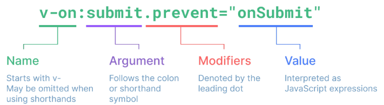

# Basic Syntax 1

## Template Syntax

DOM을 기본 구성 요소 인스턴스의 데이터에 '선언적으로 바인딩'할 수 있는 HTML 기반 '템플릿 구문'을 사용

1. Text Interpolation

```html
<p>Message: {{ msg }}</p>
```

- 데이터 바인딩의 가장 기본적인 형태
- 이중 중괄호 구문(콧수염 구문)을 사용
- 콧수염 구문은 해당 구성 요소 인스턴스의 msg 속성 값으로 대체
- msg 속성이 변경될 때 마다 업데이트됨

2. Raw HTML

```vue
<div v-html="rawHtml"></div>
const rawHtml = ref('
<span style="color:red">This should be red.</span>
)
```

- 콧수염 구문은 데이터를 일반 텍스트로 해석하기 때문에 실제 HTML을 출력하려면 v-html을 사용해야 함

3. Attribute Bindings

```vue
<div v-bind:id="dynamicId"></div>
const dynamicId = ref('my-id')
```

- 콧수염 구문은 HTML속성 내에서 사용할 수 없기 때문에 v-bind를 사용
- HTML의 id 속성 값을 vue의 dynamicID 속성과 동기화되도록 함
- 바인딩 값이 null이나 undefined인 경우 렌더링 요소에서 제거됨

4. JavaScript Expressions

```vue
{{ number + 1 }} {{ ok ? "YES" : "No" }}
{{ message.split("").reverse().join("") }}

<div :id="`list-${id}`"></div>
```

- Vue는 모든 데이터 바인딩 내에서 JavaScript 표현식의 모든 기능을 지원
- Vue 템플릿에서 JavaScript 표현식을 사용할 수 있는 위치

1. 콧수염 구문 내부
2. 모든 directive의 속성 값('v-'로 시작하는 특수 속성)

Expression 주의사항

- 각 바인딩에는 하나의 단일 표현식만 포함될 수 있음
  - 표현식은 값으로 평가할 수 있는 코드 조각(return 뒤에 사용할 수 있는 코드여야 함)
- 작동하지 않는 경우

```vue
{{ const number = 1 }} {{ if (ok) { return message }}}
```

## Directive

- '-v' 접두사가 있는 특수 속성
- Directive의 속성 값은 단일 JavaScript 표현식이어야 함(v-for, v-on 제외)
- 표현식 값이 변경될 때 DOM에 반응적으로 업데이트를 적용

```vue
<p v-if="seen">Hi There</p>
```



### Arguments

- 일부 directive는 directive뒤에 콜론(`:`)으로 표시되는 인자를 사용할 수 있음
- 아래 예시의 href는 HTML <a> 요소의 href 속성 값을 myUrl 값에 바인딩하도록 하는 v-bind의 인자

```vue
<a v-bind:href="myUrl">Link</a>
```

- 아래 예시의 click은 이벤트 수신할 이벤트 이름을 작성하는 v-on의 인자

```vue
<button v-on:click="doSomething">Button</button>
```

### Modifiers

- `.`로 표시되는 특수 접미사로, directive가 특별한 방식으로 바인딩되어야 함을 나타냄
- 아래 예시의 .prevent는 발생한 이벤트에서 event.preventDefault()를 호출하도록 v-on에 지시하는 modifier

```vue
<form @submit.prevent="onSubmit">...</form>
```

https://vuejs.org/api/built-in-directives.html

## Dynamically data binding

### v-bind

하나 이상의 속성 또는 컴포넌트 데이터를 표현식에 동적으로 바인딩

v-bind 사용처

1. Attribute Bindings

- HTML의 속성 값을 Vue의 상태 속성 값과 동기화되도록 함
- Dynamic attribute name(동적 인자 이름)
  - 대괄호(`[]`)로 감싸서 directive argument에 JavaScript 표현식을 사용할 수도 있음
  - JavaScript 표현식에 따라 동적으로 평가된 값이 최종 argument 값으로 사용됨

```html
<button :[key]="myValue"></button>
```

전체 코드

```html
<body>
  <div id="app">
    
    <a v-bind:href="myUrl">Move to url</a>
    <!-- 위 2개는 같음 -->
    <!-- 아래는 생략 구문 -->
    
    <a :href="myUrl">Move to url</a>

    <p :[dynamicattr]="dynamicValue">...</p>
  </div>

  <script src="https://unpkg.com/vue@3/dist/vue.global.js"></script>
  <script>
    const { createApp, ref } = Vue;

    const app = createApp({
      setup() {
        const imageSrc = ref("https://picsum.photos/200");
        const myUrl = ref("https://www.google.co.kr/");
        const dynamicattr = ref("title");
        const dynamicValue = ref("Hello Vue.js");
        return {
          imageSrc,
          myUrl,
          dynamicattr,
          dynamicValue,
        };
      },
    });

    app.mount("#app");
  </script>
</body>
```

- 대괄호 안에 작성하는 이름은 반드시 소문자로만 구성 가능
- 브라우저가 속성 이름을 소문자로 강제 변환하기 때문

2. Class and Style Bindings

- class와 style은 모두 HTML 속성이므로 다른 속성과 마찬가지로 v-bind를 사용하여 동적으로 문자열 값을 할당할 수 있음
- Vue는 class 및 style 속성값을 v-bind로 사용할 때 객체 또는 배열을 활용하여 작성할 수 있도록 함

  - 단순히 문자열 연결을 사용하여 이러한 값을 생성하는 것은 번거롭고 오류가 발생하기가 쉽기 때문

- 1. Binding HTML Classes - Binding to Objects

  - 객체를 :class에 전달하여 클래스를 동적으로 전환할 수 있음
  - 아래 예시는 isActive의 Boolean 값에 의해 active 클래스의 존재가 결정됨

  ```js
  <div :class="{ active: isActive }">Text</div>

  const isActive = ref(false)
  ```

  - 객체에 더 많은 필드를 포함하여 여러 클래스를 전환할 수 있음
  - 아래 예시는 :class directive를 일반 클래스 속성과 함께 사용할 수 있음을 보여줌

  ```js
  <div class="static" :class="{ active: isActive, 'text-primary':hasInfo }">Text</div>

  const isActive = ref(false);
  const hasInfo = ref(false);
  ```

  - 반드시 inline 방식으로 작성하지 않아도 됨
  - 반응형 변수를 활용해 객체를 한번에 작성할 수 있음

  ```js
  <div class="static" :class="classObj">Text</div>

  const isActive = ref(false);
  const hasInfo = ref(false);
  const classObj = ref({
    active: isActive,
    "text-primary": hasInfo,
  });
  ```

- 2. Binding HTML Classes - Binding to Arrays

  - :class를 배열에 바인딩하여 클래스 목록을 적용할 수 있음

  ```js
  <div :class="[activeClass, infoClass]">Text</div>

  const activeClass = ref("active");
  const infoClass = ref("text-primary");
  ```

  - 배열 내에서 객체 구문을 사용하는 경우

  ```html
  <div class="static" :class="[{ active: isActive}, infoClass ]">Text</div>
  ```

  - :style은 JavaScript 객체 값에 대한 바인딩을 지원(HTML style 속성에 해당)

  ```js
  <div :style="{color: activeColor, fontSize: fontSize + 'px'}">Text</div>

  const activeColor = ref('crimson')
  const fontSize = ref(50)
  ```

  - 실제 CSS에서 사용하는 것처럼 :style은 kebab-cased 키 문자열도 지원(단, camelCase 작성을 권장)

  ```js
  <div :style="{'font-size': fontSize + 'px'}">Text</div>
  ```

  - 반드시 inline 방식으로 작성하지 않아도 됨
  - 반응형 변수를 활용해 객체를 한번에 작성하는 방법

  ```js
  <div :style='styleObj'>Text</div>

  const styleObj = ref({
    color: activeColor,
    fontSize: fontSize.value + "px",
  });
  ```

  - 여러 스타일 객체를 배열에 작성해서 :style을 바인딩할 수 있음
  - 작성한 객체는 병합되어 동일한 요소에 적용

  ```js
  <div :style="[styleObj, styleObj2]">Text</div>

  const styleObj2 = ref({
    color: 'blue',
    border: '1px solid black'
  })
  ```

  v-bind 종합

- https://vuejs.org/api/built-in-directives.html#v-bind

## Event Handling

v-on

- DOM 요소에 이벤트 리스너를 연결 및 수신

```vue
v-on:event="handler"
```

- handler 종류
- 1. Inline handlers: 이벤트가 트리거될 때 실행될 JavaScript 코드
- 2. Method handlers: 컴포넌트에 정의된 메서드 이름
- v-on shorthand(약어)
  - `@`
  ```vue
  @event='handler'
  ```

[v-on 총합](https://vuejs.org/api/built-in-directives.html#v-on)

## Form Input Bindings

- form을 처리할 때 사용자가 input에 입력해야 하는 값을 실시간으로 JavaScript 상태에 동기화해야 하는 경우(양방향 바인딩)
- 양방향 바인딩 방법
- 1. v-bind와 v-on을 함께 사용

  - v-bind를 사용하여 input 요소의 value 속성 값을 입력 값으로 사용
  - v-on을 사용하여 input 이벤트가 발생할 때 마다 input요소의 value값을 별도 반응형 변수에 저장하는 핸들러를 호출

  ```js
  <p>{{ inputText1 }}</p>
  <input :value="inputText1" @input="onInput" />

  const inputText1 = ref("default");
  const onInput = function (event) {
    inputText1.value = event.currentTarget.value;
  };
  ```

- 2. v-model 사용

  - form input 요소 또는 컴포넌트에서 양방향 바인딩을 만듦
  - v-model을 사용하여 사용자 입력 데이터와 반응형 변수를 실시간 동기화

  ```js
  <p>{{ inputText2 }}</p>
  <input v-model="inputText2" />

  const inputText2 = ref("");
  ```

  > IME가 필요한 언어(한국어, 중국어, 일본어 등)의 경우 v-model이 제대로 업데이트되지 않음  
  > 해당 언어에 대해 올바르게 응답하려면 v-bind와 v-on 방법을 사용해야 함

### v-model 활용

- v-model은 단순 Text input 뿐만 아니라 Checkbox, Radio, Select등 다양한 타입의 사용자 입력 방식과 함께 사용 가능

1. 단일 체크박스와 boolean값 활용

```js
<input type="checkbox" id="checkbox" v-model="checked" />
<label for="checkbox">{{ checked }}</label>

const checked = ref(false)
```

2. 여러 체크박스와 배열 활용

```js
<div>Checked names: {{ checkedNames }}</div>

<input type="checkbox" id="alice" value="Alice" v-model="checkedNames" />
<label for="alice">Alice</label>

<input type="checkbox" id="bella" value="Bella" v-model="checkedNames" />
<label for="bella">Bella</label>

const checkedNames = ref([]);
```

Select 활용

- select에서 v-model 표현식의 초기 값이 어떤 option과도 일치하지 않는 경우 select 요소는 선택되지 않은(unselected)상태로 렌더링됨

```js
<div>Selected: {{ selected }}</div>

<select v-model="selected">
  <option disabled value="">Please select one</option>
  <option>Alice</option>
  <option>Bella</option>
  <option>Cathy</option>
</select>

const selected = ref("");
```

[v-model 종합](https://vuejs.org/api/built-in-directives.html#v-model)

## 참고

`$` 접두어가 붙은 변수

- Vue 인스턴스 내에서 제공되는 내부 변수
- 사용자가 지정한 반응형 변수나 메서드와 구분하기 위함
- 주로 Vue 인스턴스 내부 상태를 다룰 때 사용

IME(Input Method Editor)

- 사용자가 입력 장치에서 기본적으로 사용할 수 없는 문자(비영어권 언어)를 입력할 수 있도록 하는 운영 체제 구성 프로그램
- 일반적으로 키보드 키보다 자모가 더 많은 언어에서 사용해야 함
  > IME가 동작하는 방식과 Vue의 양방향 바인딩(v-model) 동작 방식이 상충하기 때문에 한국어 입력시 예상대로 동작하지 않았던 것
