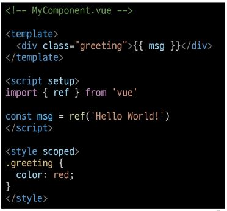
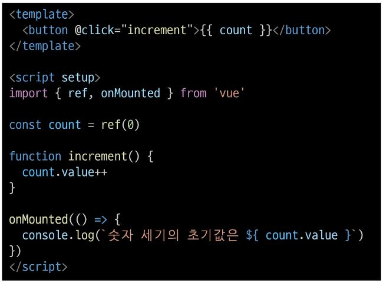
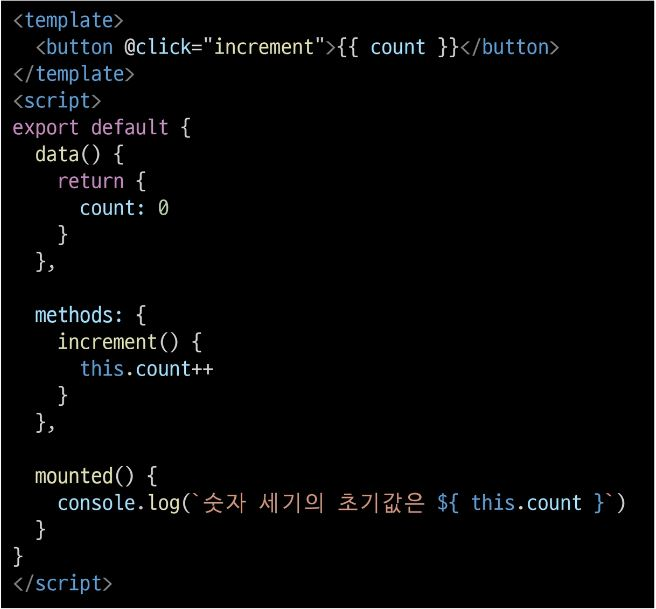

# Single File Components

## Component

SFC SFC 코드 블록

Component 특징

- UI를 독립적이고 재사용 가능한 일부분으로 분할하고 각 부분을 개별적으로 다룰 수 있음
  > 자연스럽게 어플리케이션은 중첩된 Component의 트리 형태로 구성됨
  > 

Single-File Components(SFC)

- 컴포넌트의 템플릿, 로직 및 스타일을 하나의 파일로 묶어낸 특수한 파일 형식(\*.vue 파일)

SFC 파일 예시

- Vue SFC는 HTML, CSS 및 JavaScript를 단일 파일로 합친 것
- `<template>`, `<script>` 및 `<style>` 블록은 하나의 파일에서 컴포넌트의 뷰, 로직 및 스타일을 독립적으로 배치
  

## SFC 문법

SFC 문법 개요

- 각 \*.vue파일은 세가지 유형의 최상위 언어 블록 `<template>`, `<script>`, `<style>`으로 구성됨
  > 언어 블록의 작성 순서는 상관없으나 일반적으로 template -> script-> style 순서로 작성

```vue
<template>
  <div>
    <p class="greeting">{{ msg }}</p>
  </div>
</template>

<script setup>
import { ref } from "vue";
const msg = ref("hello");
</script>

<style scoped>
.greeting {
  color: crimson;
}
</style>
```

- 각 \*.vue 파일은 최상위 `<template>` 블록을 하나만 포함할 수 있음

- 각 \*.vue 파일은 `<script setup>` 블록을 하나만 포함할 수 있음(일반 `<script>`제외)
- 컴포넌트의 setup()함수로 사용되며 컴포넌트의 각 인스턴스에 대해 실행

  > 변수 및 함수는 동일한 컴포넌트의 템플릿에서 자동으로 사용 가능

- \*.vue파일에는 여러 `<style>`태그가 포함될 수 있음
- scoped가 지정되면 CSS는 현재 컴포넌트에만 적용됨

컴포넌트 사용하기

- http://play.vuejs.org/ 에서 Vue 컴포넌트 코드 작성 및 미리보기
- Vue SFC는 일반적인 방법으로 실행할 수 없으며 컴파일러를 통해 컴파일 된 후 빌드되어야 함
  > 실제 프로젝트에서는 Vite와 같은 공식 빌드 도구를 사용

## SFC build tool

### Vite

프론트엔드 개발 도구

> 빠른 개발 환경을 위한 빌드 도구와 개발 서버를 제공  
> https://vitejs.dev/

Build

- 프로젝트의 소스 코드를 최적화하고 번들링하여 배포할 수 있는 형식으로 변환하는 과정
- 개발 중에 사용되는 여러 소스 파일 및 리소스(JavaScript, CSS, 이미지 등)를 최적화된 형태로 조합하여 최종 소프트웨어 제품을 생성하는 것

  > Vite는 이러한 빌드 프로세스를 수행하는 데 사용되는 도구

Vite 튜토리얼

```bash
npm create vue@latest
cd vue-project # 프로젝트 이름
npm install
npm run dev
```

### NPM

Node Package Manager

- Node.js의 기본 패키지 관리자

Node.js

- Chrome의 V8 JavaScript 엔진을 기반으로 하는 Server-Side 실행 환경

Node.js의 영향

- 기존에 브라우저 안에서만 동작할 수 있었던 JavaScript를 브라우저가 아닌 서버 측에서도 실행할 수 있게 함
  > 프론트엔드와 벡엔드에서 동일한 언어로 개발할 수 있게 됨
- NPM을 활용해 수많은 오픈 소스 패키지와 라이브러리를 제공하여 개발자들이 손쉽게 코드를 공유하고 재사용할 수 있게 함

### 모듈과 번들러

Module

- 프로그램을 구성하는 독립적인 코드 블록(\*.js 파일)

Module의 필요성

- 개발하는 어플리케이션의 크기가 커지고 복잡해지면서 파일 하나에 모든 기능을 담기가 어려워짐
- 따라서 자연스럽게 파일을 여러 개로 분리하여 관리를 하게 되었고, 이때 분리된 각 파일이 바로 모듈(module)
  > \*.js 파일 하나가 하나의 모듈

Module의 한계

- 하지만 어플리케이션이 점점 더 발전함에 따라 처리해야 하는 JavaScript 모듈의 개수도 극적으로 증가
- 이러한 상황에서 성능 병목 현상이 발생하고 모듈 간의 의존성(연결성)이 깊어지면서 특정한 곳에서 발생한 문제가 어떤 모듈 간의 문제인지 파악하기 어려워짐
- 복잡하고 깊은 모듈 간 의존성 문제를 해결하기 위한 도구가 필요
  > Bundler

Bundler

- 여러 모듈과 파일을 하나(혹은 여러 개)의 번들로 묶어 최적화하여 어플리케이션에서 사용할 수 있게 만들어주는 도구

Bundler의 역할

- 의존성 관리, 코드 최적화, 리소스 관리 등
- Bundler가 하는 작업을 Bundling이라고 함
  > [참고] Vite는 Rollup이라는 Bundler를 사용하며 개발자가 별도로 기타 환경설정에 신경쓰지 않도록 모두 설정해두고 있음

## Vue 프로젝트

### 프로젝트 구조

node_modules

- Node.js 프로젝트에서 사용되는 외부 패키지들이 저장되는 디렉토리
- 프로젝트의 의존성 모듈을 저장하고 관리하는 공간
- 프로젝트가 실행될 때 필요한 라이브러리와 패키지들을 포함
- .gitignore에 작성됨

package-lock.json

- 패키지들의 실제 설치 버전, 의존성 관계, 하위 패키지 등을 포함하여 패키지 설치에 필요한 모든 정보를 포함
- 패키지들의 정확한 버전을 보장하여 여러 개발자가 협업하거나 서버 환경에서 일관성 있는 의존성을 유지하는 데 도움을 줌
- npm install 명령어를 통해 패키지를 설치할 때, 명시된 버전과 의존성을 기반으로 설치

package.json

- 프로젝트의 메타 정보와 의존성 패키지 목록을 포함
- 프로젝트의 이름, 버전, 작성자, 라이센스 등과 같은 메타 정보를 정의
  > package-lock.json과 함께 프로젝트의 의존성을 관리하고, 버전 충돌 및 일관성을 유지하는 역할

public 디렉토리

- 주로 다음 정적 파일을 위치 시킴
  - 소스코드에서 참조되지 않는
  - 항상 같은 이름을 갖는
  - import할 필요 없는
- 항상 root 절대 경로를 사용하여 참조
  - public.icon.png는 소스 코드에서 /icon.png로 참조할 수 있음
- https://vitejs.dev/guide/assets.html#the-public-directory

src 디렉토리

- 프로젝트의 주요 소스 코드를 포함하는 곳
- 컴포넌트, 스타일. 라우팅 등 프로젝트의 핵심 코드를 관리

src/assets

- 프로젝트 내에서 사용되는 자원(이미지, 폰트, 스타일 시트 등)을 관리
- 컴포넌트 자체에서 참조하는 내부 파일을 저장하는데 사용
- 컴포넌트가 아닌 곳에서는 public 디렉토리에 위치한 파일을 사용

src/components

- Vue 컴포넌트들을 작성하는 곳

src/App.vue

- Vue 앱의 최상위 Root 컴포넌트
- 다른 하위 컴포넌트들을 포함
- 어플리케이션 전체의 레이아웃과 공통적인 요소를 정의

src/main.js

- Vue 인스턴스를 생성하고, 어플리케이션을 초기화하는 역할
- 필요한 라이브러리를 import하고 전역 설정을 수행

index.html

- Vue 앱의 기본 HTML 파일
- 앱의 진입점(entry point)
- Root 컴포넌트인 App.vue가 해당 페이지에 마운트 됨
  > Vue 앱이 SPA인 이유
- 필요한 스타일 시트, 스크립트 등의 외부 리소스를 로드할 수 있음
  - (ex. bootstrap CDN)

jsconfig.json

- 컴파일 옵션, 모듈 시스템 등 설정
  vite.config.js
- Vite 프로젝트 설정 파일
- 플러그인, 빌드 옵션, 개발 서버 설정 등

## Vue Component 활용

컴포넌트 사용 2단계

1. 컴포넌트 파일 생성
2. 컴포넌트 등록(import)

사전 준비

1. 초기에 생성된 모든 컴포넌트 삭제(App.vue 제외)
2. App.vue 코드 초기화
<!-- 56page부터 정리 -->

```vue
<template>
  <div>
    <h2>MyComponent</h2>
  </div>
</template>
<script setup></script>

<style scoped></style>
```

[참고] Component 이름 지정 스타일 가이드

- https://vuejs.org/style-guide/rules-strongly-recommended.html

## 추가 주제

Virtual DOM

- 가상의 DOM을 메모리에 저장하고 실제 DOM과 동기화하는 프로그래밍 개념
- 실제 DOM과의 변경 사항 비교를 위해 변경된 부분만 실제 DOM에 적용하는 방식
- 웹 어플리케이션의 성능을 향상시키기 위한 Vue의 내부 렌더링 기술
  

내부 렌더링 과정


Virtual DOM 패턴의 장점

- 효율성
  - 실제 DOM 조작을 최소화하고, 변경된 부분만 업데이트하여 성능을 향상
- 반응성
  - 데이터의 변경을 감지하고, Virtual DOM을 효율적으로 갱신하여 UI를 자동으로 업데이트
- 추상화
  - 개발자는 실제 DOM 조작을 Vue에게 맡기고 컴포넌트와 템플릿을 활용하는 추상화된 프로그래밍 방식으로 원하는 UI구조를 구성하고 관리할 수 있음

Virtual DOM 주의사항

- 실제 DOM에 직접 접근하지 말 것
  - JavaScript에서 사용하는 DOM 접근 관련 메서드 사용 금지
  - querySelector, createElement, addEventListener 등
    > Vue의 ref()와 Lifecycle Hooks 함수를 사용해 간접적으로 접근하여 조작할 것

직접 DOM Element에 접근해야 하는 경우

- ref 속성을 사용하여 특정 DOM 엘리번트에 직접적인 참조를 얻을 수 있음

```vue
<template>
  <input ref="input" />
</template>

<script setup>
import { ref, onMounted } from "vue";

// 변수명은 템플릿 ref 값과 일치해야 함
const input = ref(null);

onMounted(() => {
  console.log(input.value); // <input>
});
</script>
```

Vue를 작성하는 2가지 스타일

1. Composition API

- import해서 가져온 API 함수들을 사용하여 컴포넌트의 로직을 정의
  > Vue3에서의 권장 방식
  > 

1. Option API

- data, methods 및 mounted 같은 객체를 사용하여 컴포넌트의 로직을 정의
  > Vue2에서의 작성 방식(Vue3에서도 지원)
  > 

API별 권장 사항

- Composition API + SFC
  - 규모가 있는 앱의 전체를 구축하려는 경우
- Option API
  - 빌드 도구를 사용하지 않거나 복잡성이 낮은 프로젝트에서 사용하려는 경우
- https://vuejs.org/guide/extras/composition-api-faq.html

## 참고

모든 컴포넌트에는 최상단 HTML 요소가 작성되는 것이 권장


SFC의 CSS기능 - scoped

- scoped속성을 사용하면 해당 CSS는 현재 컴포넌트의 요소에만 적용됨
  - 부모 컴포넌트의 스타일이 자식 컴포넌트로 유출되지 않음
  - 사용하지 않으면 모든 컴포넌트에 영향을 미침
- 그러나 자식 컴포넌트의 최상위 요소(root element)는 부모 CSS와 본인 CSS 모두에게서 영향을 받음
  - 자식 컴포넌트의 최상위 요소는 부모에서 사용되기 때문
    > 이는 부모가 레이아웃 목적으로 자식 컴포넌트의 최상위 요소 스타일을 지정할 수 있도록 의도적으로 설계된 것
- https://vuejs.org/api/sfc-css-features.html
- 다음과 같이 App(부모) 컴포넌트에 적용한 스타일이 scoped에 작성되어 있지만, MyComponent(자식)의 최상위 요소(div)는 부모와 본인의 CSS 모두의 영향을 받기 때문에 부모 컴포넌트에 지정한 스타일이 적용됨
  

scoped 속성 사용을 권장

- 최상위 App 컴포넌트에서 레이아웃 스타일을 전역적으로 구성할 수 있지만, 다른 모든 컴포넌트는 범위가 지정된 스타일을 사용하는 것을 권장
- https://vuejs.org/style-guide/rules-essential.html#use-component-scoped-styling

Scaffolding(스캐폴딩)

- 새로운 프로젝트나 모듈을 시작하기 위해 초기 구조와 기본 코드를 자동으로 생성하는 과정
- 개발자들이 프로젝트를 시작하는 데 도움을 주는 틀이나 기반을 제공하는 작업
- 초기 설정, 폴더 구조, 파일 템플릿, 기본 코드 등을 자동으로 생성하여 개발자가 시작할 때 시간과 노력을 절약하고 일관된 구조를 유지할 수 있도록 도와줌

"관심사항의 분리가 파일 유형의 분리와 동일한 것이 아니다."

- "HTML/CSS/JS를 한 파일에 혼합하는 게 괜찮을까?"
  > 프론트엔드 앱의 사용 목적이 점점 더 복잡해짐에 따라, 단순 파일 유형으로만 분리하게 될 경우 프로젝트의 목표를 달성하는 데 도움이 되지 않게 됨
