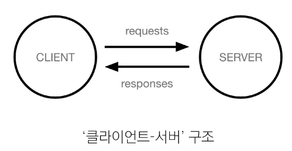

# Web Application

## Web Application 개발
- 인터넷을 통해 사용자에게 제공되는 소프트웨어 프로그램을 구축하는 과정
- 다양한 디바이스(모바일, 태블릿, PC 등)에서 웹 브라우저를 통해 접근하고 사용할 수 있음

## 웹의 동작 방식

Client
- 서비스를 요청하는 주체(웹 사용자의 인터넷이 연결된 장치, 웹 브라우저)

Server
- 클라이언트의 요청에 응답하는 주체(웹 페이지, 앱을 저장하는 컴퓨터)

웹 페이지를 보게 되는 과정
1. 웹 브라우저(클라이언트)에서 'google.com'을 입력
2. 브라우저는 인터넷에 연결된 전세계 어딘가에 있는 구글 컴퓨터(서버)에게 'Google 홈페이지.html' 파일을 달라고 요청
3. 요청을 받은 구글 컴퓨터는 데이터베이스에서 'Google 홈페이지.html' 파일을 찾아 응답
4. 전달받은 'Google 홈페이지.html' 파일을 사람이 볼 수 있도록 웹 브라우저가 해석해주면서 사용자는 구글 메인 페이지를 보게 됨

## 웹 개발에서의 Frontend와 Backend
Frontend
- 사용자 인터페이스(UI)를 구성하고, 사용자가 어플리케이션과 상호작용할 수 있도록 함
- HTML, CSS, JavaScript, Frontend Framework 등

Backend
- 서버 측에서 동작하며, 클라이언트의 요청에 대한 처리와 데이터베이스와의 상호작용 등을 담당
- 서버 언어(Python, Java 등) 및 Backend Framework, DB, API, 보안 등

## Web Framework
웹 어플리케이션을 빠르게 개발할 수 있도록 도와주는 도구  
개발에 필요한 기본 구조, 규칙, 라이브러리 등을 제공

### django
Python 기반의 대표적인 Web Framework

장점
- 다양성: Python 기반으로 소셜 미디어 및 빅데이터 관리 등 광범위한 서비스 개발에 적합
- 확장성: 대량의 데이터에 대해 빠르고 유연하게 확장할 수 있는 기능을 제공
- 보안: 취약점으로부터 보호하는 보안 기능이 기본적으로 내장
- 커뮤니티 지원: 개발자를 위한 지원, 문서 및 업데이트를 제공하는 활성화된 커뮤니티

## 가상 환경
Python 어플리케이션과 그에 따른 패키지들을 격리하여 관리할 수 있는 *독립적인* 실행 환경

가상 환경이 필요한 시나리오
1. 한 개발자가 2개의 프로젝트를 진행
2. 프로젝트 A는 requests 패키지 버전 1 사용
3. 프로젝트 B는 requests 패키지 버전 2 사용
4. 파이썬 환경에서 패키지는 1개의 버전만 존재 가능
5. A, B 프로젝트의 다른 패키지 버전 사용을 위한 독립적인 개발 환경 필요

1. 가상 환경 venv 생성
```bash
python -m venv venv
```
2. 가상 환경 활성화
```bash
source venv/Scripts/activate
```
3. 환경에 설치된 패키지 목록 확인
```bash
pip list
```

패키지 목록이 필요한 이유
- 만약 2명의 개발자가 하나의 프로젝트를 함께 개발한다고 하자
- 개발자 A가 먼저 가상 환경을 생성 후 프로젝트를 설정하고 관련된 패키지를 설치하고 개발하다가 협업을 위해 github에 프로젝트를 push한다.
- 개발자 B는 해당 프로젝트를 clone받고 실행해보려 하지만 실행되지 않는다.
- 팀원 A가 이 프로젝트를 위해 어떤 패키지를 설치했고, 어떤 버전을 설치했는지 A의 가상 환경 상황을 알 수 없다.
- 가상 환경에 대한 정보, 즉 패키지 목록이 공유되어야 한다.

의존성 패키지
- 한 소프트웨어 패키지가 다른 패키지의 기능이나 코드를 사용하기 때문에 그 패키지가 존재해야만 제대로 작동하는 관계
- 사용하려는 패키지가 설치되지 않았거나, 호환되는 버전이 아니면 오류가 발생하거나 예상치 못한 동작을 보일 수 있음

4. 의존성 패키지 목록 생성
```bash
pip freeze > requirements.txt
```