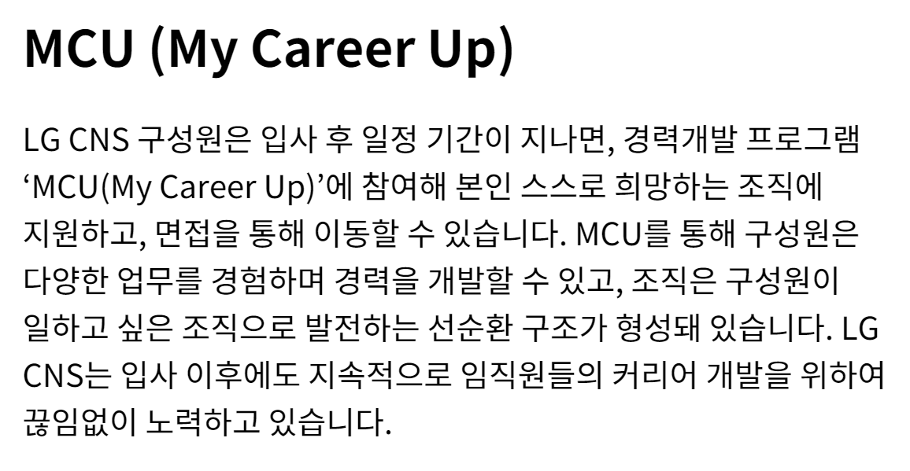
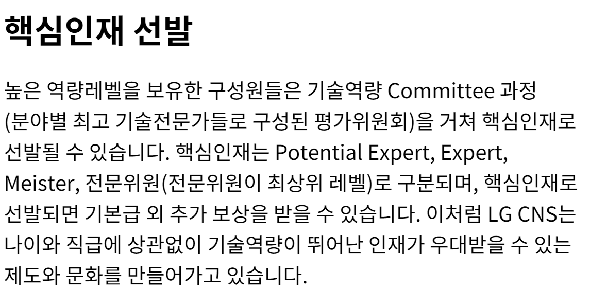

## LG CNS 스마트팩토리 자료 조사

자료 조사

[LG CNS 생성형 AI 인증기업](https://n.news.naver.com/mnews/article/119/0002879851)

[사업소개 | 스마트팩토리 – LG CNS](https://www.lgcns.com/business/smartfactory/about/)

[스마트팩토리 | Hot 채용 – LG CNS 인재영입](https://www.lgcns.com/careers/job/smartfactory/)

[LG CNS 채용공고 2024 하반기 신입사원 채용 (DX Leadership Academy/Global) | 2024년 채용](https://jasoseol.com/recruit/94400)

[블로그](https://www.lgcns.com/blog/)

스마트팩토리란?

- 공정의 전 과정을 정보통신기술로 통합해 사람과 기계를 연결하는 스마트한 공장
- IoT, 빅데이터 등을 활용해 효율성을 높인 지능형 공장
- 공장 자동화에서 한걸음 더 나아간 디지털 전환
- 제조업의 DX

스마트 팩토리 관련 담당 기술

- MES: 제조 실행 시스템
- RMS: 설비 레시피 관리 시스템
- SPC: 통계적 분석 방법으로 공정 관리
- [버추얼 팩토리(Virtual Factory), 제조 DX의 완성이자 혁신의 시작! #LG TECH CONFERENCE 2023 - LG CNS](https://www.lgcns.com/blog/cns-tech/smartlogistics-smartfactory/42539/)

LG CNS는 GE Healthcare, 현대 모비스, 두산 인프라코어, LG전자, LG디스플레이 등 글로벌 기업에게 스마트팩토리 솔루션을 제공

- 차별화된 경쟁력을 가지고 있다.

Factova(팩토바)는 초연결화, 초자동화, 초지능화 등 제조업 패러다임 변화에 빠르게 대응할 수 있는 LG CNS 스마트팩토리 플랫폼 입니다.

전체 제조공정의 밸류체인(상품기획, 제품설계, 부품공급, 생산운영, 물류, 환경, 안전, 에너지 등)에서 IT신기술을 접목해, 경쟁력(품질, 비용, 물류)을 극대화하는 제조현장을 지향합니다.

일등 LG

행동 방식

- 정직
- 공정한 대우
- 실력을 통한 정당한 경쟁
- 정도 경영

고객을 위한 가치창조

- 고객중시
- 실질적 가치 제공
- 혁신을 통한 창조

인간존중의 경영

- 창의, 자율
- 인간 중시
- 능력개발 및 발휘 극대화
- 성과주의

## 면접 기출(내 답변으로 바꿈)

### 인터넷에서 찾은 것

1. 개발 말고 장단점은 무엇인가?

- 장점은 소통을 좋아한다는 점입니다.
- 팀 프로젝트를 진행하면서 회의를 일 2회 진행하고, 중요한 부분이 있어서 결정해야 할 때도 팀원들과 토의하여 결정하곤 합니다.
- 그러자 다양한 관점에서 프로젝트를 진행할 수 있고, 낭비되는 자원 없이 자원을 활용할 수 있었습니다.
- 단점은 원칙주의자라는 점입니다.
- 팀에서 정해둔 규칙이나, 스스로 정한 규칙을 지키지 못하는 상황이 되면 답답함을 느낍니다.
- 하지만 다른 사람에게 저만의 규칙을 강요하진 않고, 스스로 다른 사람에게는 규칙을 강요하지 말자는 규칙을 만들어서 지키고 있습니다.

2. 가장 기억에 남는 프로젝트

- 신한은행 해커톤에 참가하여 여행 결제 내역 관리 및 정산 시스템을 구축한 경험이 있는데, 해당 프로젝트가 가장 기억에 남습니다.
- 2주라는 짧은 시간 내에 프로젝트를 완성해야 하는 만큼 인력이 정말 중요했는데, 초기에 1명이 불참하게 되었습니다.
- 그래서 제가 인프라와 백엔드를 혼자 맡았고, 특히 인프라의 경우 처음 해보는 분야라 굉장히 부담으로 다가왔습니다.
- 그래도 Docker와 Jenkins를 활용하여 CI/CD 환경을 구축했고, 22개의 API를 개발하며 프로젝트를 완수했습니다.

3. 우리 회사에서 하고싶은 일이 무엇인가?

- 생산 현장에서 도메인 지식을 바탕으로 디지털 신기술과 제조 기술이 융합 된 지능화된 오퍼레이션을 구현하는 전문가
  - 이걸 활용해서 내용을 만들어보자
- Factova를 의뢰받은 공장에 도입하고 구축하는 일을 수행하고 싶습니다.
- 새로운 분야에 스마트팩토리를 구축하며 점차 Factova를 범용적인 스마트팩토리 솔루션으로 개발하고,
- 다시 적용하는 선순환에 기여하고 싶습니다.

4. LG CNS를 왜 선택했는가, 단순 기술력 때문인가?

- 다양한 산업군에 스마트팩토리 솔루션을 제공하기 때문입니다.
- 현대, 두산, 그리고 LG 계열사들에 Factova를 제공함으로써 얻은 인사이트를 기반으로
- 추후 스마트팩토리 시장에서도 강세를 나타낼 것이라 생각했습니다.

5. 공장 지능화 이런 것이 하고 싶단 말인가?

- 공장 지능화, 제조 기술 개발, 버츄얼 팩토리 등 어떤 분야를 맡아도 상관없지만, 굳이 하나를 고르자면 공장 지능화에 관심이 있습니다.
- 도메인 지식을 쌓고, 이를 기반으로 공장을 지능화하는 과정이 스마트팩토리 구축의 핵심이라고 생각해서 가장 관심이 있습니다.

6. 기업이 기술력만 좋아서는 문제가 된다. 기업이 뭐하는 곳이라 생각하는가?

- 기업은 소비자가 원하는 것을 제공하는 곳입니다.

7. LG CNS 매출을 아는가? 기술력도 중요하지만 매출도 굉장히 중요한 부분을 차지한다. 알려주고 싶었다.

- 5조 5천억이더라, 매출이익은 6천억이었음.

8. Django MVC의 흐름을 이야기해보라.

- https://velog.io/@khmin1017/Django-%EC%9E%A5%EA%B3%A0%EC%9D%98-MVTMVC-%ED%8C%A8%ED%84%B4

9. 여기 전공자도 있고 비전공자도 있다. 직무와 연관해서 학기 중 인상 깊게 들었던 전공 3가지만 성적과 함께 말해보라

- 데이터베이스 이론 및 실습
- 경영정보시스템및실습
- 실험적자료분석

10. 스마트팩토리에 대해서 아는 대로 말해보세요.

- 데이터 기반 품질 향상
- 버츄얼 팩토리
- LG CNS는 Factova, 현대는 E-forest, 포스코는 Posframe
- MES에서 한단계 발전한 형태
- 생산부터 판매까지 제조의 모든 프로세스를 관리

11. LG CNS가 제공했거나 현재 서비스 중인 시스템에 대해 아는 게 있나요?

- 하루조각이라는 어플리케이션에 대해 알고있습니다.
- 대략 1년 전쯤에 광고가 많이 나와서 사용해봤는데 사용하려고 하니 동의해야하는 내용이 엄청 많았던 것이 기억에 남습니다.

12. 왜 SI?

- 난 스마트팩토리 직무라서 무조건 SI인데?

13. B2B랑 B2C의 차이?

- 서비스의 대상이 기업이나, 일반 소비자냐가 다릅니다.
- 스마트팩토리의 경우, 일반 소비자가 사용하지는 않으므로 B2B입니다.
- B2C로는 하루조각, 혹은 카카오톡 등이 있을 수 있습니다.

### 어없새 기출(내 버전으로 바꿈)

1. 전공이 시스템 경영 공학인데 IT쪽으로 옮기게 된 계기가 무엇인가?

처음에는 데이터 분석에 관심이 있었습니다. 그래서 부트캠프를 수료하며 파이썬을 활용한 데이터 분석을 시작하게 되었습니다.
그 과정에서 알고리즘 문제도 풀고, 데이터 전처리도 하며 개발을 조금씩 접하게 되었습니다.
그러다가 데이터 분석을 기반으로 모델을 구축해도, 이를 보여줄 수 있는 수단이 없어서 아쉬웠습니다.
그래서 본격적으로 IT 공부를 시작하게 되었고, 현재 삼성 청년 소프트웨어 아카데미를 이수중입니다.

2. 팀 프로젝트에서의 내 역할은 무엇인가?

보통 팀장을 맡곤 합니다. 그 외에는 프론트엔드도 담당해보고, 백엔드도 담당해보고, 인프라도 해봤습니다.
어떤 역할을 맡던, 소통을 이끌어내는 역할을 합니다.

3. 코테 점수 좀 좋은데 잘본지 알고 있었냐? 너 점수 확인 가능함?

모든 테스트 케이스에 대해 확인은 불가능합니다.
다만 3개의 문제 모두 잘 풀었다고 생각했습니다.

4. 프로젝트 중에 자랑스럽게 얘기할 수 있는것은? 상세하게 얘기해봐라.

최근 여행 수요가 증가했는데, 여행객들이 불편함을 느끼는 요소 중 하나인 정산과 일행 전체의 결제 내역을 해결해주는 서비스를 개발하고자 했습니다.
이를 위해 모든 일행의 결제 내역을 한눈에 보도록 만들고, 정산 기능까지 제공하는 서비스를 구현했습니다.
해당 프로젝트에서 Django를 활용한 백엔드와 Docker와 Jenkins를 활용한 인프라를 담당했고, 특히 인프라의 경우 처음 해보는데 필수적이었기에 일주일동안 하루에 2시간씩 자면서 개발했던 기억이 있습니다.

5. 일 하다 보면 스트레스, 어려움 이런거 오잖아요. 한계상황에 부딪혔던 일, 극복 과정에 대해서 말해봐라

앞선 프로젝트 말씀드리면서 일주일간 2시간씩 잤다고 말씀드렸는데, 그때 정말 한계를 느꼈습니다.
개발 자체는 즐겁게 했는데, 육체적으로 한계를 느껴서 너무 피곤할때는 30분씩 쪽잠을 자면서 견뎠습니다.
완성하고 나서 이틀정도는 12시간씩 자면서 회복했던 것 같습니다.
정신적으로 스트레스를 많이 받을 때는 운동 중량을 늘립니다.
매일 운동을 하는데, 스트레스를 받는 날에는 일부러 운동을 더 격하게 해서 생각을 비우면 스트레스도 같이 비워지곤 합니다.

6. 장단점. 업무적인 얘기 말고, 스스로 생각하는 이런 부분이 장단점이다.

제 장점은 잘 몰라도 일단 해본다는 점입니다.
실패하는게 두려워서 시도조차 안해보는 경우가 꽤 많은데, 저의 경우는 실패하더라도 얻어가는게 있다고 생각해서 일단 시도해보는 편입니다.
단점은 좀 원칙주의자라는 점입니다.
사회적 규칙이나, 스스로 정한 규칙을 지키지 않으면 답답함을 느낍니다.
대신 다른 사람에게 규칙을 강요하지는 않습니다.
타인에게 나의 규칙을 강요하지 않는다. 라는 규칙을 세워서 지키고 있습니다.

7. 팀에서 내가 생각하는 방향하고 팀장, PM등 상위 관리자와 방향이 다른, 이해 충돌을 어떻게 대처할 것인가?

우선 상위 관리자의 말을 따르겠습니다.
쌓아온 경험이 다르고, 실력이 다른데 제가 맞다고 생각하는 것은 오만하다고 생각합니다.
다만, 우선 따르고, 결과를 도출한 다음 어떤 부분이 틀렸는지 여쭤볼 것 같습니다.
왜 틀렸는지, 다른 판단을 내린 근거가 뭔지 알아야 저도 다음에 그렇게 생각하고, 행동할 수 있기 때문입니다.

8. 프로젝트 해보면 납기가 중요한데, 제출 하려고 하는데 품질의 이슈가 생겨버림. 어떻게 할래? 납기 vs 품질?

저는 기한이 더 중요하다고 생각합니다.
기한은 목숨이고, 품질은 자존심이다, 라는 말이 굉장히 와닿았는데
우선 고객과의 약속인 기한을 목숨처럼 지키고, 에러가 발생하기 전에 품질을 챙기려고 노력하는 방안이 옳다고 생각합니다.

9. 전공하는 산업공학의 가장 큰 매력은?

굉장히 다양한 분야에 대해 배울 수 있다는 점이 가장 매력적이었습니다.
제조, 생산, 데이터분석, 그리고 IT까지 정말 다양한 학문을 배웠고, 다양한 학문을 배운 만큼 서로 시너지효과를 낼 수 있다는 점이 좋았습니다.

### 갓지환 기출(나에게 맞는 상황으로 변경)

1. (프로젝트 질문)갈등상황은 없었나요?

   1. 프론트엔드에서 메인 기능이 개발이 되어야 했는데, 계속 시간이 미뤄지고 미뤄졌습니다.
   2. 나중에 이유를 알고 보니, 좋은 코드를 짜야한다는 생각에 계속 개발을 미루고 있었다는 사실을 알게 되었습니다.
   3. 하지만 지금 필요한 것은 좋은 코드로 완성된 기능보다는 일단 완성된 기능이었고, 그 과정에서 의견 충돌이 있었습니다.
   4. 결국 우선적으로 기능을 완성하는 것으로 합의를 봤고, 프로젝트 기한 이후 다시 수정했습니다.

2. LG CNS를 지원하신 이유가 뭔가요?

   1. LG CNS는 현대, 그리고 두산에 더해 LG 계열사들의 스마트팩토리를 구축하며 얻은 노하우를 바탕으로 스마트팩토리 분야에서 강세를 보이고 있습니다.
   2. 결국 많은 기업을 대상으로 솔루션을 제공한 회사가 미래에도 계속해서 강세를 보일 것이라 생각했고, 그래서 지원하게 되었습니다.

3. 특정 기업의 서비스를 맡았는데 그 기업의 프로그램이 코볼과 같은 옛날 기술일 수 있다. 이런 기업의 서비스 개발 및 운영을 5년동안 맡았다고 해보자. 그러면 어떻게 할것인가요?

   1. 언어는 결국 도구라고 생각합니다. 어떤 언어나 기술을 사용해서 업무를 하게 되어도 문제가 될 것은 없고, 맡은 업무를 충실히 수행하겠습니다.
   2. 지금까지 그 언어를 사용했던 이유가 보안이라는 특수성 때문이라면 더더욱 그 언어를 사용하는 것이 맞다고 생각합니다.
   3. 또한 기존 코드가 다 해당 언어로 되어있기 때문이라던지, 관행적인 부분이라고 해도 기존 코드를 알아야 이를 개선하는 작업 또한 할 수 있다고 생각합니다.

4. 저희 회사는 도메인 전문가가 있고, 기술 전문가가 있다. 어떤 전문가가 되고 싶나요?

   1. 도메인 전문가가 되고싶습니다.
   2. 스마트팩토리의 경우, 도메인을 이해해야 구축을 시작할 수 있다고 생각하고, 더더욱이 구축 과정에서도 도메인 지식이 정말 많이 활용된다고 알고있습니다.
   3. 그렇기에 더욱 넓은 관점으로 문제를 해결할 수 있는 것이 도메인 전문가라고 생각하고, 그 과정에서 기술을 도구로써 활용하는 것이기에 기술 전문가보다는 도메인 전문가가 되고 싶습니다.

5. 많은 사람들이 사용하는 영향력있는 서비스 말고, 5~10명정도 밖에 사용안하는 B2B 프로그램을 개발하는 업무를 맡게 되면 어떻게 할것인가요?

   1. 우선 주어진 업무가 어떤 업무든 수행하겠습니다.
   2. 5~10명밖에 사용하지 않는 프로그램이라면 모든 사용자의 의견을 다 듣고, 이를 서비스에 녹여낼 수 있으므로
   3. 모든 사용자들과 소통하며 부족한 부분을 채우기 위해 노력할 것 같습니다.

6. 핵심기능과 부가기능 둘다 80프로정도 검증이 되어있는 서비스와 핵심기능 100 부가기능 20정도 검증이 된 서비스 중에 어느것이 나은것 같나요?

   1. 상황에 따라 다르다고 생각합니다.
   2. 메인 기능을 사용하기 위해 부가기능들을 거쳐와야 하는 경우, 둘 다 80프로 검증된 서비스가 낫다고 생각합니다.
   3. 하지만 부가 기능이 선행되어야 하지 않거나, 보안 혹은 금융과 관련되어 회사의 이익과 직결되는 메인 기능인 경우 핵심기능이 100 검증된 서비스가 낫다고 생각합니다.

7. 보충하고 싶은 말이나 질문이 있나요?

   1. 현직자의 입장에서 봤을 때, 10년 후에 스마트팩토리가 어떤 방향으로 발전해나갈거라 생각하는지 궁금합니다.

8. 마지막 한마디 해주세요.

### 한진갓 기출

1. 자기소개 해봐라
   1. 안녕하십니까, 스마트팩토리 지원자 정태완입니다.
   2. 저를 어떻게든 목표를 완수하는 사람이라고 소개드리고자 합니다.
   3. 파티션 제조 공장에서 3개월한 외국인 근로자분들과 일한 경험이 있습니다.
   4. 익숙하지 않은 업무이기도 하고, 언어가 달라 소통이 힘들어서 배우기가 어려웠습니다.
   5. 그럼에도 불구하고 하루에 13시간씩 근무하여 맡은 일은 반드시 완수하고자 노력했습니다.
   6. 또한 프로젝트에서는 팀에 부족한 부분을 채우며 프로젝트에 기여했습니다.
   7. 프론트, 백, 인프라를 가리지 않고 팀에 기여하며 프로젝트를 완성시켰습니다.
   8. 다양한 산업의 프로젝트를 진행하는 LG CNS에서도 맡은 바를 반드시 완수하고 부족한 부분을 채울 수 있는 인재가 되겠습니다.
   9. 감사합니다.
2. LG의 인재상중에 ~을 아느냐 들어봤느냐
3. 10년 후에는 어떻게 될거 같냐?
4. 품질 vs 일정?
5. 입사 후 고객의 가치를 높이는 업무에 어떻게 기여할 수 있을 것인가?
6. 지금 둘 다 개발 업무를 하고 있는데 혹시 유지 보수나 개발외 다른업무를 같이 개발과 병행한다면 어떻게 생각하냐 본인의 가치관과 맞냐?
7. 주도적으로 어려움을 해결한 사례?
8. 마지막으로 하고 싶은 말이나 보충하고 싶은 말이 있냐?
9. 보충할 때 프로젝트 얘기를 좀 했더니 추가 질문으로 yolo 모델에서 신호등은 자동으로 탐지했을 텐데 굳이 학습을 시킨 이유가 뭐냐?

## 공통 질문

스크립트

1.  1분 자기소개 해주세요

    1. 안녕하십니까, 스마트팩토리 지원자 정태완입니다.
    2. 저를 어떻게든 목표를 달성하는 사람 이라고 소개드리고자 합니다.
    3. 지금까지 진행한 4개의 프로젝트에서 팀에게 필요한 역할을 맡아 프로젝트를 완성시켰습니다.
    4. AI 프로젝트에서는 데이터 전처리 인력이 부족해서 3만개의 데이터를 수집하고 라벨링하여 모델을 구축했습니다.
    5. IT 프로젝트에서는 프론트엔드가 필요할 땐 Vue3를 활용한 프론트엔드를, 백엔드와 인프라가 필요할 땐 Django를 활용한 백엔드와 Docker, Jenkins를 활용한 CI/CD환경을 구축하며 프로젝트 완성에 기여했습니다.
    6. 다양한 산업군의 스마트팩토리를 구축하는 LG CNS에서도 프로젝트에 필요한 부분을 파악하고 채울 수 있는 인재가 되겠습니다.
    7. 감사합니다.

2.  마지막 질문이나 하고싶은 말은?
    1. LG CNS에서 원하는 것은 지금의 뛰어난 역량도 있겠지만, 입사 후 도메인 전문가로 성장하여 발휘하는 역량도 있을 것입니다.
    2. 어떻게는 목표를 달성하려는 집념을 기반으로 성장하여 LG CNS의 스마트팩토리 구축에 기여하겠습니다.

### 자기소개서 기반 면접 예상 질문 뽑기

자기소개서

[자기소개서](https://docs.google.com/document/d/1Qju1WA81XZZsnWYatsEdy45UTgEj4bHdwpSCjM7XxgA/edit?tab=t.0)

스크립트

1. 왜 LG CNS에 지원했는가?
2. 왜 스마트팩토리 직무에 지원했는가?
3. 외국인 노동자분들과 일해봤다고 했는데, 자신만의 특별한 소통 방법이 있었는가?
   1. 먼저 다가가려는 태도가 중요했다고 생각합니다. 마침 일하고 있는 외국인 노동자분들 중 나이가 비슷한 분이 계셔서, 그분과 친하게 지내면서 이야기의 물꼬를 트기 시작했습니다. 그렇게 제가 소통하려는 의지를 보이자, 외국인 근로자 분들도 식사를 같이 하자고 하시기도 하고, 고민도 저에게 이야기하시는 등 원활한 관계를 형성할 수 있었습니다.
4. 입사 후 목표?
   1. 
5. 한 학기를 휴학했는데 그때 뭐했냐
   1. 데이터 분석 부트캠프를 수료했습니다. 여러 프로젝트를 진행하며 데이터의 중요성, 팀 프로젝트에서의 소통의 중요성에 대해 알게 되었고, 그 당시에 배웠던 경험들을 최근 팀 프로젝트를 진행하면서 유의미하게 활용하기도 했습니다.
6. 왜 산업공학과에 진학하게 되었나요?
   1. 솔직히 말씀드리자면, 의도해서 진학하진 않았습니다. 제 학과의 경우 1학년 학점을 기반으로 2학년부터 전공을 선택하게 되는데, 제 학점으로 갈 수 있는 학과가 산업공학과였습니다. 하지만 데이터 역량과 IT역량을 동시에 쌓을 수 있었던 학과이기에 운이 좋았다고 생각합니다.
7. 학점이 높은 편은 아니네요?
   1. 객관적으로 높은 편은 아니라 아쉽습니다. 대학교 초창기에 학점을 낮게 받으며 시작했던 부분이 큰 원인이라고 생각합니다. 그래도 꾸준히 학점을 올리고자 노력했고, 4학년에는 4점대 학점을 받으며 졸업할 수 있었습니다.
8. SQLD 자격증은 왜 취득했나요?
   1. 데이터를 다루는 업무에서 SQL역량은 필수적일 것이라 판단했습니다. 데이터베이스에서 자료를 가져오던지, 데이터베이스에 결과물을 INSERT하는 과정은 스마트팩토리 업무를 수행하기 위해 필수적이라 생각해서 SQLD를 취득하였습니다.
9. 결과가 중요한가요 과정이 중요한가요?
10. 둘 다 중요하지만 과정이 더 중요하다고 생각합니다. 프로젝트의 결과 뿐만 아니라 프로젝트의 진행 과정도 회사의 자산이며, 이 프로젝트는 추후 많은 프로젝트에서 참고 자료가 될 것입니다. 그 때 기존 프로젝트의 과정에서 문제가 있으면 해당 문제 때문에 참고 자료로써의 역할을 하지 못하며 프로젝트 전체의 가치가 훼손될 수 있으므로 장기적으로 바라본다면 과정이 결과보다 중요하다고 생각합니다.
11. 왜 개발자로 진로를 선택했나요?
    1. 코드를 활용하여 작은 부분부터 결과물을 쌓아올리는 과정이 흥미로웠습니다. 또한 실력이 늘어가는 것이 결과물로 보이고, 빠르게 체감할 수 있다는 점이 매력적이었습니다..
12. 회사에 들어와서는 어떤 일을 하고싶나요?
    1. ML/DL을 활용하여 지능화 스마트 팩토리를 구축하는 과정에 일조하고 싶습니다. 스마트 팩토리에서 여러 ML/DL기술을 사용하는데 그 과정에서 제가 일조할 수 있을 것이라 생각합니다. 또한 스마트 팩토리는 아직 완성된 상태가 아닌, 점차 발전하고 있는 분야이기에 변화하는 부분이 많을 것인데, 학습 역량을 가진 저로써는 변화하는 과정에서 빠르게 할 수 있는 일을 찾아내고 처리할 수 있을 것이라 생각해서 앞서 말씀드렸듯 스마트 팩토리 관련 업무를 하고 싶습니다.

### 직무 면접 예상 질문

스크립트

1. 왜 이 직무를 선택했는가?
   1. 지금까지 데이터와 IT역량을 길러왔는데, 이 두가지 역량을 동시에 필요로 하는 직무가 생산기술개발이기에 이 직무를 선택했습니다. 제가 가진 두가지 역량을 동시에 활용하며 회사에 기여할 수 있을 것이라 생각했습니다.
2. 이력서에 적힌 내용이 회사와 직무를 선택하는 것에 어떤 영향을 주었는가?
   1. 데이터 분석 역량과 IT역량을 가지고 있다는 점이 생산기술개발 직무를 선택하도록 만들었습니다. 스마트팩토리 구축에 데이터 역량과 IT역랑이 활용되기도 하고, 제조부문의 전문가와 IT/SW 전문가가 함께 협업하는 조직이라는 소개가 산업공학을 전공하며 IT역량을 기르고 있는 저에게 잘 맞는다고 생각했습니다.
3. 이 직무를 잘하기 위해 필요한 스킬이나 태도는 뭐가 있을까?
   1. 새로운 것을 배우고 빠르게 활용하는 학습 역량이 필요할 것입니다. 지금까지 쌓아온 역량과 다소 다른 업무를 맡을 수도 있고, 스마트 팩토리의 특성상 새로운 기술을 학습해야 할 수도 있는데 빠르게 역량을 확장해나가며 업무를 진행할 수 있는 학습 역량이 필요하다고 생각했습니다.
   2. 태도로는 소통하려는 자세가 필요할 것입니다. 스마트 팩토리 업무의 특성상 다른 부서와 협력하거나 논의해야 하는 일이 많은데, 그 과정에서 소통하려는 태도가 있어야 업무를 원활하게 수행할 수 있고 불필요한 자원 낭비를 줄일 수 있을 것입니다. 특히 제조 과정 전체를 혁신하는 스마트팩토리의 특성상 소통 역량은 더욱 중요할 것입니다.
4. 자신만의 경쟁력을 말해보라
   1. 학습 역량이라고 생각합니다. 싸피 과정을 진행하며 학습 역량이 제 경쟁력이라는 점을 더욱 느낄 수 있었는데, 같은 조건에서 시작했음에도 불구하고 내부 평가 상위 2%, 학습 성적 1위, 프로젝트 우수상 등을 수상하며 스스로의 학습 역량을 증명할 수 있었습니다.
5. 지원분야에서 일을 잘할 수 있겠는가
   1. 잘 할 수 있을 것이라 생각합니다. 대기업에 입사하는 경우 지금까지 배우거나 쌓아왔던 역량과 다른 업무를 하게 되서 업무에 적응하지 못하는 사람들이 많다고 들었는데, 새롭게 뭔가를 배우는 것이 장점이라고 생각하는 저에게 그러한 상황은 오히려 반길만한 상황이라고 생각하고, 그렇기에 일을 잘 할 수 있을 것이라 생각합니다.
6. 지원분야에 자신의 강점은 무엇인가
   1. 제 강점은 실행력이라고 생각합니다. 데이터 분석을 하다 보면 대부분 답이 정해지지 않은 문제에 대한 유추를 하게 되는데, 그럴 때 해결 방법이 바로 떠오르지 않아 막막함을 느낄 때도 있습니다. 그 때 멈춰서지 않고 터무니없는 아이디어라도 일단 실천해보며 길을 조금씩 찾아나갈 수 있도록 일단 해보는 것이 저의 장점이라고 생각합니다.
7. 자기개발 노력을 말해보라
   1. 2024년 들어서는 싸피 과정을 진행하며 IT역량을 길렀고 싸피 과정 이외에도 알고리즘 스터디를 운영하며 알고리즘 역량을 길렀습니다. 싸피에서 시행하는 정기 평가에서 모두 우수한 성적을 거뒀고, 학우들과 협업하며 소통 역량 및 협업 역량을 기르기 위해 노력했습니다.
8.  본인이 지원한 직무에서 중요한점
    1. 데이터 분석 능력, 그리고 소통 능력이라고 생각합니다. 스마트팩토리 지향하는 바가 데이터 기반 digital transformation이므로 데이터 역량은 당연하고, 스마트팩토리의 특성상 다른 부서와 소통해야하는 일이 많을텐데, 이에 소통능력이 중요하게 작용할 것이라 생각합니다.
9.  지원 분야 관련 경험은?
    1. 데이터 분석 프로젝트를 진행한 경험이 있습니다. 장애인 택시 관련 프로젝트를 진행할 때는 RandomForestRegressor를 활용하여 장애인 택시 대기 시간 예측 모델을 구축했고, 인스타그램 검색 결과 필터링 프로젝트를 진행할 땐 EfficientNet 모델을 활용하여 객체를 검출하는 모델을 구축했습니다.
10. LSTM 모델에 대해 설명해달라
11. 다른 지원자들에 비해 본인의 차별성을 어필한다면 어떤 것이 있겠는가?
12. 졸업 후에 무엇을 했는지?(공백기 질문)
    1. 지난 8월에 졸업 후, 6개월간은 취업 준비에 매진했습니다. 자격증도 취득하고, 저라는 사람에 대해 어떻게 소개해야 하는지 연습도 하고 이를 위해 스스로에 대해 생각하는 시간을 많이 가졌습니다. 24년 들어서는 싸피 과정을 수료하며 IT역량을 기르기 위해 노력했습니다.
13. 가장 인상깊었던 프로젝트 경험을 소개해보라
    1. 인스타그램 검색 필터링 프로젝트를 소개드리겠습니다. 해당 프로젝트는 미국에서 청소년들이 정보 검색을 위해 인스타그램을 많이 활용하고, 우리나라에서도 그런 경향성이 커지고 있다는 기사를 보고 시작하게 되었습니다. 인스타그램 게시물의 첫번째 사진, 즉 썸네일을 기반으로 검색어와 연관된 물체가 존재하면 좋은 정보라고 판단했고, 8개의 라벨을 만들어서 인스타그램에 존재하는 사진 수집하고 15000개의 사진을 직접 라벨링했습니다. 또한 모든 검색어를 고려할 순 없었기에 인기 해시태그를 기준으로 100개를 선정했고, 해당 해시태그들을 정리하여 그에 맞는 라벨을 만들고 라벨링 했습니다. 카페, 헬스장 등의 해시태그가 선정되었고, EfficientNet 모델을 활용하여 사진 내의 객체를 검출했습니다. 결과적으로 각 라벨을 기준으로는 90%이상의 정확도를, 멀티 라벨의 경우 75%의 정확도를 보이는 모델을 구축하여 성공적으로 마무리할 수 있었습니다.
14. 이 자리에 오기 위해서 무엇을 준비했는가?
15. 인상 깊게 들은 과목은 무엇인가?
17. 창의력을 발휘한 경험/ 개선해본 경험을 말해보라
18. 리더 경험있는가
19. 본인만의 창의적인 경험은?
20. 도전적인 경험은?
21. 꼼꼼함을 보일 수 있는 사례는?
22. 프로젝트를 하면서 힘들었던 경험과 어떻게 해결했는지
23. 리더십이란 무엇인가
24. 이것도 하고 싶고 저것도 하고 싶어서 한 가지를 포기한 적이 있나요?
25. 본인이 가장 흥미롭게 들었던 수업은 무엇이었고 그 이유는 무엇인가?
26. 주변 사람들이 말하는 자신의 단점은?
27. 휴학기간 동안 무엇을 했는가?
    1. 부트캠프를 수료했습니다. 학교에서 데이터 분석에 관해 배우는 것도 좋지만, 학교 외에서는 어떤 내용을 배우는지 궁금했고, 기초도 다지고 프로젝트 진행 경험도 쌓고 싶어서 진행하게 되었습니다.결과적으로 모두가 열심히 하는 팀 프로젝트도 진행해보고, 부족한 부분도 채울 수 있었습니다.
28. 리더형인가요 팔로워형인가요?
    리더형이라고 생각합니다.

### 인성 면접 예상 질문

스크립트

1. 친구들이 나를 위해서 희생했던 경험
   1. 취직한 친구들이 부담주지 않고 돈을 덜 쓰게 만드는 경험이 있습니다. 제가 빚지는 것을 워낙 싫어하는 사람인데, 친구들이 그걸 알기에 몰래몰래 돈을 낸다던지, 차례를 정해서 돈을 내자고 하고 제 차례가 되면 말을 꺼내지 않는 경우가 몇번 있었습니다.
2. 목표를 세우고, 그 목표를 위해 전념했던 경험이 있나?, 어려움을 극복하고 최선의 결과물을 만들어 낸 사례, 주위 사람들과 협력하여 원하는 목표를 달성하거나, 어려운 위기를 극복한 사례
   1. 인스타그램 검색 결과 필터링 프로젝트를 진행할 때의 사례로 설명드리겠습니다. 해당 프로젝트를 진행하기 위해서는 데이터를 라벨링하는 작업이 필요했습니다. 라벨링에 시간을 많이 투자해야했고, 팀원들은 다소 꺼려하는 눈치였습니다. 저는 주제가 굉장히 마음에 들었기에 팀원들을 설득하여 일주일간 15000개의 이미지를 라벨링하였고, 해당 데이터를 바탕으로 프로젝트를 성공적으로 마무리할 수 있었습니다.
3. 리더나 팔로워로 함께 하는 과정에서 본인의 역할이나 노력이 무엇인가
   1. 저는 보통 팔로워로 팀 프로젝트에 참여하고, 그 과정에서 소통을 이끌어내는 역할을 맡았습니다. 팀 프로젝트에서 소통이 부족할 때 자원 낭비가 심하다는 것을 잘 알고 있었기에 최대한 소통을 많이 해서 팀 전체의 상황을 파악하고 팀원들에게 일을 배분하는 역할 또한 수행했습니다.
4. 팀 내의 갈등을 해결하기 위해 노력했던 경험이 있는가
   1. 학부 마지막 프로젝트를 진행할 때, 저를 포함한 4명의 팀원 중 2명의 팀원이 자주 연락두절되는 경우가 빈번했습니다. 그래서 그 2명에 대한 불만이 굉장히 컷었고, 이대로 프로젝트가 진행되다가는 불필요한 자원 낭비 및 감정 소모가 심해질 것이 명백했습니다. 결국 온라인으로 진행되던 프로젝트 팀원들을 현실에 불러모아 3시간가량 이야기를 나눴고, 상황이 완화된 후 보다 원활하게 팀 프로젝트를 진행할 수 있었습니다.
5. 거절하기 어려운 사람으로부터 다소 비윤리적인 부탁을 받았던 경험에 대해 말해달라
   1. 유감스럽게도 아직 그러한 경험은 없습니다. 하지만 만약 비윤리적인 부탁을 받는다면, 이렇게 되물을 것 같습니다. 지금 제가 들은 내용은 제가 이해하기로는 다소 모호하여 스스로 오해의 여지가 있다는 생각이 듭니다. 혹시 풀어서 다시 이야기해주실 수 있을까요? 라고 되묻겠습니다. 그럼에도 불구하고 비윤리적이라는 생각이 든다면, 그때는 제가 비윤리적이라고 느낀 부분을 말씀드리고 거절하겠습니다.
6. 상이한 가치가 충돌할 때 어떤 선택과 행동을 했으며, 경험을 통해 어떻게 성장할 수 있었는가
   1. 프로젝트를 진행할 때, 완성도를 높이느나, 혹은 새로운 기능을 추가하느냐로 의견이 충돌한 경험이 있습니다. 둘 다 프로젝트를 위해 필요한 작업이었기에 많은 고민을 했으나, 결국 업무를 최대한 세세하게 나누어서 시간이 오래 걸리는 업무들을 우선 진행하고, 남는 인원을 두가지 파트에 적절히 배분하는 방식으로 일이 중간에 중단되어 투자한 자원이 쓸모없어지는 일을 방지하려고 했습니다.
7. 내 핵심 역량은 무엇인가?
   1. 소통과 학습 역량이라고 생각합니다. DS부문의 데이터를 담당하는 혁신센터의 특성상 소통이 업무와 시너지를 일으킬 수 있을 것이고, 아직 변화하는 중인 데이터 센터, 혹은 스마트 팩토리에서도 새롭게 역량을 길러 회사에 기여하는 것에 학습 역량이 일조할 수 있을 것입니다.
8. 그렇다면 그 근거는 무엇이고, 경험은 어떤 부분이 있는가?
   1. 대부분의 팀 프로젝트에서 업무를 배분하고, 주도하는 일을 맡았었습니다. 이를 위해서는 각각의 업무를 진행하는 사람들과 소통하는 일이 필수였고, 제가 자진해서 이러한 역할을 맡는 것이 아니라 사람들이 자연스럽게 역할을 맡겼다는 점에서 소통 역량이 있음을 증명할 수 있겠습니다.
   2. 학습 역량으로는 최근까지 진행하고 있는 싸피 과정으로 설명드릴 수 있을 것 같습니다. 지금까지 데이터 분석을 진행했고, 싸피에서는 장고와 vue와 같은 웹 프레임워크를 배웠습니다. 코딩 역량이 필요하긴 하지만 다소 다른 영역이었음에도 불구하고 우수한 성적을 받으며 정기 평가에서 모두 상위 5%에 이르는 쾌거를 이룰 수 있었습니다. 이와 같은 경험으로 학습 역량을 증명할 수 있겠습니다.
9. 회사에 어떤 기대를 가지고 있는가?
   1. 아무리 뛰어난 역량을 가진 신입이라도 자신의 최대 역량을 꽃피우는 것에는 충분한 시간이 필요할 수 있습니다. 회사가 사람에게 충분한 시간을 줄 수 있으면 좋겠다는 기대를 가지고 있습니다.
10. 회사는 나에게, 나는 회사와 어떤 부분을 주고받을 수 있는가?
    1. 성취감을 받고,
11. 회사에서 나는 어떤 모습이 되기를 바라는가
    1. 신뢰할 수 있는 사람이 되기를 바랍니다. 신뢰라는 것은 단순히 일을 잘한다, 정직하다라는 한가지 부분에서 얻을 수 있는 것이 아닙니다. 다양한 부분에서 상대에게 믿음을 줘야, 상대가 자연스럽게 믿을 수 있어야 얻을 수 있는 것이라 생각합니다. 그래서 신뢰할 수 있는 사람이 되고 싶습니다. 업무뿐만 아니라 다른 부분에서도 뛰어난 사람이 되고싶습니다.
12. 지원한 분야가 본인하고 잘 안 맞으면 어떻게 할 것인가?
13. 자신만의 스트레스 해소법을 말해보라
    1. 운동을 다니고 있습니다. 헬스장에서 무거운 무게를 들어올리면서 잡념들이나, 스트레스때문에 왜곡된 생각들을 정리하는 시간을 가집니다. 그렇게 시간을 보내면, 어느 순간 스트레스가 다 사라졌다는 것을 알 수 있고, 이를 최대한 자주 하면서 스트레스를 관리하고 있습니다.
14. 회사에서 중요하다고 생각하는 가치는?
15. 자신의 단점 3가지는?
16. 힘들 때 누구에게 조언을 받나?
    1. 제가 배울만한 점이 많은 사람에게 조언을 받습니다. 현재로써는 싸피 과정을 수행하며 만난 동료들에게 조언을 구하고 있습니다. 보통 조언을 구하는 것이 어려워서 잘 구하지 않는데, 최근에 그런 저에게도 손을 내밀어 준 사람이 있어서 그 사람에게는 염치없지만 조금 더 조언을 구하고 있습니다.
17. 친구를 사귈 때 가장 중요하게 생각하는 부분은? 갈등 경험이 있다면 어떻게 풀어갔는가?
18. 팀 활동을 하면서 힘든 일이 생긴다면 어떻게 할것인가
19. 개인의 비전은 무엇인가?
20. 본인의 장점, 단점
21. 좋아하는 일과 잘하는 일 중에 어느 것을 직업으로 하는게 좋다고 생각하는가?
22. 본인이 생각하는 창의성이란?
23. 꼼꼼함을 설명할 수 있는 사례를 말해보아라
24. 팀 활동을 하면서 힘든 일이 생긴다면 어떻게 하겠는가?
25. 개인의 이익과 윤리 사이에서 무엇을 중시하는지
    1. 윤리를 중요시합니다. 윤리를 포기하고 얻은 개인의 이익을 떳떳하게 쓸 자신이 없습니다. 또한 저라는 사람은 제 주위 사람과도 연관되어 있다고 생각합니다. 제가 윤리를 저버리는 사람이 되면, 제 주위 사람들은 윤리를 저버리는 사람의 지인이 되는 것입니다. 그러한 상황을 원하지 않기에, 이익이 없더라도 윤리는 저버리지 않겠습니다.
26. 10년 뒤 본인의 모습은 어떠한가?
    1. 2~3년간은 저의 경쟁력을 기르기 위해 최선을 다하겠습니다. 선배님들의 노하우를 습득하고, 제 부족한 부분을 채우겠습니다. 제가 할 수 있는 일을 찾아서 작은 일부터 익숙해지겠습니다. 그 후로는 배운 내용을 적용하여 아이디어를 내겠습니다. 어떤 부분을 개선하면 좋을지, 그 과정에서 어떤 부서의 협력이 필요한지 배운 내용을 바탕으로 건의하며 제 업무를 수행하겠습니다. 6년차부터는 중간관리자로써 제 업무뿐만 아니라 쌓은 역량을 기반으로 후배님들을 도와드리고, 프로세스 혁신 관련 프로젝트를 진행하며 변화를 이끌어가겠습니다.
27. 상사와의 갈등이 있다면 어떻게 할 것인가
    1. 저는 어떤 갈등이든 양측의 잘못이 다 있다고 생각하는 사람입니다. 즉, 늘 저에게도 잘못이 있다는 뜻이며, 제 잘못이 어떤 부분인지, 그로 인해 상사가 어떤 생각을 하게 되었는지 고려하겠습니다. 정리가 되면, 대화를 요청하고 사과의 말씀을 드리며 이야기를 풀어나가겠습니다.
28. 이 면접에서 떨어지면 어떨 것 같나?
    1. 스스로 아쉬운 부분도 있지만, 미안하다는 감정이 들 것 같습니다. 면접을 위해 물심양면 도와준 동료들에게 좋은 성과로 갚고싶다는 마음이 이번 면접을 더 열심히 준비하도록 만들었는데, 떨어진다면 그 동료들에게 미안하다는 생각이 들 것 같습니다.
29. 면접 끝나고의 계획은?
    1. 일단 면접 복기를 하겠습니다. 어떤 부분이 아쉬웠고, 다음엔 어떤 부분을 보완할 것이며, 어떤 부분은 괜찮았는지, 면접관분들의 의도를 놓친 답변이 있는지 복기하겠습니다. 그 후론 보완해야 하는 부분을 위해 계획을 세우고, 다음 시즌을 노리겠습니다.
30. 삼성전자 외에 지원한 기업이 있나?
    1. 스마트 팩토리 솔루션 제공 기업인 코오롱베니트, 현대 제철, 그리고 증권사나 금융사에 지원했었습니다. 스마트팩토리 업무를 원활히 수행할 수 있을 것이라 생각해 코오롱 베니트에 지원했고, 많은 데이터를 다루고 가치를 창출하는 업무가 하고싶었기에 증권사, 금융사에 지원했습니다.
31. 존경하는 인물이 한 명언은? 그 명언이 끼친 영향은?
    1. 나는 중량을 들어올린다, 고로 테라피는 내게 필요 없다는 명언이 있습니다. 저도 스트레스를 받을 때 운동을 하며 스트레스를 해소하고 마음을 정리하곤 합니다. 덕분에 일상적으로 받는 스트레스가 쌓이는 일이 거의 없으며, 그로 인해 스트레스라는 요소가 저의 의사결정이나 다른 사람에게 보여지는 저의 모습에 영향을 준 적이 거의 없었습니다.
32. 아래 사람을 어떻게 다뤄야 회사의 생산성이 높아지는가
    1. 상황을 단편적으로 보기보단 포괄적으로 볼 수 있게 만들어야 합니다. 자신이 어떤 업무를 하고 있는지는 물론이고, 자신이 한 일이 어떤 프로젝트의 일부이며, 회사는 그 프로젝트로 뭘 이루려고 하는지 생각하게 만들어야 생산성이 높아질 것이라 생각합니다.
33. 회사 수익과 사회 공헌 중 무엇이 더 중요한가?
    1. 회사 수익이 더 중요하다고 생각합니다. 사회 공헌 또한 중요하지만, 회사의 목적은 이윤 창출이며, 사회 공헌은 중요도로 따지면 이윤 창출의 뒤에 있다고 생각합니다.
34. 대기업이 책임 지어야하는 사회적 책임에는 어떤 것 들이 있는지 말해보세요
    1. 정직한 세금 납부와 최소한 회사를 위해 일하는 근로자들의 복지에는 책임이 있다고 생각합니다. 또한, 취약계층에 대한 지원 또한 있어야 할 것입니다.
35. 우리회사 인재상이 무엇인지 아는가?
    1. 열정, 창의혁신, 도덕성입니다.
36. 지원한 분야와 회사에서 배정된 직무가 잘 맞지 않으면 어떻게 할 것인가?
    1. 일단 배정된 직무에서 최선을 다 하겠습니다. 물론 맞지 않는 직무라고 생각이 드는 시기이라면, 개선의 의지 또한 가져야 할 것입니다. 삼성전자의 경우 5년마다 있는 직무FA라는 기회가 있으므로, 해당 기회를 잡기 위해서 희망 업무에 대한 공부는 물론 현재 업무에 대한 최선을 다 해야 할 것입니다.
37. 상사가 부당하거나 불법한 지시를 내린다면 어떻게 할 것 인가
    1. 우선, 근거 자료를 더 찾아보겠습니다. 부당하거나 불법적인 지시라고 확신하게 된다면, 해당 근거 자료를 가져가서 말씀드리겠습니다. 해당 부분이 기업의 방향에 맞지 않는 것 같아서 관련 자료를 찾아봤다, 그러다 보니 내리신 지시는 부당하거나 불법한 지시라고 생각이 든다, 해당 부분에 대해 인지하고 계신지, 혹은 제가 찾은 부분에서 틀린 부분이 있는지 여쭤보고 싶다, 고 말씀드리겠습니다. 저는 신입사원이고, 시야가 상사보다 좁을 수 밖에 없기 때문에 스스로 틀릴 수 있다는 가능성을 항상 염두에 두고 대화를 시도하겠습니다.
38. 같이 일하고 싶지 않은 유형은 어떤 유형인가?
    1. 소통하려고 하지 않는 사람이 제일 힘들 것 같습니다. 하나의 부서는 하나의 팀이고, 팀이라면 같은 목표를 달성하기 위해 협업해야 하는데, 소통의 과정 없이 자신의 방향을 따라오라고 강요받는듯한 느낌을 받는다면 일하기 힘들지 않을까 싶습니다.

